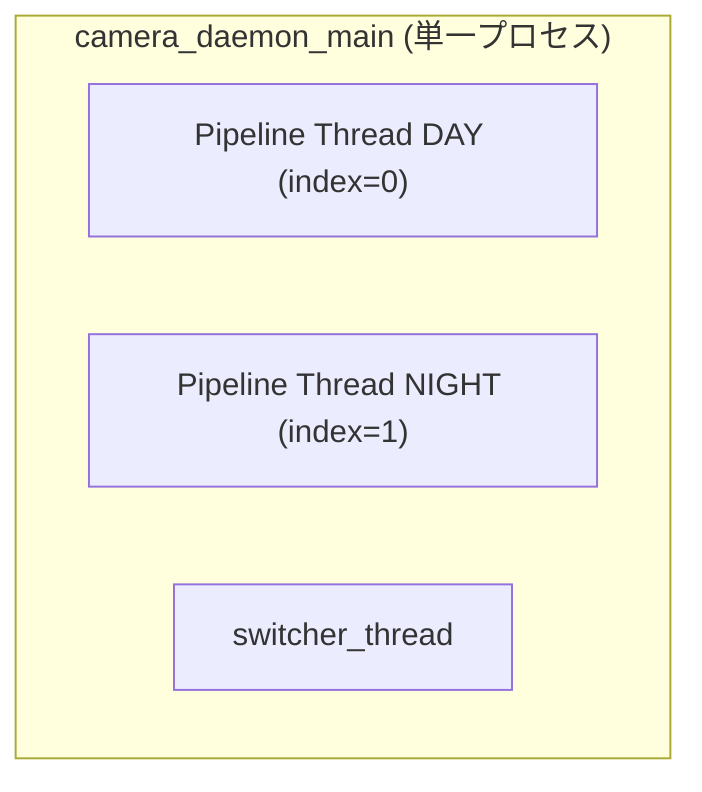
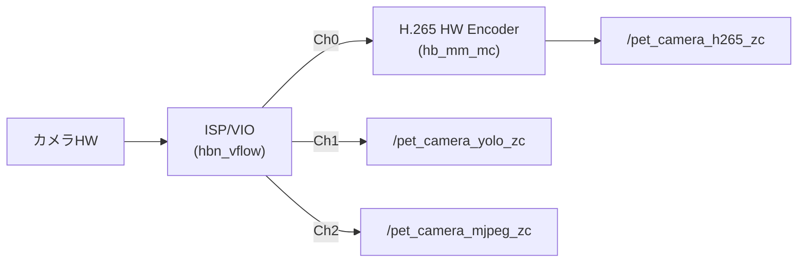
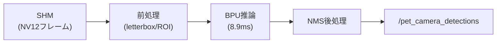
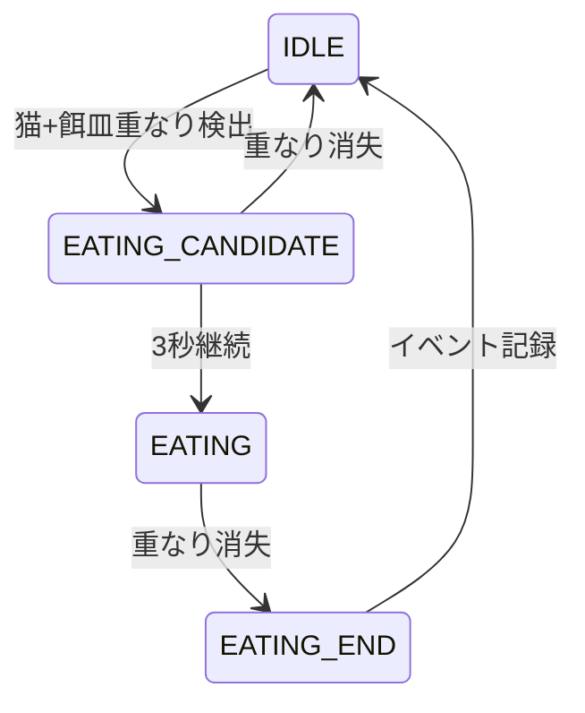
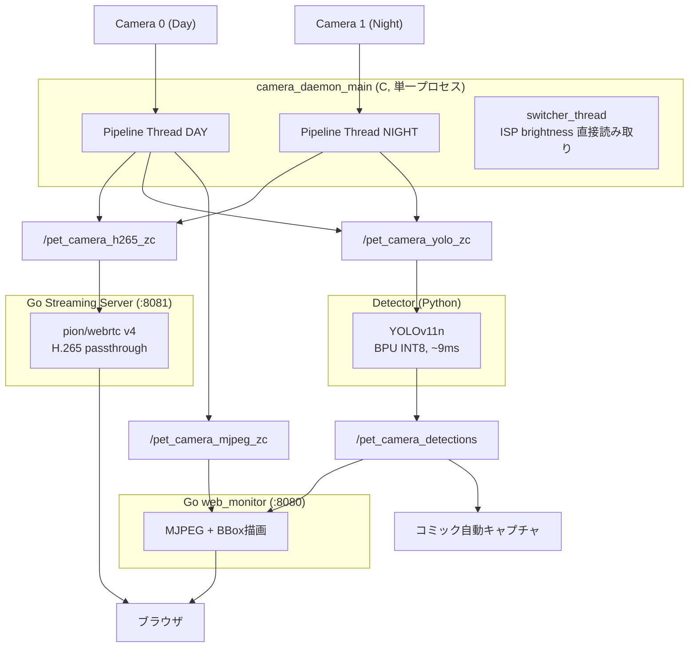

# 機能設計 - スマートペットカメラ

## システム概要

スマートペットカメラは、以下の主要コンポーネントで構成される：

1. **カメラキャプチャデーモン** - C言語、映像取得・H.265エンコード・共有メモリ書き込み [実装済]
2. **物体検出モジュール** - Python、YOLO推論・検出結果SHM書き込み [実装済]
3. **ストリーミングサーバー** - Go (pion/webrtc v4)、WebRTC H.265/MJPEG配信 [実装済]
4. **Web Monitor** - Go、UIホスティング + MJPEG :8080 [実装済]
5. **行動推定モジュール** - 行動判定ロジック [未実装]
6. **設定管理モジュール** - YAML構成管理 [未実装]
7. **システム監視モジュール** - ヘルスチェック [一部実装]

---

## コンポーネント設計

### 1. カメラキャプチャデーモン（Camera Capture Daemon） [実装済]

#### 責務
- 昼用/夜用カメラからの映像取得（hbn_vflow: VIN→ISP→VSE）
- H.265ハードウェアエンコード（hb_mm_mc API）
- 共有メモリへのゼロコピーフレーム書き込み
- 明るさ計測（ISP直接読み取り、SHM不要）

#### 主要機能

##### 1.1 マルチカメラ管理 [実装済]

カメラデーモンはシングルプロセス・マルチスレッド構成。2つのパイプラインスレッドと1つのswitcherスレッドが同一プロセス内で動作する。



##### 1.2 カメラ切り替え [実装済]

**方式**: switcherスレッドがISP brightnessを直接読み取り、プロセス内共有変数 (`g_active_camera`) で切り替え

| パラメータ | 値 |
|-----------|-----|
| ポーリング間隔 (DAY active) | 250ms |
| ポーリング間隔 (NIGHT active) | 5000ms |
| DAY→NIGHT 閾値 | brightness < 50（10秒保持） |
| NIGHT→DAY 閾値 | brightness > 60（10秒保持） |
| ヒステリシス | 閾値間に10のギャップ（安定性確保） |

[制約事項] 切り替え判定は常にDAYカメラ (index=0) の明るさを使用。NIGHTカメラの明るさは判定に使用しない。

詳細は `camera-and-isp.md` 参照。

##### 1.3 H.265エンコード [実装済]

| パラメータ | 値 |
|-----------|-----|
| エンコーダ | hb_mm_mc API（D-Robotics VPU ハードウェア） |
| コーデック | H.265 (MEDIA_CODEC_ID_H265) |
| デフォルトビットレート | 600kbps |
| ハードリミット | 700kbps |
| GOP | intra_period = fps (30フレーム = 1秒) |
| VIOパイプライン | hbn_vflow API (VIN→ISP→VSE) |

##### 1.4 データフロー


---

### 2. 物体検出モジュール（Object Detection Module） [実装済]

#### 責務
- 共有メモリからのYUVフレーム読み取り
- YOLO推論（BPU INT8）
- 検出結果の共有メモリ書き込み

#### 推論パイプライン

##### 2.1 モデル [実装済]

| パラメータ | 値 |
|-----------|-----|
| モデル | YOLOv11n |
| ランタイム | D-Robotics BPU（INT8量子化） |
| 推論時間 | 8.9ms |
| 入力サイズ | 640x640 |

##### 2.2 前処理パイプライン [実装済]

**昼カメラ（DAY）:**
```
VSE出力 → 640x360 → レターボックス → 640x640
  shift = (140.0, 0.0)
```

**夜カメラ（NIGHT）:**
```
1280x720 → 3 ROI (640x640 each)
  - 50% 水平オーバーラップ
  - ラウンドロビン推論 ~22fps
```

##### 2.3 レターボックス仕様 [実装済]

| パラメータ | 値 |
|-----------|-----|
| フォーマット | NV12 |
| Y パディング値 | 16 (黒) |
| UV パディング値 | 128 (ニュートラル) |
| バッファ | 事前確保（フレーム毎のアロケーションなし） |

[制約事項] NV12フォーマットでは Y=0/UV=0 は黒ではなく緑になる。Y=16, UV=128 を使用すること。

##### 2.4 検出対象クラス
- `cat`: 猫

##### 2.5 検出結果データフロー


---

### 3. ストリーミングサーバー [実装済]

#### 責務
- WebRTC H.265ストリーム配信
- MJPEG配信
- シグナリング

#### 構成

| コンポーネント | 言語 | ポート | 役割 |
|-------------|------|--------|------|
| Go streaming server | Go (pion/webrtc v4) | :8081 | H.265 WebRTC配信 |
| Go web_monitor | Go | :8080 | MJPEG配信、Preact SPA、REST API |

##### 3.1 WebRTC仕様 [実装済]

| パラメータ | 値 |
|-----------|-----|
| ライブラリ | pion/webrtc v4 |
| 方式 | H.265パススルー（再エンコードなし） |
| VPS/SPS/PPS | キャッシュ済（途中参加クライアント対応） |
| カメラ切替後ウォームアップ | 15フレーム（キーフレーム保証） |

---

### 4. コミック自動キャプチャ（アルバム機能） [実装済]

#### 責務
- YOLO検出トリガーによる4コマ画像自動生成
- 検出結果に基づく自動撮影

詳細は `pet-album-spec.md` 参照。

---

### 5. H.265録画 [実装済]

#### 責務
- サーバーサイドH.265 NALキャプチャ
- ゼロCPUオーバーヘッド録画（SHMから直接NAL取得）
- `.hevc` → `.mp4` 自動変換 (`ffmpeg -f hevc -c copy`)

---

### 6. 行動推定モジュール（Behavior Estimation Module） [未実装]

#### 設計方針（計画）
- バウンディングボックスの重なり計算（IoU）
- 食事/水飲み行動の判定
- 行動イベントの生成

##### 行動判定ロジック（計画）

**食事行動の判定：**
1. 猫と餌皿の両方が検出される
2. IoU or 重なり比率が閾値以上
3. 一定時間（例：3秒）以上継続

**状態遷移図（計画）：**


---

### 7. 設定管理モジュール（Configuration Module） [未実装]

[制約事項] YAML設定システムは未実装。現在パラメータは以下に分散してハードコードされている：

| パラメータ種別 | 定義場所 |
|-------------|---------|
| ISPパラメータ | `.h` ヘッダファイル |
| 検出閾値・SHM名 | Pythonソースコード |
| エンコードパラメータ | Cソースコード |
| ストリーミング設定 | Goソースコード |

---

### 8. システム監視モジュール（System Monitor Module） [一部実装]

#### 実装済み機能
- `scripts/profile_shm.py`: SHM統計スナップショット（FPS、ドロップレート等）
- `src/mock/main.py`: テスト用モックフレームワーク (カメラ・検出・SHM)

#### 未実装機能
- 自動復旧
- リソース監視アラート
- ストレージ管理自動化

---

## 共有メモリレイアウト [実装済]

システム全体で6つの共有メモリ領域を使用（定義元: `src/capture/shm_constants.h`）:

| SHM名 | 用途 |
|--------|------|
| `/pet_camera_h265_zc` | H.265ストリーム ゼロコピー (encoder → Go streaming) |
| `/pet_camera_yolo_zc` | YOLO入力 ゼロコピー (統合、旧zc_0/zc_1を置換) |
| `/pet_camera_detections` | 検出結果 (Python detector → Go web_monitor) |
| `/pet_camera_mjpeg_zc` | MJPEG NV12 ゼロコピー (camera → Go web_monitor) |
| `/pet_camera_roi_zc_0` | 夜間ROI領域0 (640x640, NIGHTカメラのみ) |
| `/pet_camera_roi_zc_1` | 夜間ROI領域1 (640x640, NIGHTカメラのみ) |

[制約事項] SHM構造体定義の変更は危険。変更時は全コンポーネント（C/Python/Go）の定義を統一的に更新すること。

---

## データフロー図 [実装済]



---

## パフォーマンス実測値

| 項目 | 値 |
|------|-----|
| YOLO推論 | 8.9ms (BPU INT8) |
| H.265エンコード | ハードウェア（hb_mm_mc） |
| ストリーミング遅延 | WebRTC: 低遅延 |
| 夜カメラROI推論 | ~22fps（3 ROI ラウンドロビン） |
| ビットレート | 600kbps default / 700kbps hard limit |

---

## エラー処理戦略

### エラー分類

1. **致命的エラー（システム停止）**
   - モデルロード失敗
   - 全カメラ接続失敗
   - SHM作成失敗

2. **復旧可能エラー（リトライ）**
   - 単一カメラ接続失敗
   - フレームキャプチャ失敗（一時的）
   - VIOバッファエラー

3. **警告（ログ記録のみ）**
   - 検出結果なし
   - 低い信頼度
   - CPU使用率高

[制約事項] セマフォの二重初期化は未定義動作を引き起こす。`O_EXCL` フラグによる新規/既存判定が必須。詳細は `04_architecture.md` 参照。

---

## テスト戦略

### プロファイラパターン [実装済]
- `scripts/profile_shm.py` でSHM統計スナップショットを取得
- JSON出力によるFPS・ドロップレートの定量評価
- `src/mock/main.py` によるカメラデーモンシミュレーション

### シナリオテスト
- 昼夜カメラ切り替えの安定性
- 長時間稼働テスト（24時間以上）
- WebRTCクライアント途中参加
