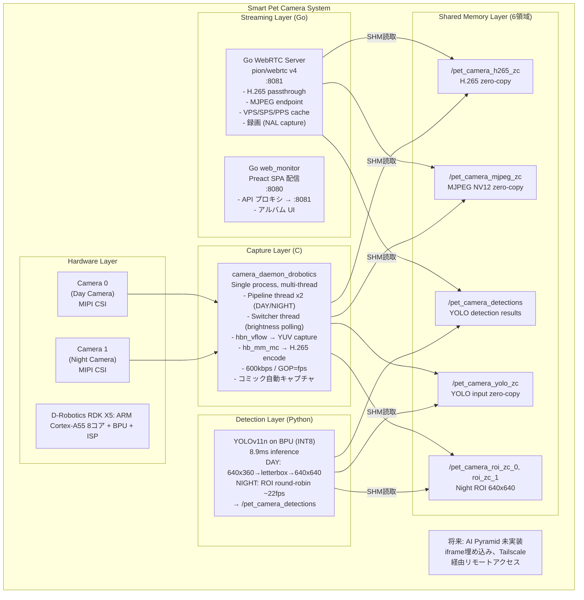
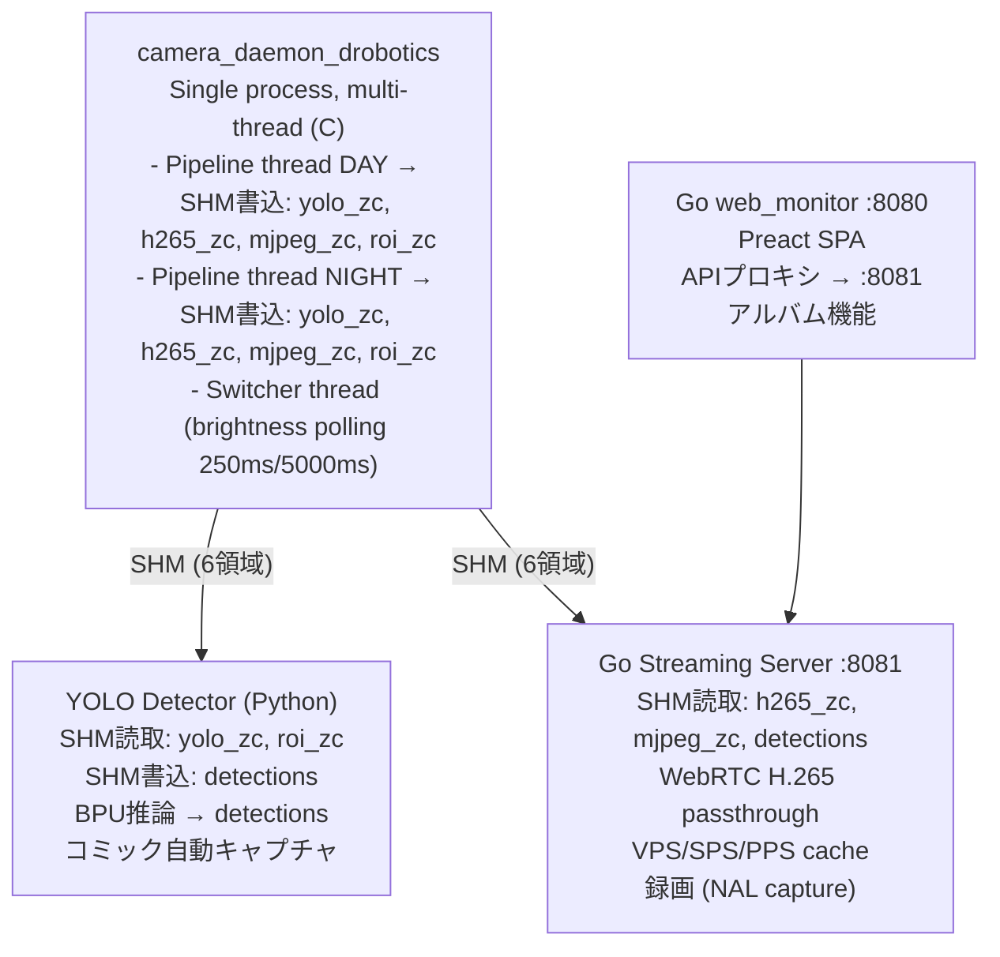
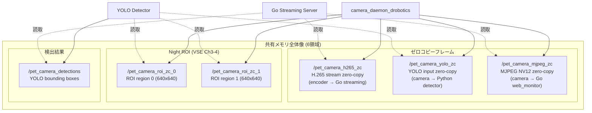
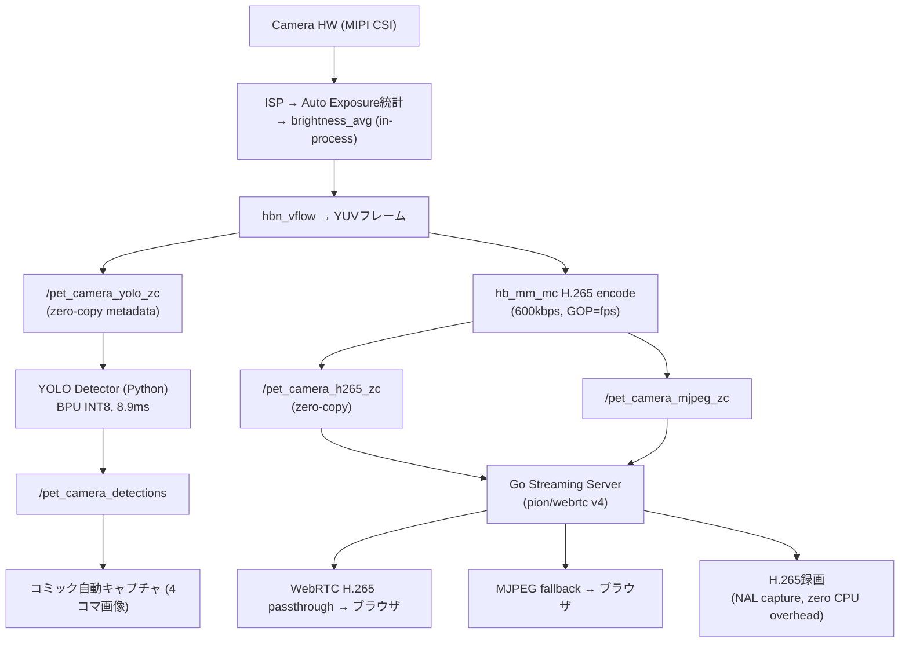
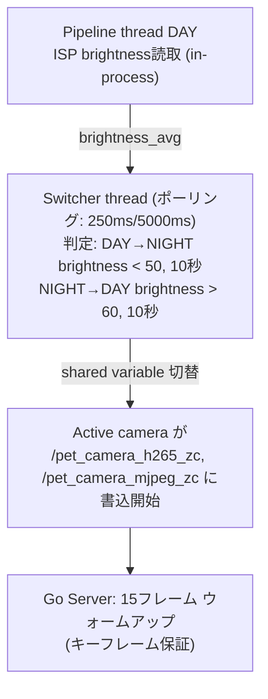
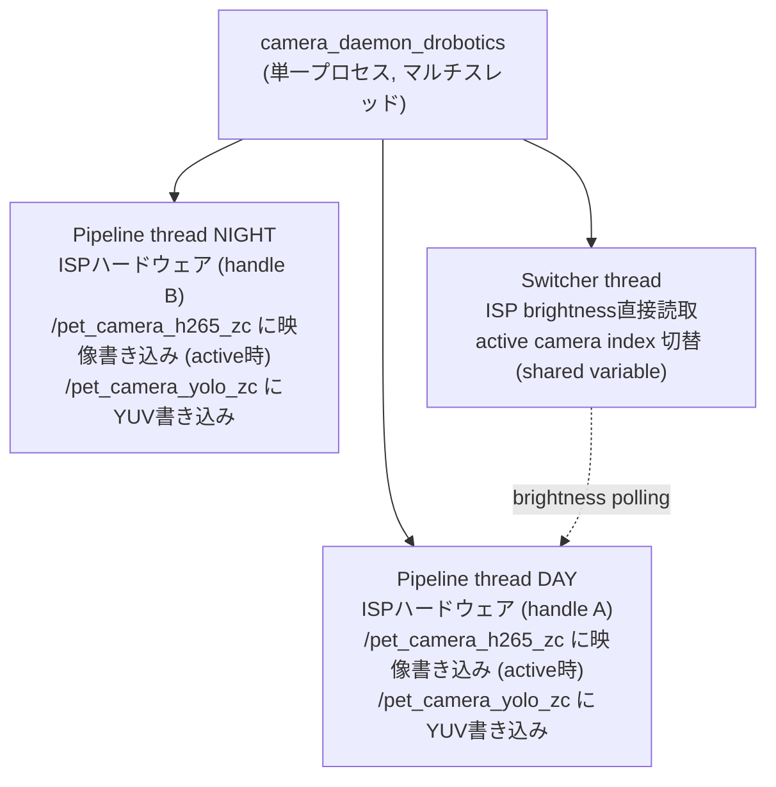
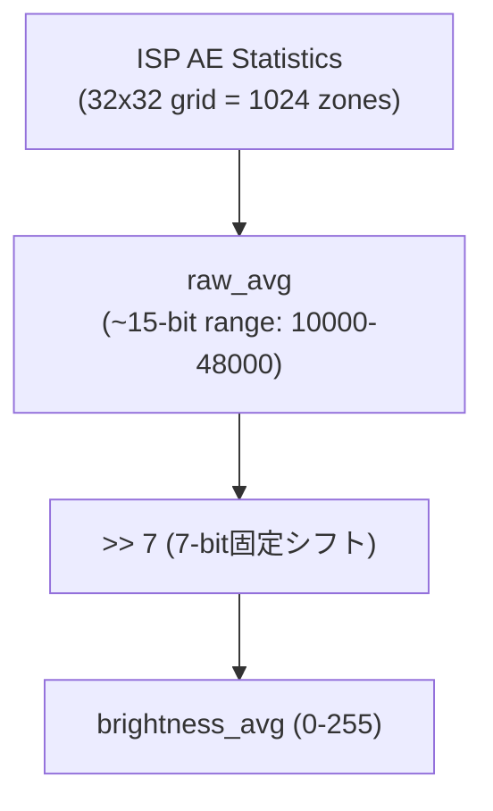

# システムアーキテクチャ - スマートペットカメラ

## 全体アーキテクチャ

### システム構成図 [実装済]



---

## プロセスアーキテクチャ [実装済]

### プロセス構成

システムは3つの独立プロセスで構成され、共有メモリ（SHM）で通信する：



### プロセス間通信（IPC）方式 [実装済]

**採用方式**: POSIX共有メモリ + セマフォ

| 特性 | 詳細 |
|------|------|
| 通信方式 | POSIX `shm_open()` + `mmap()` |
| 同期 | `sem_t`（プロセス間セマフォ） |
| コピー | ゼロコピー（mmap直接参照） |
| 初期化 | `O_EXCL` フラグで新規/既存を判定 |

[制約事項] セマフォの二重初期化は未定義動作（UB）を引き起こす。`shm_open()` で `O_EXCL` を使用し、`created_new` が true の場合のみ `sem_init()` を呼ぶこと。

---

## 共有メモリレイアウト [実装済]

### 全6領域の詳細



---

## データフロー [実装済]

### メインデータパス



### カメラ切り替えフロー



---

## 技術スタック [実装済]

### カメラキャプチャレイヤー
- **言語**: C
- **ハードウェアAPI**: D-Robotics hbn_vflow (ISP/VIO) / hb_mm_mc (H.265 Encoder)
- **IPC**: POSIX共有メモリ + セマフォ
- **関連ファイル**: `src/capture/`

### 物体検出レイヤー
- **言語**: Python
- **推論**: YOLOv11n on D-Robotics BPU (INT8)
- **画像処理**: NumPy（NV12直接操作）
- **関連ファイル**: `src/detector/`

### ストリーミングレイヤー
- **言語**: Go
- **WebRTC**: pion/webrtc v4
- **H.265**: パススルー（再エンコードなし）
- **関連ファイル**: `src/streaming_server/`

### Web UIレイヤー
- **サーバー**: Go web_monitor (:8080)
- **フロントエンド**: Preact SPA
- **関連ファイル**: `src/streaming_server/internal/webmonitor/`

### 共通モジュール
- **Python型定義・共有ロジック**: `src/common/`
- **モック**: `src/mock/`

### 開発ツール
- **パッケージ管理**: `uv`（pip不使用）
- **型チェック**: pyright
- **ビルド**: Make (Cコード)
- **バージョン管理**: Git

### デプロイメント
- **OS**: Linux (D-Robotics RDK X5, ARM Cortex-A55)
- **プロセス管理**: systemd
- **ログ**: Python logging → systemd journal

---

## ディレクトリ構造 [実装済]

```
/app/smart-pet-camera/
│
├── docs/                          # ドキュメント（設計の真実の源泉）
│   ├── 01_project_goals.md
│   ├── 02_requirements.md
│   ├── 03_functional_design.md
│   ├── 04_architecture.md
│   └── *log.md                    # 開発ログ
│
├── src/
│   ├── capture/                   # カメラキャプチャ (C)
│   │   ├── camera_daemon_main.c   # 統合デーモン (マルチスレッド)
│   │   ├── camera_pipeline.c
│   │   ├── camera_switcher.c
│   │   ├── encoder_lowlevel.c     # hb_mm_mc H.265エンコーダ
│   │   ├── vio_lowlevel.c         # hbn_vflow VIO制御
│   │   ├── isp_brightness.c
│   │   ├── shared_memory.c / .h
│   │   ├── shm_constants.h        # SHM名・サイズ定義 (single source of truth)
│   │   └── mock_detector_daemon.py # POSIX SHMテスト用検出モック
│   │
│   ├── detector/                  # 物体検出 (Python)
│   │   └── YOLOv11n BPU推論
│   │
│   ├── streaming_server/          # Go WebRTC + web_monitor
│   │   ├── Go WebRTCサーバー (:8081)
│   │   └── Go web_monitor (:8080)
│   │
│   ├── common/                    # 共有Python型・ロジック
│   ├── mock/                      # モジュールモック
│   └── monitor/                   # システム監視
│
├── scripts/
│   └── profile_shm.py            # SHMプロファイラ
│
└── pyproject.toml                 # uv パッケージ管理
```

---

## デプロイメント構成 [実装済]

### systemdサービス

```ini
# カメラキャプチャ
smart-pet-camera-capture.service
  ExecStart: camera_daemon_drobotics (single process, multi-thread)

# 物体検出
smart-pet-camera-detection.service
  ExecStart: uv run src/detector/...
  After: capture.service

# ストリーミング
smart-pet-camera-streaming.service
  ExecStart: Go binary (:8081)
  After: capture.service

# Web UI (Go web_monitor)
smart-pet-camera-ui.service
  ExecStart: Go web_monitor binary (:8080)
```

---

## カメラ切り替えシステム [実装済]

### プロセス構成



### 明るさ計算

ISPハードウェアのAE (Auto Exposure) 統計を使用：



### 切り替え判定

| 切り替え | 閾値 | 保持時間 | ポーリング間隔 |
|---------|------|---------|--------------|
| DAY→NIGHT | brightness < 50 | 10秒 | 250ms |
| NIGHT→DAY | brightness > 60 | 10秒 | 5000ms |

**切替制御**: Switcher thread が shared variable (active camera index) を更新

詳細は `camera-and-isp.md` 参照。

---

## 共有メモリとセマフォの実装上の注意点 [制約事項]

### 問題: セマフォの二重初期化

複数プロセスが同一SHMにアクセスする場合、`sem_init()` の二重呼び出しは未定義動作。
`vio_get_frame()` が `-43 (EIDRM)` エラーを返す原因となる。

### 解決策: O_EXCL フラグによる判定

```c
// O_EXCL: 既存の場合はEEXISTエラーを返す
shm_fd = shm_open(name, O_CREAT | O_EXCL | O_RDWR, 0666);
if (shm_fd == -1 && errno == EEXIST) {
    // 既存 → セマフォ再初期化しない
    shm_fd = shm_open(name, O_RDWR, 0666);
} else {
    // 新規 → sem_init() を呼ぶ
    is_new = true;
}
```

### 関連ファイル
- `src/capture/shared_memory.c`: `shm_create_or_open_ex()`
- `src/capture/camera_pipeline.c`: 共有メモリのopen/create処理
- `src/capture/camera_daemon_main.c`: 統合デーモン（マルチスレッド）

---

## ハードウェア構成

### D-Robotics RDK X5

| コンポーネント | 詳細 |
|-------------|------|
| CPU | ARM Cortex-A55 (8コア), ARMv8.2-A |
| BPU | D-Robotics AI推論プロセッサ（INT8） |
| ISP | 内蔵ISP（AE/AWB統計、低照度補正） |
| GPU | Vivante GC8000L (OpenCL対応) |
| AES HW | 非対応（ソフトウェア実装） |

### GPU活用状況

| 処理 | GPU活用 | 備考 |
|------|---------|------|
| YOLO推論 | BPU使用 | GPU不使用、専用AI プロセッサ |
| SRTP暗号化 | 不可 | データ転送コスト > 暗号化コスト |
| H.265エンコード | hb_mm_mc | 専用ハードウェアエンコーダ (VPU) |

---

## 将来の拡張 [未実装]

### AI Pyramid
- iframe埋め込みによるAI分析ダッシュボード
- Tailscale経由のリモートアクセス

### 行動推定
- 食事/水飲み行動の自動検出・記録
- IoUベースの重なり判定

### アルバム機能拡張
- 詳細は `pet-album-spec.md` 参照

---

## まとめ

このアーキテクチャは以下の原則に基づいて設計・実装されている：

1. **ゼロコピーIPC**: 共有メモリによるプロセス間のゼロコピーデータ転送
2. **ハードウェア活用**: BPU (YOLO), ISP (画像処理), hb_mm_mc (H.265) の専用HW活用
3. **言語適材適所**: C (キャプチャ/エンコード), Python (AI推論), Go (WebRTC/ストリーミング)
4. **パススルー設計**: H.265をカメラからブラウザまで再エンコードなしで配信
5. **信頼性**: セマフォ安全初期化、ヒステリシス付きカメラ切替、ウォームアップフレーム
