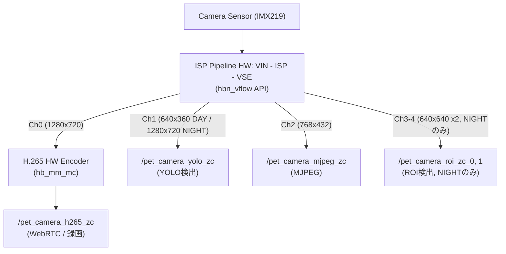
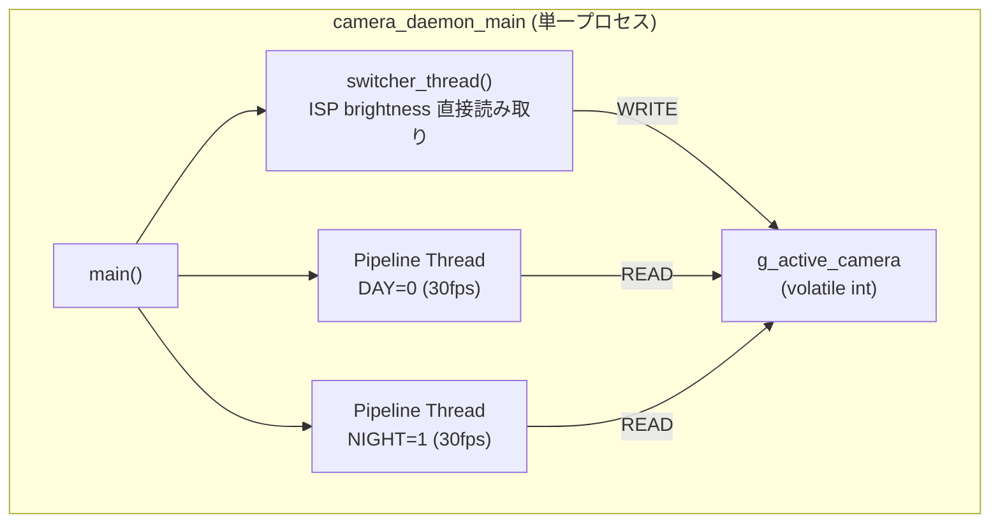
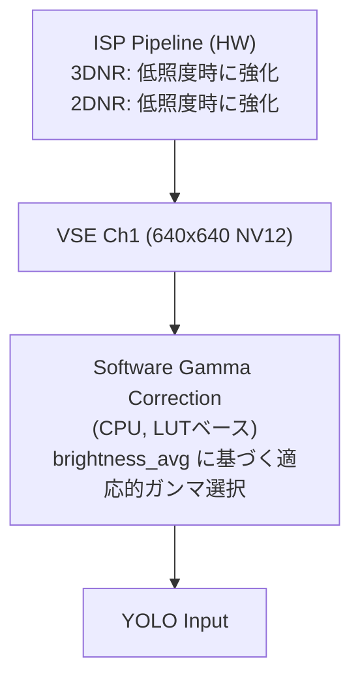
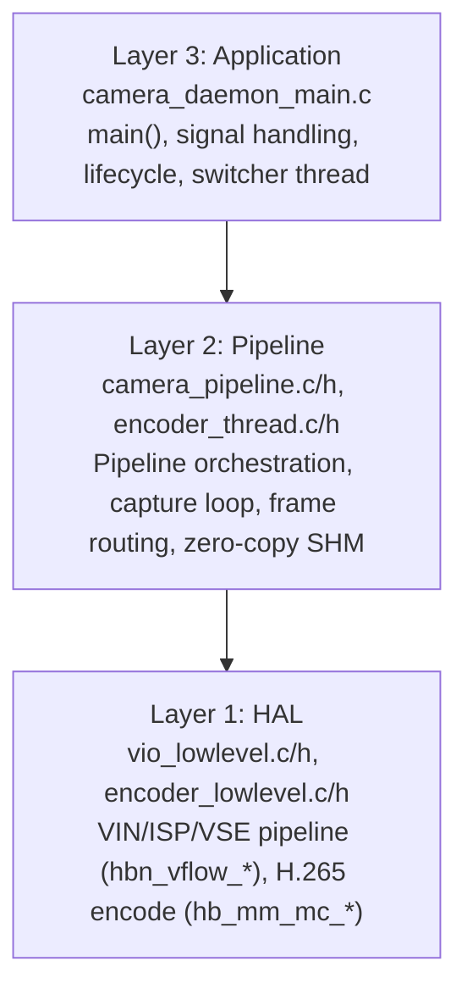

# カメラ・ISP・エンコーディング リファレンス

本ドキュメントは、カメラ切り替え、ISP低照度補正、AWBチューニング、H.265ハードウェアエンコーディング、ストリーム切り替えに関する設計・実装の知見を統合したものである。

---

## 目次

1. [システム全体アーキテクチャ](#1-システム全体アーキテクチャ)
2. [カメラ切り替え (Camera Switcher)](#2-カメラ切り替え-camera-switcher)
3. [ISP低照度補正](#3-isp低照度補正)
4. [AWBチューニング (夜間カメラ)](#4-awbチューニング-夜間カメラ)
5. [H.265ハードウェアエンコーディング](#5-h265ハードウェアエンコーディング)
6. [ストリーム切り替え (Fluent Stream Switching)](#6-ストリーム切り替え-fluent-stream-switching)
7. [カメラデーモン 3層アーキテクチャ](#7-カメラデーモン-3層アーキテクチャ)

---

## 1. システム全体アーキテクチャ



### 共有メモリ構成

| SHM名 | 用途 | Producer | Consumer |
|--------|------|----------|----------|
| `/pet_camera_h265_zc` | H.265ゼロコピーストリーム | camera_daemon (encoder_thread) | Go streaming server |
| `/pet_camera_yolo_zc` | YOLO入力ゼロコピー（統合、旧zc_0/zc_1を置換） | camera_daemon (active pipeline) | Python YOLO detector |
| `/pet_camera_detections` | 検出結果 | Python YOLO daemon | Go web_monitor |
| `/pet_camera_mjpeg_zc` | MJPEGゼロコピーNV12 | camera_daemon (active pipeline) | Go web_monitor |
| `/pet_camera_roi_zc_0` | 夜間ROI領域0 (640x640) | camera_daemon (NIGHT pipeline) | Python YOLO detector |
| `/pet_camera_roi_zc_1` | 夜間ROI領域1 (640x640) | camera_daemon (NIGHT pipeline) | Python YOLO detector |

定義元: `src/capture/shm_constants.h`

---

## 2. カメラ切り替え (Camera Switcher)

### 現在の設計

シングルプロセス・マルチスレッド構成。DAY/NIGHTの2パイプラインスレッドと1つのswitcherスレッドが同一プロセス内で動作する。カメラ切り替えはプロセス内共有変数（`volatile int g_active_camera`）で制御し、SHMは使用しない。



### switcherスレッド

```c
// camera_daemon_main.c
static void *switcher_thread(void *arg) {
    while (g_running) {
        // DAYカメラのISPハンドルからbrightness直接読み取り（SHM不要）
        isp_brightness_result_t brightness = {.valid = false};
        if (g_pipelines[0].vio.isp_handle > 0) {
            isp_get_brightness(g_pipelines[0].vio.isp_handle, &brightness);
        }

        if (brightness.valid) {
            CameraSwitchDecision decision = camera_switcher_record_brightness(
                &ctx->switcher, CAMERA_MODE_DAY, (double)brightness.brightness_avg);

            if (decision == CAMERA_SWITCH_DECISION_TO_NIGHT) {
                g_active_camera = 1;
                pthread_cond_broadcast(&g_pipelines[0].switch_cond);
                pthread_cond_broadcast(&g_pipelines[1].switch_cond);
            }
            // ... (逆方向も同様)
        }

        int interval_ms = (g_active_camera == 0) ? 250 : 5000;
        usleep(interval_ms * 1000);
    }
}
```

### 非activeパイプラインのブロック

非activeパイプラインは `pthread_cond_timedwait` でブロックし、CPU消費をゼロにする。switcherスレッドが `pthread_cond_broadcast` で起床させる。

```c
// camera_pipeline.c
bool write_active = pipeline->active_camera &&
                    *pipeline->active_camera == pipeline->camera_index;
if (!write_active) {
    pthread_mutex_lock(&pipeline->switch_mutex);
    pthread_cond_timedwait(&pipeline->switch_cond, &pipeline->switch_mutex, &ts);
    pthread_mutex_unlock(&pipeline->switch_mutex);
    continue;
}
```

### 切り替え判定パラメータ

```c
CameraSwitchConfig cfg = {
    .day_to_night_threshold = 50.0,
    .night_to_day_threshold = 60.0,
    .day_to_night_hold_seconds = 0.5,
    .night_to_day_hold_seconds = 3.0,
    .warmup_frames = 15,
};
```

- **DAY→NIGHT**: brightness_avg < 50.0 が0.5秒持続
- **NIGHT→DAY**: brightness_avg > 60.0 が3.0秒持続
- ヒステリシス付き（`camera_switcher.c` の既存ロジックを維持）

---

## 3. ISP低照度補正

### D-Robotics ISP API対応状況

| API | 関数 | 結果 |
|-----|------|------|
| AWB | `hbn_isp_set_awb_attr` | **有効** |
| 3DNR | `hbn_isp_set_3dnr_attr` | **有効** |
| 2DNR | `hbn_isp_set_2dnr_attr` | **有効** |
| Color Process | `hbn_isp_set_color_process_attr` | **無効** - API成功するが映像に反映されない |
| Gamma | `hbn_isp_set_gc_attr` | **無効** - error -65545 |
| WDR | `hbn_isp_set_wdr_attr` | **無効** - error -65545 |
| Exposure/AE | `hbn_isp_set_exposure_attr` | **無効** - 低照度時はセンサー限界で効果なし |

### 採用アーキテクチャ

> **注意**: ISP低照度補正（NR調整・ガンマ補正）はフレームドロップの原因となったため**現在は無効化**されている。画像補正はYOLO detector側のCLAHE前処理で代替。以下は設計時の知見として残す。

ISPのHW機能（NR）＋ソフトウェアガンマ補正の組み合わせ:



### ノイズリダクション設定

| Brightness Zone | 3DNR Strength | 2DNR Blend |
|-----------------|---------------|------------|
| DARK (< 50) | 120 | 0.7 |
| DIM (50-70) | 115 | 0.5 |
| NORMAL (>= 70) | 113 | 5.0 |

### 適応ガンマ補正

| brightness_avg | Gamma | 効果 |
|----------------|-------|------|
| < 20 | 0.40 | 非常に強い増輝 |
| < 35 | 0.50 | 強い増輝 |
| < 50 | 0.60 | 中程度の増輝 |
| < 65 | 0.75 | 軽い増輝 |
| < 80 | 0.85 | わずかな増輝 |
| >= 80 | 1.00 | 補正なし |

```c
// LUT生成（起動時に事前計算）
for (int i = 0; i < 256; i++) {
    float normalized = i / 255.0f;
    float corrected = powf(normalized, gamma);
    lut[i] = (uint8_t)(corrected * 255.0f + 0.5f);
}

// Y channelのみに適用 (640*640 = 409,600 pixels)
const uint8_t *lut = select_gamma_lut(brightness_avg);
if (lut) {
    for (size_t i = 0; i < y_plane_size; i++) {
        y_data[i] = lut[y_data[i]];
    }
}
```

### AE統計のビット深度

カメラごとに異なるため自動検出が必要:
- Camera 0 (Day): 8-bit (max ~255)
- Camera 1 (Night): 16-bit (max ~65535)

```c
int shift_bits = 0;
if (max_val > 4095)      shift_bits = 8;   // 16-bit -> 8-bit
else if (max_val > 255)  shift_bits = 4;   // 12-bit -> 8-bit
result->brightness_avg = (float)(raw_avg >> shift_bits);
```

### 性能

- ガンマLUT: 起動時に事前計算、ランタイムコストはほぼゼロ
- LUT適用: ~410K byteルックアップ/フレーム（高速メモリアクセス）
- ISP NR更新: ~1Hzに抑制

### 関連ファイル

- `src/capture/camera_pipeline.c` - 適応ガンマ補正
- `src/capture/isp_brightness.c` - ISPノイズリダクション制御
- `src/capture/isp_lowlight_profile.h` - プロファイル定義

---

## 4. AWBチューニング (夜間カメラ)

### 背景

夜間IRカメラ（Camera 1, IMX219, IRカットフィルタなし）はAWB Autoだとゲインがドリフトし、映像が紫色や青色になる。IR映像には意味のある色情報がないため、AWB Manualで固定する。

### 採用設定

```
AWB Mode: MANUAL
rgain:  1.8
grgain: 1.8
gbgain: 1.8
bgain:  2.34
```

- 色味: R:G:B = 1:1:1.3 比率（寒色系、暗視カメラらしい印象）
- 暗部: 全体ゲイン1.8倍で暗部が十分に視認可能
- ノイズ: 3DNR=128との組み合わせで許容範囲

### 重要な制約

**AWBゲイン値は1.0以上が必須**。1.0未満を指定すると error -65545 が返る。

### 設定タイミング

AWB Manual設定は **ISPがフレーム処理を開始してから約1秒後（~30フレーム後）** に行う必要がある。`pipeline_create` 時や `vflow_start` 直後では、ISPのAWB初期化処理に上書きされて効かない。

```c
// camera_pipeline.c の pipeline_run 内
if (!night_awb_applied && frame_number == 30) {
    hbn_isp_awb_attr_t awb_attr = {0};
    hbn_isp_get_awb_attr(pipeline->vio.isp_handle, &awb_attr);
    awb_attr.mode = HBN_ISP_MODE_MANUAL;
    awb_attr.manual_attr.gain.rgain  = 1.8f;
    awb_attr.manual_attr.gain.grgain = 1.8f;
    awb_attr.manual_attr.gain.gbgain = 1.8f;
    awb_attr.manual_attr.gain.bgain  = 2.34f;
    hbn_isp_set_awb_attr(pipeline->vio.isp_handle, &awb_attr);
    night_awb_applied = true;
}
```

### 調整ポイント

| パラメータ | 現在値 | 調整方向 |
|-----------|--------|----------|
| B/R比率 | 1.3 | 青み強化: 1.4~1.5 / ニュートラル: 1.0 |
| 全体ゲイン | 1.8 | 明るく: 2.0（ノイズ増加とトレードオフ） |

---

## 5. H.265ハードウェアエンコーディング

### Media Codec API (hb_mm_mc)

D-Robotics X5のVPUハードウェアエンコーダーを `hb_mm_mc` APIで制御する。旧 `libspcdev` APIは使用しない。

### 基本パイプライン

```c
// encoder_lowlevel.c

// 1. コーデック設定
media_codec_context_t *encoder = &ctx->codec_ctx;
encoder->encoder = 1;
encoder->codec_id = MEDIA_CODEC_ID_H265;

// 2. エンコードパラメータ
encoder->video_enc_params.width = width;
encoder->video_enc_params.height = height;
encoder->video_enc_params.pix_fmt = MC_PIXEL_FORMAT_NV12;

// 3. H.265 CBRレート制御
encoder->video_enc_params.rc_params.mode = MC_AV_RC_MODE_H265CBR;
encoder->video_enc_params.rc_params.h265_cbr_params.bit_rate = bitrate;
encoder->video_enc_params.rc_params.h265_cbr_params.frame_rate = fps;
encoder->video_enc_params.rc_params.h265_cbr_params.intra_period = fps;  // GOP = fps

// 4. 初期化・設定・開始
hb_mm_mc_initialize(encoder);
hb_mm_mc_configure(encoder);
hb_mm_mc_start(encoder, &startup_params);

// 5. エンコードループ (encoder_thread.c)
hb_mm_mc_dequeue_input_buffer(&ctx->codec_ctx, &input_buffer, timeout);
// NV12データをinput_bufferにmemcpy
hb_mm_mc_queue_input_buffer(&ctx->codec_ctx, &input_buffer, timeout);
hb_mm_mc_dequeue_output_buffer(&ctx->codec_ctx, &output_buffer, &info, timeout);
// H.265ビットストリームをSHMに書き込み

// 6. クリーンアップ
hb_mm_mc_stop(encoder);
hb_mm_mc_release(encoder);
```

### VIOパイプライン (hbn_vflow)

カメラ入力は `hbn_vflow` APIで VIN→ISP→VSE パイプラインを構築する。

```c
// vio_lowlevel.c
hbn_vflow_create(&ctx->vflow_fd);
hbn_vflow_add_vnode(ctx->vflow_fd, vin_node_handle);
hbn_vflow_add_vnode(ctx->vflow_fd, isp_node_handle);
hbn_vflow_add_vnode(ctx->vflow_fd, vse_node_handle);
hbn_vflow_bind_vnode(ctx->vflow_fd, ...);
hbn_vflow_start(ctx->vflow_fd);
```

### ビットレート制限

**D-Robotics X5のH.265 HWエンコーダーには700 kbps (700000 bps) のハード制限がある。**

```c
#define DEFAULT_BITRATE  600000  // 600 kbps (安全マージン含む)
```

- 100~700 kbps: 動作確認済み
- 750 kbps以上: エラー

### H.265キーフレーム判定

```c
static bool is_h265_keyframe(const uint8_t *data, size_t size) {
    if (size < 5) return false;
    // Annex-B start code: 00 00 00 01
    if (data[0] == 0x00 && data[1] == 0x00 &&
        data[2] == 0x00 && data[3] == 0x01) {
        uint8_t nal_type = (data[4] >> 1) & 0x3F;
        return (nal_type >= 16 && nal_type <= 21);  // IDR/BLA/CRA
    }
    return false;
}
```

### 録画コマンド

```bash
curl -X POST http://localhost:8080/api/recording/start
sleep 10
curl -X POST http://localhost:8080/api/recording/stop
# 録画は .hevc → .mp4 変換で保存
```

---

## 6. ストリーム切り替え (Fluent Stream Switching)

### 課題

H.265デコーダーはキーフレーム（IDR/CRA）から再生を開始する必要がある。カメラ切り替え時にP-frameから配信すると画面が乱れる。

### 採用方式: ウォームアップ延長型

ウォームアップ期間を延長してキーフレーム遭遇を保証する方式を採用。

```c
// camera_daemon_main.c
cfg.warmup_frames = 15;  // 約500ms @ 30fps
```

**根拠**:
- GOP: `intra_period = fps` (30フレーム = 1秒)
- warmup: 15フレーム (500ms)
- 実装: 1行変更のみ

---

## 7. カメラデーモン 3層アーキテクチャ

### 実装済みアーキテクチャ



### 主要API

```c
// Layer 1: VIO (hbn_vflow API)
int vio_create(vio_context_t *ctx, int camera_index,
               int sensor_w, int sensor_h, int output_w, int output_h, int fps);
int vio_get_frame(vio_context_t *ctx, hbn_vnode_image_t *frame, int timeout_ms);
int vio_get_frame_ch1(vio_context_t *ctx, hbn_vnode_image_t *frame, int timeout_ms);
int vio_get_frame_ch2(vio_context_t *ctx, hbn_vnode_image_t *frame, int timeout_ms);
int vio_get_frame_roi(vio_context_t *ctx, int roi_index, hbn_vnode_image_t *frame, int timeout_ms);

// Layer 1: Encoder (hb_mm_mc API)
int encoder_create(encoder_context_t *ctx, int camera_index, int w, int h, int fps, int bitrate);
int encoder_encode_frame_zerocopy(encoder_context_t *ctx, const uint8_t *nv12_y, const uint8_t *nv12_uv,
                                   size_t y_size, size_t uv_size, int timeout_ms, encoder_output_t *out);

// Layer 2: Pipeline
int pipeline_create(camera_pipeline_t *p, int cam_idx, int sensor_w, int sensor_h,
                     int output_w, int output_h, int fps, int bitrate, volatile int *active_camera);
int pipeline_run(camera_pipeline_t *p, volatile bool *running_flag);
```

---

## 参考情報

### ヘッダー・ライブラリ

| パス | 内容 |
|------|------|
| `hb_mm_mc.h` | Media Codec API (H.265エンコード) |
| `hbn_vflow.h`, `hbn_vnode_*.h` | VIO Pipeline API |
| `hbn_isp_api.h` | ISP API (AWB, NR) |
| `hb_mem_mgr.h` | メモリ管理 (zero-copy import/export) |

### デバッグコマンド

```bash
# 共有メモリ確認
ls -lh /dev/shm/pet_camera_*

# プロファイリング
uv run scripts/profile_shm.py
```
