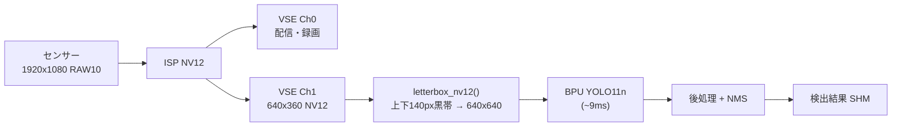
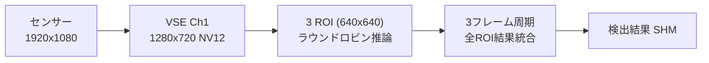

# 検出パイプライン & YOLO リファレンス

**最終更新**: 2026-02-02

---

## 1. 全体概要

RDK X5 (D-Robotics Sunrise 5, BPU Bayes-e 10 TOPS, シングルコア) 上で YOLO ベースの物体検出を行うペットカメラシステム。カメラデーモン (C) が共有メモリにフレームを書き込み、Python 検出デーモンが BPU 推論を実行、結果を共有メモリ経由で WebMonitor に渡す。

### ハードウェア仕様

| 項目 | 値 |
|------|-----|
| SoC | D-Robotics Sunrise 5 (RDK X5) |
| BPU | Bayes-e, **1コア**, 10 TOPS (INT8) |
| CPU | 8x Arm Cortex-A55 @ 1.5-1.8 GHz |
| RAM | 4 GB LPDDR4 |

---

## 2. 現行検出パイプライン

### 日中カメラ (camera_id=0)



- レターボックス: 640x360 -> 640x640 (Y=16黒, UV=128中間), `shift=((input_h - h) // 2, 0.0)` で bbox 座標補正（640x360入力時は140.0）
- レターボックスバッファは事前確保済み (alloc 0回/フレーム, memcpy 2回のみ)

### 夜間カメラ (camera_id=1) - ROI モード



| パラメータ | 値 | 理由 |
|-----------|-----|------|
| 入力解像度 | 1280x720 | 広角レンズの詳細を維持 |
| ROI サイズ | 640x640 | YOLO ネイティブ入力 |
| ROI 数 | 3 | 水平全域カバー |
| オーバーラップ | 320px (50%) | 境界オブジェクトが必ず1つのROIに完全に含まれる |
| 実効FPS | ~22fps | 30fps / 1.35 |

ROI 座標:

| ROI | X | Y | カバー範囲 |
|-----|---|---|-----------|
| 0 | 0 | 40 | 0-640 |
| 1 | 320 | 40 | 320-960 |
| 2 | 640 | 40 | 640-1280 |

重複排除ロジックは不要 (50%オーバーラップにより分断が発生しないため)。全ROI の結果を単純に結合して出力。

### 共有メモリ構成

| 名前 | 形式 | 用途 |
|------|------|------|
| `/pet_camera_h265_zc` | H.265 zero-copy | WebRTC 配信・H.265録画 |
| `/pet_camera_yolo_zc` | NV12 zero-copy | BPU推論用 (VSE直送, 統合) |
| `/pet_camera_detections` | struct | 検出結果 (CLatestDetectionResult) |
| `/pet_camera_mjpeg_zc` | NV12 zero-copy | MJPEG配信用 |
| `/pet_camera_roi_zc_0`, `roi_zc_1` | NV12 zero-copy | 夜間ROI 640x640 (NIGHTのみ) |

### 検出結果の表示

Go web_monitor (`src/streaming_server/cmd/web_monitor/`) が検出 SHM を読み取り、BBox を合成して MJPEG ストリーミング。

クラス別色分け: cat=緑, food_bowl=オレンジ, water_bowl=青。信頼度スコアをラベルに表示。

---

## 3. YOLO モデル進化とベンチマーク

### 採用モデル: YOLO11n

起動スクリプトのデフォルト: `--yolo-model v11n`
ファイル: `models/yolo11n_detect_bayese_640x640_nv12.bin`

選定理由: BPU推論速度と検出精度のバランスが最良。後処理コード変更不要 (v8n/v13n と同一出力フォーマット)。

### BPU 推論ベンチマーク (hrt_model_exec, シングルスレッド)

| モデル | BPU レイテンシ | FPS | モデルサイズ | 備考 |
|--------|--------------|-----|-------------|------|
| yolov8n (system) | 6.1 ms | 164 | - | /opt/hobot/, bbox量子化(S32 SCALE) |
| **yolov8n (local)** | **7.7 ms** | **129** | 3.6 MB | models/ |
| **yolo11n** | **8.9 ms** | **112** | 3.3 MB | **採用モデル** |
| yolo26n | 13.6 ms | 74 | 3.5 MB | 後処理調整済み |
| yolov12n | 21.3 ms | 47 | - | /opt/hobot/ |
| yolov13n | 45.5 ms | 22 | 8.9 MB | アテンション機構が重い |

### トータルパイプラインベンチマーク (COCO128, 20枚平均)

| モデル | 推論 (ms) | 前処理 (ms) | 後処理 (ms) | 合計 (ms) | FPS | 検出数/フレーム |
|--------|----------|------------|------------|----------|-----|---------------|
| YOLOv8n | 10.00 | 12.91 | 5.22 | 28.17 | 35.5 | 2.2 |
| YOLO11n | 11.29 | 12.82 | 5.21 | 29.36 | 34.1 | 2.0 |
| YOLO26n | 13.58 | 12.37 | 5.38 | 31.33 | ~32 | 4 (調整後) |
| YOLO13n | 51.30 | 13.20 | 5.41 | 69.94 | 14.3 | 1.6 |

注: YOLO26n の後処理は統合修正後の値 (修正前は31.89ms/247.8検出)。

### 実運用時性能 (yolo11n, NV12直接入力)

| 指標 | 値 |
|------|-----|
| BPU推論 | ~9 ms |
| 実運用 (zero-copy + letterbox + 後処理) | 16-20 ms |
| 内訳推定 | zero-copy import ~2ms, letterbox ~1ms, 後処理/NMS ~5-10ms |

### Python API オーバーヘッド

| 計測方法 | yolov13n | yolo11n | yolov8n |
|----------|---------|---------|---------|
| hrt_model_exec (C, BPU only) | 45.5 ms | 8.9 ms | 7.7 ms |
| hobot_dnn (Python API) | 46.3 ms | 9.5 ms | 8.2 ms |
| **オーバーヘッド** | ~0.8 ms | ~0.6 ms | ~0.5 ms |

結論: C API 移行は不要 (オーバーヘッド < 1ms)。

### モデル入出力仕様

全モデル共通:
- 入力: `(1, 3, 640, 640)` NV12, 614400 bytes, `HB_DNN_INPUT_FROM_PYRAMID`
- 出力: 6ヘッド (stride 8/16/32), NHWC

| モデル群 | 出力順序 | bbox形式 | デコード |
|---------|---------|---------|---------|
| Legacy (v8/v11/v13) | cls -> bbox | DFL (64ch) | softmax + DFL期待値 |
| YOLO26 | bbox -> cls | 直接座標 (4ch) | grid +/- box |

---

## 4. VSE によるハードウェア最適化

### VSE Dual Channel

VSE (Video Scaler Engine) により、1つの入力ソースから配信用映像と推論用映像をハードウェアで同時生成。

- `src/capture/vio_lowlevel.c`: VSE Ch1 有効化
- `src/capture/camera_pipeline.c`: YOLO用ストリームを `/pet_camera_yolo_input` に書き込み

**効果**: CPU による画像変換・リサイズを100%排除。前処理時間 ~20ms -> < 1ms。

### 実装済み後処理最適化

| 最適化 | 内容 |
|--------|------|
| scipy.softmax -> numpy | `np.exp(x - max) / sum` で置換 |
| レターボックスバッファ事前確保 | 初回のみ alloc + パディング書き込み、以後 memcpy 2回のみ |
| SHM バージョンチェック削除 | 常時全力推論 (最大スループット) |

---

## 5. YOLO26 統合

### 概要

YOLO26 (2026年1月リリース) はエッジ推論に最適化。BPU推論は13.6msで高速だが、出力形式が従来モデルと異なるため専用後処理を実装。

### 実装

`YoloDetector` に `model_type` パラメータ (`"auto"` / `"legacy"` / `"yolo26"`) を追加。ファイル名から自動検出。

追加メソッド:
- `_init_yolo26_grids()`: 各ストライドの anchor-free グリッドを事前計算
- `_postprocess_yolo26()`: bbox=直接座標, cls=logit の専用デコード + NMS

### 改善結果

| 指標 | 修正前 | 修正後 |
|------|--------|--------|
| 後処理時間 | 31.89 ms | 5.38 ms (6倍高速化) |
| 検出数/フレーム | 247.8 | 4 (正常化) |

### 使用方法

```python
from detection.yolo_detector import YoloDetector

# 自動検出 (ファイル名に "yolo26" が含まれれば自動判定)
detector = YoloDetector(
    model_path="models/yolo26n_det_bpu_bayese_640x640_nv12.bin"
)
```

---

## 6. 夜間検出

### GPU (OpenCL) による夜間モード最適化 [実験済・未採用]

> **注意**: GPU OpenCL フィルタは実験的に実装されたが、現在はコードベースから削除済み。夜間の画像補正はYOLO detector側のCLAHE前処理で代替している。以下は設計時の知見として残す。

- **ガンマ補正**: Y平面 (輝度) を持ち上げ、暗部の特徴を抽出
- **動き検出強調**: フレーム差分で動き領域の UV 平面を赤色に書き換え
- **ゼロコピー転送**: `clEnqueueMapBuffer` でホスト-GPU間転送コスト最小化

### 夜間カメラ ROI モード

夜間カメラは広角レンズのため、1280x720 入力 + 3 ROI スライド推論で検出カバレッジを確保 (詳細はセクション2参照)。

---

## 7. ROI 検出 - 設計と制約

### 日中カメラ ROI (実装済み・無効化中)

640x360 レターボックス方式で運用中。ROI コードは保持されているが `roi_enabled = False`。

| 機能 | ファイル | 状態 |
|------|---------|------|
| `detect_nv12_roi()` | `yolo_detector.py` | 実装済み・未使用 (640x640入力用) |
| `get_roi_regions()` | `yolo_detector.py` | 実装済み・未使用 (640x640入力用) |
| `detect_nv12_roi_720p()` | `yolo_detector.py` | 実装済み (1280x720入力、夜間3ROI用) |
| `get_roi_regions_720p()` | `yolo_detector.py` | 実装済み (1280x720→3x640x640 ROI座標生成) |
| 3パターン巡回 | `yolo_detector.py` | 実装済み・未使用 |
| 時間統合 + NMS | `yolo_detector_daemon.py` | 実装済み・未使用 |
| `--no-roi` フラグ | `yolo_detector_daemon.py` | 実装済み |

無効化理由:
1. ROI 境界 (x=640) でのオブジェクト分断 (水平オーバーラップ 0px だったため)
2. 検出結果の左右点滅
3. bbox 形状の歪み

再有効化の条件:
- ROI 間の水平オーバーラップ追加
- 3 ROI 横分割 (左・中央・右) で境界問題を軽減
- または C API `hbDNNRoiInfer()` によるハードウェア ROI 推論

### スライドクロップ方式 (検討済み・未実装)

1920x1080 から 640x640 を複数クロップして推論する方式。解像度維持で小物体の検出精度向上が期待できるが、推論時間が N 倍になりリアルタイム性とトレードオフ。現時点ではレターボックス方式で十分と判断。

| 方式 | 推論回数/フレーム | 推定FPS |
|------|------------------|---------|
| レターボックス | 1 | 20-30 |
| 2クロップ | 2 | 10-15 |
| 3クロップ | 3 | 7-10 |
| ハイブリッド (適応的) | 1-2 | 15-25 |

---

## 8. 主要ファイル

| コンポーネント | ファイル | 役割 |
|--------------|---------|------|
| カメラデーモン | `src/capture/camera_pipeline.c` | VSE dual channel + SHM 書き込み |
| VSE 低レベル | `src/capture/vio_lowlevel.c` | VSE Ch0/Ch1 設定 |
| YOLO 検出器 | `src/common/src/detection/yolo_detector.py` | BPU推論 + 後処理 (legacy/yolo26) |
| 検出デーモン | `src/detector/yolo_detector_daemon.py` | SHM 読み取り -> 推論 -> 結果書き込み |
| SHM ラッパー | `src/capture/real_shared_memory.py` | POSIX 共有メモリ Python アクセス |
| GPU フィルタ | ~~`src/gpu_lib/`~~ | 削除済み (CLAHE前処理で代替) |
| WebMonitor | `src/streaming_server/cmd/web_monitor/` | BBox 合成 + MJPEG ストリーミング (Go) |

---

## 9. 起動コマンド

```bash
# 通常起動 (日中)
./scripts/run_camera_switcher_yolo_streaming.sh

# 夜間モード (GPU補正有効)
./scripts/run_camera_switcher_yolo_streaming.sh --night-mode

# 手動起動
./build/camera_daemon_drobotics -C 1 -P 1 --daemon
uv run src/detector/yolo_detector_daemon.py --yolo-model v11n
uv run src/monitor/main.py --shm-type real --host 0.0.0.0 --port 8080
```

---

## 夜間カメラ前処理パターン（実験結果）

IR夜間カメラのYOLO検出精度向上のため、以下の前処理パターンを検証済み:

| パターン | 内容 | 備考 |
|---|---|---|
| `raw` | 前処理なし（ベースライン） | |
| `uv128` | UV平面を128固定（色情報除去） | |
| `clahe3` | CLAHE (clipLimit=3.0, tileGrid=8x8) | コントラスト強調 |
| `clahe3+uv128` | CLAHE + UV固定 | |
| `med3+clahe3+uv128` | メディアンブラー(k=3) + CLAHE + UV | ノイズ除去 |
| `med5+clahe3+uv128` | メディアンブラー(k=5) + CLAHE + UV | 強めのノイズ除去 |
| `gauss3+clahe3+uv128` | ガウシアンブラー(3x3) + CLAHE + UV | |
| `bilat5+clahe3+uv128` | バイラテラルフィルタ(k=5, σ=50) + CLAHE + UV | エッジ保持型ノイズ除去 |

検出パラメータ: `score_threshold=0.25`, `nms_threshold=0.7`
誤検出ラベル: toilet, person, dog（夜間IR画像で頻出する誤検知対象）
