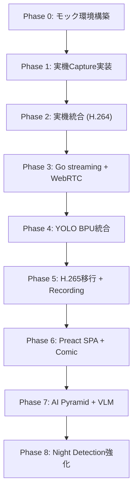

# 開発ロードマップとタスク管理

スマートペットカメラプロジェクトの開発計画とタスク管理

**最終更新**: 2026-03-25

---

## 全体計画

### 開発方針

1. **モック優先**: 実機なしでローカルPC上で全体システムを検証
2. **段階的実装**: 各フェーズで動作確認しながら価値を積み上げ
3. **疎結合設計**: 各モジュールを独立して開発・テスト可能
4. **早期評価環境**: Webモニター優先でモデル評価を早期実現

### フェーズ構成

全フェーズ完了済み。現在は継続的改善フェーズ。

---

## Phase 0: モック環境構築

**完了日**: 2025-12-19

- MockSharedMemory、MockCamera、MockDetector実装
- Flask + MJPEGストリーミング (Phase 0のみ、後にGo web_monitorへ移行)
- 全モジュール統合起動 (`src/mock/main.py`)
- 実行: `uv run src/mock/main.py --detection-prob 0.7`

---

## Phase 1: 実機Captureデーモン化

**完了日**: 2025-12-20

- D-Robotics ネイティブAPI (libcam.so/libvpf.so → 後にhbn_vflow APIへ移行)
- POSIX共有メモリ (shm_open/mmap) + atomic操作
- ダミー検出デーモン (`mock_detector_daemon.py`)
- WebMonitorでBBox合成映像配信

---

## Phase 2: H.264カメラスイッチャー

**完了日**: 2025-12-24

- NV12+H.264デュアルフォーマット生成
- 6箇所の共有メモリ構成確立
- 昼夜カメラ切替 (明るさベース、ブラックアウトなし)

---

## Phase 3: Go Streaming Server + WebRTC

**完了日**: 2025-12-26

- Go streaming server実装 (pion/webrtc)、H.264パススルー
- WebRTCシグナリング + MJPEGフォールバック
- :8081 (WebRTC) + :8080 (web_monitor) 2ポート構成

---

## Phase 4: YOLO BPU統合

**完了日**: 2026-01-28

- BPUプロファイリングにより yolov13n (45.5ms) → yolo11n (8.9ms) へ切替 (5.1x高速化)
- Night camera ROI検出 (1280x720 → 3 ROI 640x640、50%オーバーラップ、~22fps)
- BPUシングルコア確定、Python API オーバーヘッド <1ms
- 詳細: `docs/detection-and-yolo.md`

---

## Phase 5: H.265移行 + Recording

**完了日**: 2026-03-21 (H.265) / 2026-02-04 (Recording)

### H.265移行 (HW offload Phase 1)
- hb_mm_mc VPUエンコーダ (600kbps default / 700kbps hard limit, CBR)
- pion/webrtc v4 H.265パススルー (VPS/SPS/PPS caching)
- Camera switch warmup: 15フレーム (GOP=14でkeyframe保証)
- 詳細: `docs/hw-offload-roadmap.md`

### Recording
- H.265 NALキャプチャ → .hevc → ffmpeg -c copy → .mp4
- Heartbeat 3s timeout、最大30分
- サムネイル自動生成
- 詳細: `docs/recording-design.md`

---

## Phase 6: Preact SPA + Comic Capture

**完了日**: 2026-03-21

### Preact SPA
- Flask/HTML → Preact + Bun に完全移行
- WebRTC/MJPEG切替、BBoxオーバーレイ、録画UI、モバイル対応
- SSEによる検出データ/ヒートマップリアルタイムプッシュ (10fps)
- 詳細: `src/web/CLAUDE.md`

### Comic Capture
- 5秒検出ウィンドウ → 4パネル 400x225 (16:9) 自動生成
- レート制限: 3枚/5分
- アルバムギャラリーUI (Sidebar)

---

## Phase 7: AI Pyramid + VLM

**完了日**: 2026-03-22

- AI Pyramid Pro (Axera AX8850) 上のRust実装 (axum + rusqlite)
- VLM: Qwen3-VL-2B-Instruct (axllm serve、9.2 tok/s)
- pet_id: HSVカラー分析 (Go bbox色分類 → filename)、VLMはchatora biasで不採用
- VLM用途: is_valid判定、キャプション生成、行動解析
- Comic → rsync → AI Pyramid ingest → VLM → アルバムUI
- iframe埋め込みでRDK X5 Preact SPAと連携
- GitHub Actions aarch64自動ビルド
- 詳細: `src/ai-pyramid/CLAUDE.md`, `docs/pet-album-spec.md`

---

## Phase 8: Night Detection強化 + 継続改善

**完了日**: 2026-03-24 (night detection) / 継続中

### Night Detection
- Motion-guided focus crop + base reference image
- base_diff ヒートマップオーバーレイ (軌跡キャンバス)
- Go server側base_diff API (HTTPS mixed content対策)

### 継続改善 (2026-03-24〜25)
- Day camera motion detection for comic crop改善
- pet_id multi-feature classification with confidence scoring
- Detection backfill (rdk-x5 /detect API)
- EventDetail UI redesign (pet_id/status/behavior editing)
- color_metrics JSON + edit_history for feedback loop
- Heatmap SSE push (polling → SSE、10fps)

---

## 未実装 / 計画中

| 項目 | 状態 | 参照 |
|------|------|------|
| JSONイベント記録 | スキーマ定義済み、コード未実装 | `docs/02_requirements.md` FR-04 |
| 統一YAML設定ファイル | パラメータはハードコード | — |
| プロセス自動復旧 / ストレージクリーンアップ | 未実装 | NFR-02-01 |
| マルチカメラ融合モード | 未実装 | — |
| HW offload Phase 2 | 計画化済み | `docs/hw-offload-roadmap.md` |

---

## マイルストーン

| Phase | 目標 | 完了日 | ステータス |
|-------|------|--------|-----------|
| Phase 0 | モック環境構築 | 2025-12-19 | 完了 |
| Phase 1 | 実機Capture + BBox | 2025-12-20 | 完了 |
| Phase 2 | H.264カメラスイッチャー | 2025-12-24 | 完了 |
| Phase 3 | Go streaming + WebRTC | 2025-12-26 | 完了 |
| Phase 4 | YOLO BPU統合 (v11n 8.9ms) | 2026-01-28 | 完了 |
| Phase 5 | H.265移行 + Recording | 2026-03-21 | 完了 |
| Phase 6 | Preact SPA + Comic | 2026-03-21 | 完了 |
| Phase 7 | AI Pyramid + VLM | 2026-03-22 | 完了 |
| Phase 8 | Night Detection強化 | 2026-03-24 | 完了 |
| — | HW offload Phase 2 | TBD | 計画化済み |

---

## リスクと対策

### 解決済み

| リスク | 結果 |
|--------|------|
| 検出モデルの精度/速度 | YOLOv11n 8.9ms BPU推論で解決 |
| 推論レイテンシー | BPU INT8で十分な速度達成 |
| 共有メモリのパフォーマンス | Zero-copy SHMで問題なし |
| VLM pet_id精度 | chatora biasのためHSVカラー分析に切替 |

### 残存

| リスク | 影響度 | 対策 |
|--------|--------|------|
| プロセス自動復旧なし | 中 | systemd watchdog検討 |
| ストレージ管理なし | 中 | 自動削除ポリシー未実装 |
| 統一設定ファイルなし | 低 | パラメータ分散 (C/Python/Go/Rust) |

---

## 変更履歴

- 2026-03-25: **Heatmap SSE + pet_id feedback loop** (PR #135-137)
  - Heatmap polling → SSE push (10fps)
  - color_metrics JSON + edit_history for pet_id feedback loop
  - EventDetail UI redesign (pet_id/status/behavior editing)

- 2026-03-24: **Night detection + Day motion + Pet ID** (PR #118, #120, #130)
  - Night: motion-guided focus crop + base_diff heatmap
  - Day: motion detection for comic crop改善
  - pet_id: multi-feature classification with confidence scoring

- 2026-03-22: **AI Pyramid + VLM integration** (PR #56-116)
  - Rust実装 (axum + rusqlite) on AX8850
  - Qwen3-VL-2B axllm serve (9.2 tok/s)
  - pet_id HSVカラー分析、iframe UI、rsync sync
  - standalone album UI with sidebar/search/pagination

- 2026-03-21: **H.265移行 + Preact SPA + Comic** (PR #45-54)
  - H.265 hb_mm_mc encoder + pion/webrtc v4
  - Preact + Bun migration (Flask/HTML全廃)
  - 4-panel comic capture + album gallery
  - docs大整理 (47docs → 7カテゴリ)

- 2026-02-04: **Recording pipeline + MJPEG improvements** (PR #34-42)
  - H.265 NAL → .hevc → .mp4 recording
  - Heartbeat/max duration safeguards
  - Thumbnail auto-generation
  - HW JPEG encoder for MJPEG 30fps

- 2026-01-28: **YOLO検出改善 Phase 0-1** (PR #29-30)
  - yolov13n (45.5ms) → yolo11n (8.9ms) 切替
  - Night camera ROI detection (3 ROI round-robin ~22fps)
  - BPUシングルコア確定
