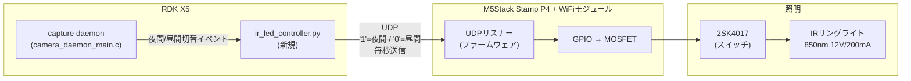
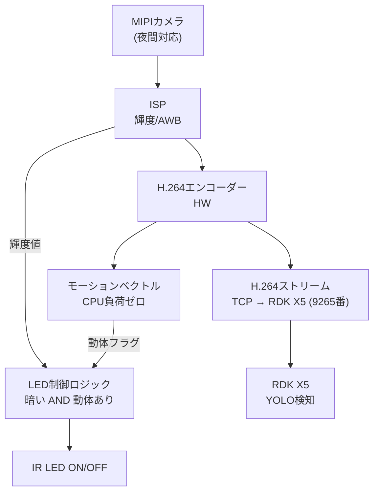
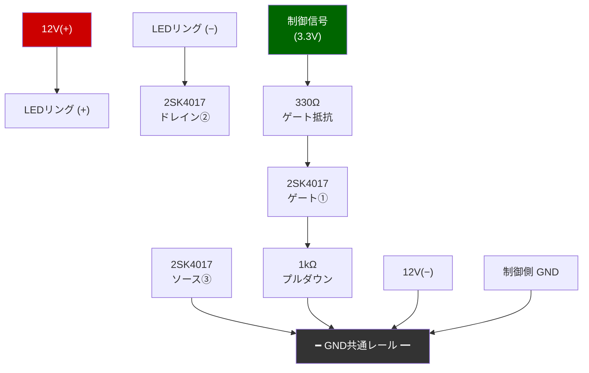

# IR LEDコントローラー設計書

夜間カメラ補助用 850nm IRリングライトのコントロール基板設計と、RDK X5との連携仕様。

**最終更新**: 2026-04-11

---

## 全体構成

MIPIカメラの有無で2つの構成がある。

### Phase 1〜2: UDPによる外部制御（MIPIカメラなし）



### Phase 4: 自律制御（MIPIカメラあり）

MIPIカメラが届いたらRDK X5との通信なしで自律制御に移行できる。  
H.264エンコーダーが**CPU負荷ゼロでモーションベクトルを出力**するため、YOLOなしで動体検知が可能。



LED点灯条件の段階的な発展:

| ステップ | 条件 | 実装難易度 |
|----------|------|-----------|
| ① 輝度のみ | ISP輝度 < 閾値 | 低 |
| ② 輝度 + 動体 | 暗い AND モーションベクトルあり | 低（HWが出力） |
| ③ ペット検知 | YOLO-tinyで動物クラス検出（将来） | 高 |

---

## フェーズ分割

### Phase 1: ハードウェア組み立て（ブレッドボード）

**難易度**: 低  
**作業時間**: 1〜2時間  
**ゴール**: 12Vを手動でスイッチしてLEDが点灯することを確認する

#### 部品リスト

| 部品 | 型番 | 数量 | 入手先 | 用途 |
|------|------|------|--------|------|
| IR LEDリングライト | FRS5CC (850nm) | 1 | 秋月 | 夜間照明 |
| NchパワーMOSFET | 2SK4017 | 1 | 秋月 | IRリングライトスイッチ |
| 2ch H-ブリッジ | **L9110S** | 1 | 秋月 | IR-CUTソレノイド駆動 |
| カーボン抵抗 330Ω | 手持ち | 1 | — | MOSFETゲート抵抗 |
| カーボン抵抗 1kΩ | 手持ち | 1 | — | MOSFETプルダウン |
| JST PHコネクターケーブル 2P | — | 1 | 秋月 | LEDリング接続 |
| ブレッドボード | 手持ち | 1 | — | — |
| 12V電源 | 手持ち | 1 | — | — |
| ジャンパーワイヤ | 手持ち | 適量 | — | — |

> **注**: L9110SはLDR自動制御のないモジュールか、LDRをバイパスした場合に必要。モジュール到着後に要確認。

#### 回路図



**2SK4017 ピン配置（TO-220、正面から見てタブが上）**

```
①Gate  ②Drain  ③Source
```

#### Phase 1 確認手順

1. 回路を組む（制御信号ピンはまだどこにも繋がない）
2. 12V電源を入れる → LEDが点灯しないことを確認（プルダウンでOFF状態）
3. 制御信号ピンを **3.3Vに直接繋ぐ** → LEDが点灯することを確認
4. GNDに戻す → 消灯することを確認

> **注意**: LEDのPHコネクターは赤が(+)、黒が(−)。逆接すると壊れるので最初に極性確認。

---

### Phase 2: M5Stamp P4 ファームウェア

**難易度**: 中  
**作業時間**: 半日〜1日  
**ゴール**: WiFi経由でUDPパケットを受け取ってGPIOをON/OFFする

#### 技術選定

M5Stack Stamp P4はESP32-P4ベース。ESP32-P4はWiFiを内蔵していないため、WiFiモジュールが別途必要（M5Stack公式のWiFiモジュールを使う想定）。

**ファームウェア言語**

ESP-IDF v5.3以降が全ハードウェアブロック（H.264, MIPI-CSI, PIE）をサポートしている。  
MicroPythonのESP32-P4対応は限定的なため、**ESP-IDF (C/C++)** を使う。

M5Stackの公式WiFiモジュールは**ESP32-C6**ベースの可能性が高い。  
P4とC6はUARTまたはSPIで通信するESP-AT構成、またはM5Stack独自のコプロセッサー構成になると想定。

#### 通信プロトコル: UDP

RDK X5が1秒ごとに現在のカメラモードを送り続ける（状態同期型）。  
パケットロスしても次の送信で回復するため、再送制御が不要。

```
送信内容: 1バイト
  "1" → 夜間モード → GPIO HIGH → LED点灯
  "0" → 昼間モード → GPIO LOW  → LED消灯

ポート: 5000（仮）
```

#### GPIO割り当て（Phase 2時点）

| GPIO | 用途 | 接続先 |
|------|------|--------|
| GPIO_A | IRリングライト ON/OFF | 330Ω → 2SK4017ゲート |
| GPIO_B | IR-CUT DAY方向パルス | L9110S IN_A |
| GPIO_C | IR-CUT NIGHT方向パルス | L9110S IN_B |

#### IR-CUT制御仕様

- ソレノイドは**5V駆動**（L9110SのVCC2に5Vを供給、3.3Vでは動作不安定）
- パルス幅: **100ms** → その後両ピンをLOWに戻す（連続通電で焼損）
- 起動時は必ずDAYパルスを1回出して既知状態にリセット

```
昼→夜: GPIO_C HIGH 100ms → LOW
夜→昼: GPIO_B HIGH 100ms → LOW
```

#### ファームウェアの実装（最小限）

実装すること:
- WiFi接続（SSID/パスワードをコードにハードコード or NVSに保存）
- UDPソケット受信ループ（ポート5000）
- 受信値でGPIO_A（IRリングライト）とIR-CUTを連動更新
- 起動時: IR-CUT DAYリセットパルス → LED OFF を初期状態とする
- タイムアウト監視: 一定時間パケットが来なければ昼間モードに戻す（安全策）

#### Phase 2 確認手順

1. Stamp P4にファームウェアを書き込む
2. WiFiに接続されることをシリアルモニターで確認
3. RDK X5から `echo -n "1" | nc -u <StampのIP> 5000` → LED点灯
4. `echo -n "0" | nc -u <StampのIP> 5000` → 消灯

---

### Phase 3: RDK X5との連携

**難易度**: 低  
**作業時間**: 2〜3時間  
**ゴール**: カメラが夜間モードに切り替わると自動でLEDが点灯する

#### 連携ポイント

夜間/昼間の切り替えは `src/capture/camera_daemon_main.c` が管理している。
切り替わりのタイミング（L83〜98付近）:

```c
// 昼→夜
g_active_camera = 1;
camera_switcher_notify_active_camera(..., CAMERA_MODE_NIGHT, ...);

// 夜→昼
g_active_camera = 0;
camera_switcher_notify_active_camera(..., CAMERA_MODE_DAY, ...);
```

C側に直接UDP送信を追加するのは複雑なので、**Pythonスクリプトが定期的にSHMを監視してモードを判断し、UDPを送り続ける**方式を採用する。

#### 新規ファイル: `src/ir_led/controller.py`

仕様:
- SHMを監視してカメラモードを輝度しきい値で判断（capture daemonと同じ閾値: 昼→夜50、夜→昼60）
- 1秒ごとに現在状態（`"1"` or `"0"`）をUDPで送信し続ける
- M5StampのIPと送信先ポートは環境変数で指定

```python
# 概要イメージ（実装時に詳細化）
import socket, time
sock = socket.socket(socket.AF_INET, socket.SOCK_DGRAM)
while True:
    mode = read_camera_mode_from_shm()  # 0=昼, 1=夜
    sock.sendto(str(mode).encode(), (STAMP_IP, STAMP_PORT))
    time.sleep(1)
```

#### systemdサービス

`deploy/rdk-x5/pet-camera-ir-led.service` として追加。  
`pet-camera.target` の `WantedBy` に含める。

#### Phase 3 確認手順

1. `controller.py` を手動実行
2. カメラを手で暗くして夜間モードに切り替わることを確認
3. 自動でLEDが点灯することを確認
4. 明るくして昼間モードに戻ると消灯することを確認
5. systemdサービスとして登録して自動起動確認

---

## フェーズ一覧

| フェーズ | 内容 | 前提 |
|----------|------|------|
| Phase 1 | ブレッドボード回路（手動ON/OFF確認） | 部品調達済み |
| Phase 2 | Stamp P4ファームウェア + UDP制御 | Stamp P4 + WiFiモジュール |
| Phase 3 | RDK X5との自動連携（SHM監視） | Phase 2完了 |
| Phase 4 | MIPIカメラ自律制御（輝度 + 動体） | MIPIカメラ到着後 |
| Phase 5 | 第2カメラノード（H.264 → RDK X5） | Phase 4完了 |

## 未決事項

- [ ] WiFiモジュール型番確定（ESP32-C6ベースか確認）
- [ ] Stamp P4のGPIOピン番号確定（ピン配置図要確認）
- [ ] LEDの固定方法・設置場所
- [ ] M5StampのIPアドレス固定方法（DHCPスタティック割り当てまたはmDNS）
- [ ] OV5647モジュール到着後: LDR有無 / IR-CUTコネクター形状確認
- [ ] LDR自動制御の場合: LDRバイパス（デソルダーまたはジャンパー）
- [ ] MIPIカメラのISPドライバ対応確認（OV5647は`libov5647.so`が存在、ただしP4向け）
- [ ] Phase 4移行時にRDK X5側のUDP送信コードを削除
