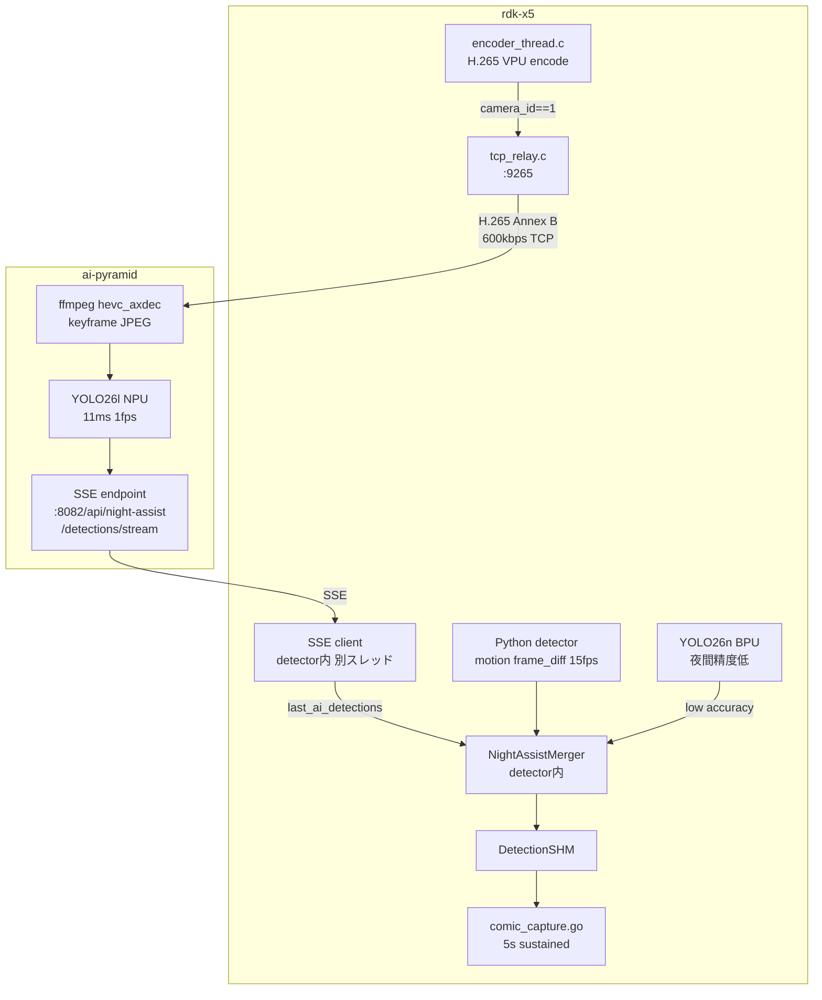

# Night Assist — 夜間補助検出仕様書

ai-pyramid (AX650 NPU, YOLO26l) を rdk-x5 の夜間補助検出器として活用し、
IR映像でのcomic生成漏れを防ぐ。

## 背景

- rdk-x5 の YOLO26n (BPU) は夜間IR映像で検出率が低い
- ai-pyramid の YOLO26l (AX650 NPU) は夜間IRで ~100% 検出可能（実験済み）
- comic capture は DetectionSHM に 5秒間持続検出が必要

## アーキテクチャ



### 設計判断

| 選択 | 理由 |
|------|------|
| H.265 TCP (not MJPEG) | MJPEGはオーバーレイ焼込済でYOLO不適。H.265は600kbps (MJPEG比1/25) |
| C実装TCP relay (not Go) | encoder_thread内でVPUバッファ直接write。追加memcpyゼロ |
| SSE (not HTTP POST) | 持続接続。検出頻度変更に透過的に対応 |
| カメラモード通知なし | TCP relay が camera_id==1 のみ送出。フレーム到着=night, 停止=day |
| 全キーフレームYOLO | 1fps x 11ms = NPU 1.1%。シンプルで確実 |
| Python detector内で購読 | motion bboxはSHM外 (detector内メモリのみ)。マージにはdetector内部にいる必要 |
| class_name区別なし | ai-pyramid検出も "cat" そのまま。DetectionEntry変更不要 |

---

## 1. H.265 TCP Relay (rdk-x5, C実装)

### 仕様

| 項目 | 値 |
|------|---|
| フォーマット | H.265 Annex B (start code delimited NAL units) |
| ビットレート | 600 kbps (CBR) |
| 解像度 | 1280x720 |
| FPS | 30 |
| GOP | 30 (IDR 1回/秒) |
| IDR NAL type | 19 (IDR_W_RADL), 20 (IDR_NLP) |
| VPS/SPS/PPS | NAL type 32/33/34、IDR と共に送��� |
| ポート | TCP 9265 (plain, single client) |

### 実装: `src/capture/tcp_relay.h`

```c
#ifndef TCP_RELAY_H
#define TCP_RELAY_H

#include <pthread.h>
#include <stdbool.h>
#include <stdint.h>

typedef struct {
    int listen_fd;
    int client_fd;       // single client (ai-pyramid)
    pthread_mutex_t mu;
    bool active;
} TcpRelay;

// Create relay server (bind + listen, non-blocking accept)
TcpRelay* tcp_relay_create(int port);

// Destroy relay server
void tcp_relay_destroy(TcpRelay* r);

// Send frame data to connected client (non-blocking)
// Called from encoder_thread worker — must not block encoding
void tcp_relay_send(TcpRelay* r, const void* data, uint32_t size);

#endif // TCP_RELAY_H
```

### 実装: `src/capture/tcp_relay.c` (~100行)

```c
#include "tcp_relay.h"
#include "logger.h"
#include <stdlib.h>
#include <string.h>
#include <unistd.h>
#include <errno.h>
#include <fcntl.h>
#include <sys/socket.h>
#include <netinet/in.h>
#include <netinet/tcp.h>
#include <poll.h>

TcpRelay* tcp_relay_create(int port) {
    int fd = socket(AF_INET, SOCK_STREAM, 0);
    if (fd < 0) return NULL;

    int opt = 1;
    setsockopt(fd, SOL_SOCKET, SO_REUSEADDR, &opt, sizeof(opt));

    struct sockaddr_in addr = {
        .sin_family = AF_INET,
        .sin_port = htons(port),
        .sin_addr.s_addr = INADDR_ANY,
    };

    if (bind(fd, (struct sockaddr*)&addr, sizeof(addr)) < 0 ||
        listen(fd, 1) < 0) {
        close(fd);
        return NULL;
    }

    // Non-blocking accept
    fcntl(fd, F_SETFL, fcntl(fd, F_GETFL) | O_NONBLOCK);

    TcpRelay* r = calloc(1, sizeof(TcpRelay));
    r->listen_fd = fd;
    r->client_fd = -1;
    pthread_mutex_init(&r->mu, NULL);
    r->active = true;

    LOG_INFO("TcpRelay", "Listening on port %d", port);
    return r;
}

void tcp_relay_destroy(TcpRelay* r) {
    if (!r) return;
    r->active = false;
    if (r->client_fd >= 0) close(r->client_fd);
    if (r->listen_fd >= 0) close(r->listen_fd);
    pthread_mutex_destroy(&r->mu);
    free(r);
}

void tcp_relay_send(TcpRelay* r, const void* data, uint32_t size) {
    if (!r || !r->active || !data || size == 0) return;

    pthread_mutex_lock(&r->mu);

    // Try non-blocking accept on each send
    if (r->client_fd < 0) {
        int cfd = accept(r->listen_fd, NULL, NULL);
        if (cfd >= 0) {
            // Disable Nagle for low latency
            int opt = 1;
            setsockopt(cfd, IPPROTO_TCP, TCP_NODELAY, &opt, sizeof(opt));
            r->client_fd = cfd;
            LOG_INFO("TcpRelay", "Client connected (fd=%d)", cfd);
        }
    }

    if (r->client_fd >= 0) {
        // Non-blocking write — drop frame on EAGAIN/EWOULDBLOCK
        ssize_t written = write(r->client_fd, data, size);
        if (written < 0 && errno != EAGAIN && errno != EWOULDBLOCK) {
            LOG_INFO("TcpRelay", "Client disconnected: %s", strerror(errno));
            close(r->client_fd);
            r->client_fd = -1;
        }
    }

    pthread_mutex_unlock(&r->mu);
}
```

### 組込み

#### `encoder_thread.h` に追加

```c
// encoder_thread_t 構造体に追加:
#include "tcp_relay.h"
// ...
TcpRelay *tcp_relay;  // NULL if disabled
```

#### `encoder_thread.c` line 69 の後に挿入

```c
// TCP relay: night camera frames only, direct VPU buffer write
if (ctx->tcp_relay && frame->camera_id == 1) {
    tcp_relay_send(ctx->tcp_relay, enc_out.vir_ptr, enc_out.data_size);
}
```

**ポイント**:
- `enc_out.vir_ptr` を直接 `write()` — 追加 memcpy ゼロ
- `frame->camera_id == 1` の���送出 (day時はパイプライン非活性で到達しないが二重ガード)
- `tcp_relay_send()` は非ブロッキング: client未接続 or 書込失敗→即return

#### `camera_daemon_main.c` で初期化

```c
// TCP relay for night-assist (optional, port 9265)
TcpRelay *relay = tcp_relay_create(9265);
if (relay) {
    g_pipelines[1].encoder_thread.tcp_relay = relay;
    LOG_INFO("Main", "TCP relay enabled on port 9265");
}
```

---

## 2. ai-pyramid NightAssistWorker (Rust実装)

### 概要

H.265ストリームをffmpegでデコードし、キーフレームごとにYOLO26l推論、
結果をSSEで配信する。

### ffmpeg コマンド

```bash
ffmpeg -c:v hevc_axdec -f hevc -i tcp://<rdk-x5-host>:9265 \
  -vf "select=eq(pict_type\,I)" -vsync 0 \
  -f image2pipe -vcodec mjpeg -q:v 2 pipe:1
```

- `hevc_axdec`: AXERA HW decoder (VPU)
- `select=eq(pict_type,I)`: キーフレームのみ (1fps @ GOP=30)
- `image2pipe` + `mjpeg`: stdout に JPEG ストリーム出力

### 検出ループ

```
loop:
  1. ffmpeg stdout から最新JPEG読み取り (tokio::sync::watch)
  2. /tmp/night_assist_frame.jpg に書き出し
  3. npu_semaphore.try_acquire() → 失敗(VLM実行中)ならスキップ
  4. LocalDetector::detect_image() → YOLO26l (~11ms)
  5. 6クラスフィルタ適用 (cat, person, cup, food_bowl, chair)
  6. broadcast::send(NightAssistDetection)
  7. 次のキーフレーム到着を待つ
```

### 状態管理

- フレーム到着中 = night mode active → YOLO実行
- 3秒間フレームなし = day mode → idle (NPU解放)
- ffmpegプロセス死亡 → 自動再起動 (backoff: 5s → 30s)
- TCP接続失敗 → 自動再接続 (同backoff)

### SSE エンドポイント

```
GET /api/night-assist/detections/stream
Content-Type: text/event-stream
```

#### detection イベント

```json
{
  "detections": [
    {
      "class_name": "cat",
      "confidence": 0.87,
      "bbox": {"x": 340, "y": 180, "w": 200, "h": 150}
    }
  ],
  "source_width": 1280,
  "source_height": 720,
  "timestamp": 1711785600.123
}
```

#### heartbeat イベント

```json
{"status": "active", "fps": 1.0}
```

heartbeat は 10秒間隔。SSE接続維持 + 状態監視用。

### class_name フィルタ

rdk-x5 の DetectionClass 6種に限定:

| class_name | COCO ID | 備考 |
|-----------|---------|------|
| cat | 15 | dog(16) は normalize_class で "cat" に変換済み |
| person | 0 | |
| cup | 41 | |
| food_bowl | 45 | COCO "bowl" |
| chair | 56 | |

### 変更ファイル

| ファイル | 変更 |
|---------|------|
| `src/ai-pyramid/src/night_assist/mod.rs` | **新規**: worker + ffmpeg + YOLO + SSE |
| `src/ai-pyramid/src/lib.rs` | `pub mod night_assist;` |
| `src/ai-pyramid/src/main.rs` | CLI引数 (`--rdk-x5-host`), worker spawn |
| `src/ai-pyramid/src/application/context.rs` | `vlm_semaphore` → `npu_semaphore` rename |
| `src/ai-pyramid/src/server/mod.rs` | SSE route追加 |

---

## 3. Python Detector SSE購読 + マージ (rdk-x5)

### 概要

`yolo_detector_daemon.py` 内に `NightAssistMerger` クラスを追加。
別スレッドで ai-pyramid の SSE を購読し、メインループで motion bbox とマージ。

### NightAssistMerger

```python
class NightAssistMerger:
    """ai-pyramid SSE検出 + local motion をマージ"""

    AI_MAX_AGE = 45   # 1.5秒 @30fps
    IOU_THRESH = 0.15  # 緩い空間一致閾値

    def __init__(self, ai_pyramid_url: str):
        self.last_ai_detections = []  # thread-safe via GIL
        self.ai_detection_age = 0
        self._thread = threading.Thread(target=self._sse_loop, daemon=True)
        self._thread.start()

    def _sse_loop(self):
        """別スレッドで SSE 購読。urllib のみ使用 (依存追加なし)"""
        while True:
            try:
                req = urllib.request.Request(
                    f"{self.url}/api/night-assist/detections/stream",
                    headers={"Accept": "text/event-stream"},
                )
                with urllib.request.urlopen(req, timeout=30) as resp:
                    for line in resp:
                        line = line.decode().strip()
                        if line.startswith("data:"):
                            data = json.loads(line[5:])
                            if "detections" in data:
                                self.last_ai_detections = data["detections"]
                                self.ai_detection_age = 0
            except Exception:
                time.sleep(5)  # reconnect backoff

    def merge(self, motion_bboxes, local_yolo_results):
        """毎フレーム呼び出し。マージ検出を返す"""
        self.ai_detection_age += 1

        # 1. ローカルYOLOがpet検出 → そのまま (従来通り)
        if any(d["class_name"] in ("cat", "dog", "person")
               for d in local_yolo_results):
            return local_yolo_results

        # 2. ai-pyramid検出 + motion bbox 空間一致 → 合成
        if self.ai_detection_age < self.AI_MAX_AGE and motion_bboxes:
            for ai_det in self.last_ai_detections:
                ai_bbox = ai_det["bbox"]
                for m_bbox in motion_bboxes:
                    if iou(ai_bbox, m_bbox) > self.IOU_THRESH:
                        return [{
                            "class_name": ai_det["class_name"],
                            "confidence": ai_det["confidence"] * 0.9,
                            "bbox": m_bbox,  # motionの方が位置が新鮮
                        }]

        # 3. ai-pyramid検出のみ (0.5秒以内) → そのまま通す
        if self.ai_detection_age < 15:
            return self.last_ai_detections

        # 4. 検出なし
        return []
```

### マージ戦略

| 優先度 | 条件 | 動作 | 根拠 |
|-------|------|------|------|
| 1 | ローカルYOLOがpet検出 | そのまま使用 | 稀に夜間でも検出可能。レイテンシ最小 |
| 2 | ai-pyramid + motion IoU一致 | motion bboxでai-pyramidラベルを使用 | 「catがいる」+「動いている」= 高確度 |
| 3 | ai-pyramidのみ (0.5s以内) | ai-pyramid結果をそのまま使用 | 静止中のcatにも対応 |
| 4 | いずれも該当しない | 空リスト | ai-pyramid結果が古すぎる |

### 挿入点

`_run_night_iteration()` 内、既存の `detection_writer.write_detection_result()` 直前:

```python
merged = self.night_assist_merger.merge(motion_bboxes, scaled_dicts)
if merged:
    scaled_dicts = merged

self.detection_writer.write_detection_result(
    frame_number=self.cache_frame_number,
    timestamp_sec=self.cache_timestamp,
    detections=[_det_to_dict(d) for d in scaled_dicts],
)
```

### 依存

追加なし。`urllib.request` + `json` (stdlib) のみ使用。

---

## 4. NPU/VPU 競合

| リソース | 用途 | 排他制御 |
|---------|------|---------|
| VPU (ai-pyramid) | hevc_axdec (ffmpeg) | なし (NPUと独立) |
| NPU (ai-pyramid) | YOLO26l (ax_yolo_run) | npu_semaphore (permits=1) |
| NPU (ai-pyramid) | VLM (axllm serve) | npu_semaphore (permits=1) |

VPU と NPU は別ハードウェアユニットのため並行動作可能。
NPU は npu_semaphore で排他制御済み (YOLO実行中はVLMスキップ、逆も同様)。

---

## 検証手順

### 単体テスト

```bash
# ai-pyramid
cd src/ai-pyramid && cargo check && cargo clippy && cargo test

# ffmpeg decode テスト (実機)
ffmpeg -c:v hevc_axdec -f hevc -i tcp://rdk-x5:9265 \
  -vf "select=eq(pict_type\,I)" -frames:v 1 /tmp/test_night.jpg
```

### 結合テスト (夜間)

1. 夜間カメラ切替 → rdk-x5 TCP relay フレーム送出確認
2. ai-pyramid ffmpeg 接続 → JPEG decode 確認
3. YOLO26l 推論 → SSE 配信確認
4. Python detector SSE 受信 → motion マージ → DetectionSHM 書込
5. comic_capture 5秒持続検出 → comic 自動生成
