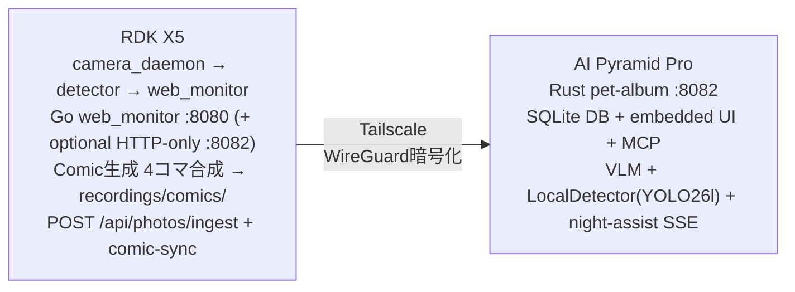
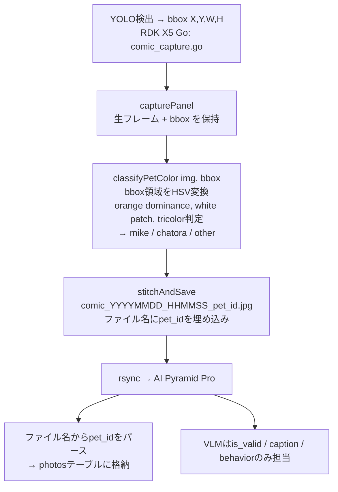
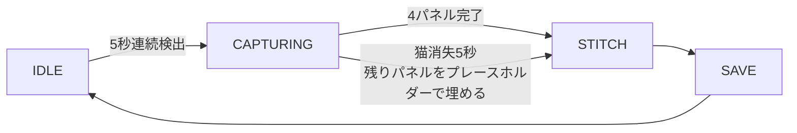
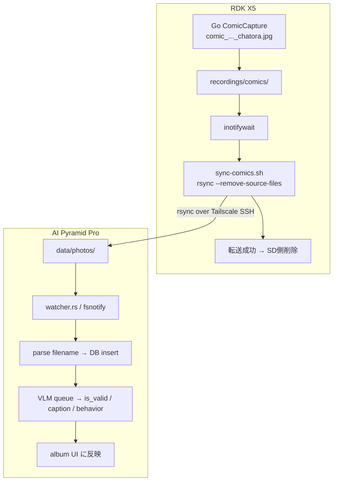
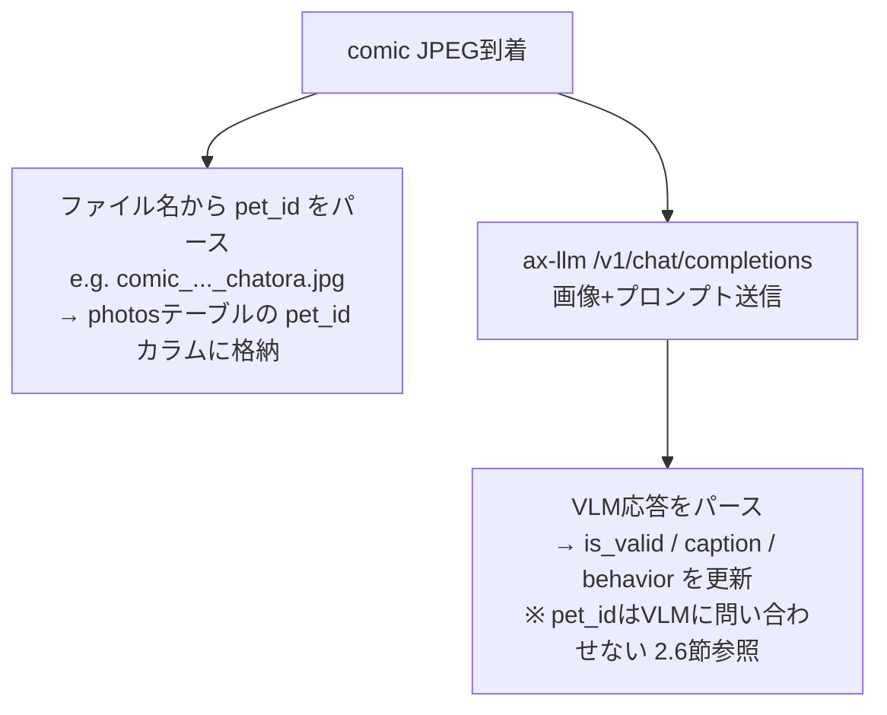

# ペットアルバム機能 設計書

**Status**: 実装追随版
**Date**: 2026-03-30

---

## 1. 概要

RDK X5 側で 4 コマ comic を生成し、ai-pyramid 側で ingest・VLM・再検出・MCP を担うアルバムシステム。設計よりコードが先行しているため、本書は現行実装を要約した運用仕様とする。

### 1.1 コンポーネント構成



### 1.2 データフロー

```
[生成フロー]
YOLO/DetectionSHM で 5 秒連続 pet 検出
  → Go `ComicCapture` が comic 生成
  → `/recordings/comics` に保存
  → `POST /api/photos/ingest` で detection metadata を送信
  → `comic-sync.service` が JPEG を rsync

[配信フロー]
Browser
  └─ https://<camera-host>:8080
       ├─ Preact SPA（映像・YOLO検出・軌跡）
       └─ <iframe src="https://<album-host>:8082/app">
            └─ AI Pyramid Proが完全にレンダリングしたアルバムUI
                ├─ 写真一覧（フィルタ・キャプション表示）
                ├─ detection / behavior / pet_id 編集
                └─ 統計・backfill・night assist
```

### 1.3 設計方針

| 方針 | 決定 | 理由 |
|------|------|------|
| フロントエンド | iframe（AI Pyramid ProがHTMLを配信） | AI Pyramid Pro単体で開発・テスト可能 |
| データ配信 | AI Pyramid Proから直接（CSR） | Go ServerのProxy不要、責務分離 |
| HTTPS | Tailscale証明書（両デバイス） | Mixed Content回避、セキュリティ |
| DB配置 | AI Pyramid Pro側SQLite (eMMC) | SD寿命保護、信頼性、速度 |
| 写真同期 | inotify + rsync | サーバー外で完結、転送確認+削除が安全 |
| メタデータ | AI Pyramid Proに完全委任 | Single source of truth |
| リポジトリ | 同一リポジトリ (`src/ai-pyramid/`) | 設計書・型定義を一元管理 |
| Mock | 新規開発不要 | 既存mock + サンプルJPEGで十分 |

---

## 2. AI Pyramid Pro デバイス環境

### 2.1 ハードウェアスペック

| 項目 | 値 | 備考 |
|------|-----|------|
| デバイス | M5Stack AI Pyramid Pro | 8GB版、グレー筐体 |
| SoC | Axera AX8850 (内部: AX650C_CHIP) | ボードID: AX650N_M5stack_8G |
| CPU | 8× ARM Cortex-A55 @ 1500MHz | ARMv8.2-A, NEON/FP16/DotProd対応 |
| NPU | 24 TOPS @ INT8 | 第5世代、Transformer最適化アーキテクチャ |
| メモリ合計 | 8GB LPDDR4x (4266Mbps) | — |
| → System RAM | **2GB** | OS・アプリ・Webサーバー用 |
| → CMM (HWアクセラレーション) | **6GB** | NPU推論・ビデオエンコード/デコード用 |
| ストレージ | 32GB eMMC 5.1 + microSDスロット | DB・画像はeMMCに配置 |
| Ethernet | 2× Gigabit Ethernet | デュアルポート |
| USB | 4× USB-A 3.0 + 2× USB-C (Host + PD 3.0 100W) | — |
| HDMI | 2× HDMI 2.0 (1入力 + 1出力) | 4K@60fps、Pro固有のHDMI入力 |
| ビデオエンジン | 8K@30fps H.264/H.265 エンコード/デコード | 16ch 1080p並列デコード |
| オーディオ | ES8311コーデック + ES7210 4マイクアレイ + スピーカー | — |
| OLED | SSD1306 (128×32) | ステータス表示用 |
| 電源 | PD入力 DC 9V@3A (27W) | — |
| サイズ / 重量 | 114.5×105.0×62.0mm / 194.9g | — |

### 2.2 メモリアーキテクチャの制約

```
8GB LPDDR4x 合計
├── System RAM: 2GB ← OS, Webサーバー, SQLite, Python/Go プロセス
└── CMM (Contiguous Memory Manager): 6GB ← NPU推論, VENC/VDEC, IVPS
```

**設計上の影響:**
- Webサーバー + SQLite + VLM前処理/tokenizer は **System 2GB** に収める必要がある
- VLMモデルウェイト自体はCMM経由でNPUにロードされるため6GB側を使用
- Go/Pythonのプロセスメモリを最小化する設計が必須
- 大量画像のインメモリ処理は避け、ストリーミング/ディスクベースで処理

### 2.3 ソフトウェア環境

| 項目 | 値 |
|------|-----|
| OS | Linux (Debian系, aarch64) |
| SDK | Axera SDK V3.6.4 |
| NPUエンジン | AX_ENGINE v2.12.0s |
| NPU推論モード | VIRTUAL_NPU_DISABLE |
| Python | Python 3 + PyTorch 2.10.0+cpu (aarch64) |
| NPU Python API | PyAXEngine (cffi, ONNXRuntime互換) |
| LLM/VLMフレームワーク | ax-llm (OpenAI API互換サーバー) |
| モデル形式 | `.axmodel` (Pulsar2 v4.1+ でコンパイル) |
| ライブラリパス | `/soc/lib/` (libax_engine.so, libax_ivps.so 等34モジュール) |
| コンパイラ | GCC aarch64, `-O3 -march=armv8.2-a+fp16+dotprod` |
| MAU | 利用不可 (AX650Cバリアントでは非搭載) |

### 2.4 VLMモデル選定

**方針**: Qwen3.5世代を目標とし、AXERA-TECH公式axmodelの提供状況に応じて段階的に移行する。

#### 現行候補（AXERA-TECH HuggingFace でaxmodel提供済み）

| モデル | 量子化 | サイズ目安 | 特徴 |
|--------|--------|-----------|------|
| **Qwen3-VL-2B-Instruct** | GPTQ-Int4 (w4a16) | ~1.5GB | 軽量、System 2GB制約と最も相性が良い |
| **Qwen3-VL-4B-Instruct** | GPTQ-Int4 (w4a16) | ~2.5GB | 高精度、メモリ余裕があれば推奨 |
| Qwen3-VL-8B-Instruct | GPTQ-Int4 (w4a16) | ~5GB | 最高精度だがメモリ制約で要検証 |
| InternVL3.5-1B | GPTQ-Int4 | ~1GB | 軽量代替 |

#### 目標（Qwen3.5世代 — Early-Fusion VLM）

Qwen3.5はLLM自体にVision Encoderが統合された**early-fusion**アーキテクチャ。
Qwen3-VLのような個別VLエンコーダ+LLMの分離構成ではなく、事前学習段階から
マルチモーダルトークンで統合訓練されている。

| モデル | パラメータ | アーキテクチャ | axmodel状態 |
|--------|-----------|--------------|-------------|
| **Qwen3.5-0.8B** | 0.8B (dense) | Gated DeltaNet + Attention hybrid, 24層 | 未提供 |
| **Qwen3.5-2B** | 2B (dense) | 同上 | 未提供 |
| **Qwen3.5-4B** | 4B (dense) | 同上, 32層 | 未提供 |

**Qwen3.5 アーキテクチャ特徴:**
- **Early Fusion**: Vision Encoder内蔵、テキスト・画像・動画をネイティブ処理
- **Gated Delta Networks**: 線形Attention（3層）+ 標準Attention（1層）のハイブリッド構成
- **262Kコンテキスト**: YaRN拡張で最大1Mトークン対応
- **201言語対応**: 日本語プロンプトに自然に対応
- **Multi-Token Prediction**: 推論高速化（speculative decoding対応）
- ONNX export対応確認済み（[onnx-community/Qwen3.5-0.8B-ONNX](https://huggingface.co/onnx-community/Qwen3.5-0.8B-ONNX)）

**axmodel変換の見通し:**

| 項目 | 状況 |
|------|------|
| AXERA公式axmodel | 2026-03-21時点で**未提供**（Qwen3-VLまで対応済み） |
| Pulsar2 LLM Build | `pulsar2 llm_build` でsafetensors→axmodel変換可能（実験段階） |
| 量子化オプション | w8a16 (s8), w4a16 (s4) をサポート |
| チップターゲット | `--chip AX650` |
| 変換の障壁 | Gated DeltaNet（線形Attention）がPulsar2で対応済みか**未検証** |
| ONNX経由 | ONNX exportは可能だが、LLM BuildはHuggingFace safetensorsを直接入力 |

**推奨パス:**
1. **Phase 2開始時**: Qwen3-VL-2B-Instruct (GPTQ-Int4) で実装・検証（axmodel提供済み）
2. **並行検証**: Qwen3.5-0.8B の `pulsar2 llm_build` 変換を試行
   - Gated DeltaNet対応が確認できればQwen3.5-2Bに移行
   - 非対応の場合、AXERA公式対応を待つ
3. **最終目標**: Qwen3.5-2B or 4B（early-fusionによるレイテンシ改善+画像理解精度向上）

#### デプロイ方式

M5Stack標準の `llm-openai-api` (systemd) が OpenAI互換APIを `localhost:8000` で提供。
`llm-vlm` / `llm-llm` / `llm-sys` が自動起動済み。

```
systemd services (自動起動)
  llm-sys       → バックエンド管理
  llm-llm       → LLM推論 + tokenizer (port 8080)
  llm-vlm       → VLM推論
  llm-openai-api → OpenAI互換API (port 8000)

Album/VLMサービス (Rust `pet-album`)
  ├── POST http://localhost:8000/v1/chat/completions
  │     model: "AXERA-TECH/Qwen3-VL-2B-Instruct-GPTQ-Int4-C256-P3584-CTX4095"
  │     画像: base64エンコードJPEG
  ├── JSON応答をパースして is_valid / caption / behavior を抽出
  └── SQLiteに保存
```

### 2.5 実機ベンチマーク（2026-03-21 実測）

#### テスト条件
- デバイス: M5Stack AI Pyramid Pro (AX650N_M5stack_8G)
- モデル: AXERA-TECH/Qwen3-VL-2B-Instruct-GPTQ-Int4-C256-P3584-CTX4095
- API: llm-openai-api (localhost:8000)
- max_tokens: 100-128

#### 応答時間

| 画像サイズ | max_tokens | 応答時間 |
|-----------|-----------|---------|
| ~2 MB | 128 | **5-8秒** |
| ~500 KB | 128 | **4-6秒** |
| ~2 MB | 512 | 60-180秒（繰り返しループ発生） |

→ **max_tokens=100-128が最適**。ペットアルバム用途では十分。

#### is_valid判定精度

| 画像タイプ | テスト数 | 正解率 |
|-----------|---------|--------|
| 猫画像 | 8 | **100%** (全てtrue) |
| 非猫画像（犬・昆虫・食べ物） | 7 | **86%** (6/7 正解、1件falseが稀にtrueに) |

#### caption品質（英語出力）

| 画像 | caption例 |
|------|----------|
| 茶トラ on 壁 | "A tabby cat with brown and black stripes sits calmly, gaze fixed on viewer" |
| 子猫 | "A tabby cat with white muzzle and green eyes, paw raised as if to play" |
| 雪上の猫 | "A tabby cat with striped coat and yellow eyes walking in snow" |

→ 毛色・目の色・姿勢・行動を1文で的確に記述。

#### 言語別安定性

| 項目 | English | Japanese | Chinese |
|------|---------|----------|---------|
| JSON parse成功率 | **最高** | プロンプト漏れあり | 一部エラー |
| caption品質 | **◎ 具体的** | △ 不安定 | ○ |
| 推奨度 | **採用** | × | △ |

→ **プロンプトは英語を採用**。captionも英語で生成し、UI側で必要に応じ翻訳。

#### VLMフィルタリング プロンプト（v2 — pet_id判定はVLMから分離）

```
Analyze this photo of a pet camera feed. Respond with valid JSON only, no markdown.
{"is_valid": true if a cat is clearly visible else false,
 "caption": "one sentence describing the cat's appearance and action",
 "behavior": one of "eating","sleeping","playing","resting","moving","grooming","other"}
```

→ **pet_idフィールドはVLMプロンプトから削除**。理由は下記「2.6 pet_id判定の設計変更」を参照。

#### 既知の問題
- `max_tokens` が大きいと同じ文が繰り返されるループ現象 → max_tokens=100で回避
- llm-openai-api Plugin側で一部リクエストが `NoneType` エラー → リトライロジックで対応
- 非猫画像のis_valid判定が稀にtrueになる → 閾値調整またはダブルチェックで対応

### 2.6 pet_id判定の設計変更（2026-03-21 検証結果）

#### VLMによるpet_id判定の問題

55枚のテスト画像（Wikimedia Commons）を用いた定量評価で、VLMによるpet_id判定が
信頼できないことが判明した。

**テスト結果サマリ（Qwen3-VL-2B-Instruct, otherプロンプト, 均等データセット）:**

| 指標 | 値 |
|------|-----|
| is_valid accuracy | **100%** (55/55) |
| pet_id accuracy (balanced) | **73%** (22/30) |
| majority-class baseline | 57% |

**混同行列（cat画像30枚, 各10枚均等）:**

```
Expected → Predicted   Count
chatora  → chatora       10   (100% — ただしバイアスの恩恵)
mike     → mike           3   (30%)
mike     → chatora        6   (60% 誤判定)
other    → other          9   (90%)
other    → chatora        1   (10% 誤判定)
```

**バイアス分析（入力比率を変えたリサンプリング検証）:**

| 入力比率 | GT chatora% | 応答 chatora% | 解釈 |
|---------|:-----------:|:-------------:|------|
| tabby-heavy | 67% | 79% | 入力が多くても応答はさらに偏る |
| equal | 33% | 59% | 33%しか入れていないのに59%がchatora |
| calico-heavy | 17% | 64% | **入力と無関係にchatoraと回答** |
| mike-vs-chatora | 50% | 85% | 二択で85%がchatora — 識別不能 |

→ chatora応答比率はGT比率に追従せず、**モデルのデフォルト回答バイアス**が支配的。
  tabby 100%正解は「識別」ではなく「常にchatoraと答えた結果の偶然」。

**VLMがpet_idに使えない理由:**
1. JSON `null` リテラルを生成できない（旧プロンプト: other_cat全件がchatora）
2. `"other"` 文字列にすると改善するが、mike/chatoraの二値識別が機能しない
3. 2Bパラメータモデルの限界: 毛色の微妙な違い（三毛 vs 茶トラ）を区別できない

**VLMが有効な判定:**
- `is_valid`: 100%正解 — 猫の有無判定は完全に信頼可能
- `caption`: 毛色・姿勢・行動を的確に記述（英語プロンプト時）
- `behavior`: 行動分類も安定

#### 新アーキテクチャ: bbox色分析によるpet_id判定

pet_id判定をVLMからRDK X5側のGo処理に移管する。



**色分析の方針:**
- bbox領域（背景を含まない猫の体）のHSVヒストグラムを使用
- 彩度のあるピクセルに限定して色比率を計算（背景の白壁・暗い床を除外）
- 三毛猫(mike): 白+黒+オレンジの3色パッチが共存
- 茶トラ(chatora): オレンジ/茶が支配的、白パッチが小さい
- その他(other): 上記いずれにも該当しない（黒猫、白猫等）

**ファイル名規約:**
```
comic_YYYYMMDD_HHMMSS_chatora.jpg   # 茶トラ検出
comic_YYYYMMDD_HHMMSS_mike.jpg      # 三毛猫検出
comic_YYYYMMDD_HHMMSS_other.jpg     # その他/不明
comic_YYYYMMDD_HHMMSS.jpg           # 旧形式（後方互換）
```

**テストデータ:**
- `tests/vlm/` にテスト画像55枚 + ground truth + 評価スクリプトを整備済み
- `tests/vlm/analyze_bias.py`: VLMバイアス分析（リサンプリング検証）
- 色分析のチューニングは実機のmike/chatoraの実写bbox画像で実施予定

### 2.5 AI Pyramid Pro 固有機能（将来活用の可能性）

| 機能 | 活用案 | 優先度 |
|------|--------|--------|
| HDMI入力 | RDK X5からHDMI経由で直接映像取得（MJPEG over Tailscaleの代替） | 低 |
| デュアルGbE | RDK X5と有線直結で高帯域・低レイテンシ転送 | 中 |
| 4マイクアレイ | ペットの鳴き声検出・音声イベントトリガー | 低 |
| H.265 HWエンコード | 映像アーカイブの圧縮保存 | 低 |
| OLED (SSD1306) | デバイスステータス表示（推論中、DB容量等） | 低 |

---

## 3. 現状アーキテクチャ（実装済み）

### 3.1 キャプチャ状態マシン

Go内の `ComicCapture` が以下の状態遷移でcomicを生成する:



| パラメータ | 値 | 説明 |
|---|---|---|
| DetectionThreshold | 5秒 | 連続検出でキャプチャ開始 |
| BaseCaptureInterval | 10秒 | パネル間の基本間隔（適応的に伸長） |
| DetectionLost | 5秒 | 猫消失判定の閾値 |
| MaxPanels | 4 | 常に2x2グリッド |
| RateLimitWindow | 5分 | スライディングウィンドウ |
| RateLimitMax | 3 | ウィンドウ内の最大comic数 |

### 3.2 画像合成

| 項目 | 値 |
|---|---|
| パネルサイズ | 400x225 (16:9) |
| キャンバスサイズ | 836x494 |
| マージン / ギャップ / ボーダー | 12px / 12px / 2px |
| JPEG品質 | 85 |
| 保存先 | `{RecordingOutputPath}/comics/comic_YYYYMMDD_HHMMSS.jpg` |

**パネル内容:**
- Panel 0: 全体フレーム（エスタブリッシングショット）
- Panel 1-3: bbox中心のズームクロップ（1.3x-2.5x、ランダム）
- プレースホルダー: 広角クロップ（3.0x-4.0x）

### 3.3 REST API（現在のGo実装 → Phase 2で廃止予定）

| エンドポイント | メソッド | 説明 |
|---|---|---|
| `/api/comics` | GET | ページネーション付き一覧 (`limit`, `offset`) |
| `/api/comics/{filename}` | GET | 画像配信 |
| `/api/comics/{filename}` | DELETE | 画像削除 |

### 3.4 フロントエンド（Preact SPA）

- サイドバー「アルバム」セクション → Phase 2でiframeに置き換え
- 現在: 横スクロールギャラリー、無限スクロール、ライトボックス、削除

---

## 4. 拡張ロードマップ

### Phase 2: AI Pyramid Pro アルバムサービス

#### 4.1 写真同期（inotify + rsync）

RDK X5 で生成されたcomic JPEGを AI Pyramid Pro に自動転送する。

**前提条件:**
- Tailscale SSH が両デバイス間で認証済み
- RDK X5 に `inotify-tools` パッケージがインストール済み
- AI Pyramid Pro で pet-album サービスが `data/photos/` を監視中

**パス対応:**

| デバイス | パス | 説明 |
|---------|------|------|
| RDK X5 (送信元) | `./recordings/comics/` | Go ComicCapture の出力先 |
| AI Pyramid Pro (受信先) | `data/photos/` | pet-album の fsnotify 監視ディレクトリ |

**ファイル名規約:**
```
comic_YYYYMMDD_HHMMSS_{pet_id}.jpg    # 新形式 (bbox色分析でpet_id付与)
comic_YYYYMMDD_HHMMSS.jpg             # 旧形式 (後方互換)
```

**同期スクリプト (`scripts/sync-comics.sh` on RDK X5):**

```bash
#!/bin/bash
# Comic JPEG → AI Pyramid Pro 自動同期
# Usage: systemctl start comic-sync (systemdで自動起動)

WATCH_DIR="${RECORDING_PATH:-./recordings}/comics"
REMOTE_HOST="<album-host>"
REMOTE_DIR="data/photos"
LOG_TAG="comic-sync"

mkdir -p "$WATCH_DIR"

logger -t "$LOG_TAG" "Watching $WATCH_DIR → ${REMOTE_HOST}:${REMOTE_DIR}"

inotifywait -m -e close_write -e moved_to --format '%f' "$WATCH_DIR" |
while read -r file; do
  # comic JPEGのみ対象
  case "$file" in
    comic_*.jpg|comic_*.JPG) ;;
    *) continue ;;
  esac

  src="${WATCH_DIR}/${file}"
  [ -f "$src" ] || continue

  logger -t "$LOG_TAG" "Syncing: $file"

  # rsync with retry (Tailscale SSH経由)
  for attempt in 1 2 3; do
    if rsync -a --remove-source-files "$src" "${REMOTE_HOST}:${REMOTE_DIR}/" 2>/dev/null; then
      logger -t "$LOG_TAG" "OK: $file"
      break
    fi
    logger -t "$LOG_TAG" "Retry $attempt: $file"
    sleep $((attempt * 2))
  done
done
```

**systemd service (`/etc/systemd/system/comic-sync.service` on RDK X5):**

```ini
[Unit]
Description=Comic JPEG sync to AI Pyramid Pro
After=network-online.target tailscaled.service
Wants=network-online.target

[Service]
Type=simple
ExecStart=/opt/smart-pet-camera/scripts/sync-comics.sh
Restart=always
RestartSec=5
Environment=RECORDING_PATH=/opt/smart-pet-camera/recordings

[Install]
WantedBy=multi-user.target
```

**動作フロー:**


**設計ポイント:**
- `--remove-source-files`: rsync転送成功分のみSD側を削除（SD寿命保護）
- `close_write` + `moved_to`: ファイル書き込み完了後にのみ発火（不完全ファイル転送を防止）
- 3回リトライ + exponential backoff: ネットワーク断の一時的な障害に対応
- Goサーバーと独立プロセス: サーバー障害時も同期は継続
- Tailscale SSH: WireGuard暗号化、パスワード不要（事前認証済み）

**Tailscale SSH セットアップ（初回のみ）:**
```bash
# RDK X5 で実行
tailscale ssh <album-host>    # 初回接続で認証
ssh <album-host> "mkdir -p data/photos"  # 受信ディレクトリ作成
```

**障害時のフォールバック:**
- AI Pyramid Pro 停止時: rsync失敗 → リトライ後もSD側にファイル残留（削除されない）
- ネットワーク断: 同上。復旧後に inotifywait は新規ファイルを検知して再送
- 大量蓄積時: RDK X5 復旧時に手動一括同期も可能:
  ```bash
  rsync -a --remove-source-files recordings/comics/ <album-host>:data/photos/
  ```

#### 4.2 AI Pyramid Pro HTTPS化

```bash
tailscale cert <album-host>
```

- RDK X5と同じTailscale証明書方式
- ブラウザからのiframeアクセスにHTTPS必須（Mixed Content回避）

#### 4.3 DB設計（AI Pyramid Pro側 SQLite on eMMC）

```sql
CREATE TABLE photos (
    id INTEGER PRIMARY KEY AUTOINCREMENT,
    filename TEXT NOT NULL UNIQUE,       -- "comic_20260321_104532.jpg"
    captured_at DATETIME DEFAULT CURRENT_TIMESTAMP,
    caption TEXT,                         -- VLMによるキャプション
    is_valid BOOLEAN,                    -- NULL: 未処理, 1: 良い, 0: イマイチ
    pet_id TEXT,                          -- "mike", "chatora", "other", or NULL
                                         -- ファイル名からパース（Go側bbox色分析で判定）
    behavior TEXT,                        -- VLM判定の行動分類
    vlm_attempts INTEGER NOT NULL DEFAULT 0,
    vlm_last_error TEXT,
    detected_at TEXT                      -- NULL: detect未実行, 非NULL: 実行済み（検出数問わず）
);
CREATE INDEX idx_photos_valid ON photos(is_valid, captured_at);
CREATE INDEX idx_photos_pet_id ON photos(pet_id, captured_at DESC);

CREATE TABLE detections (
    id INTEGER PRIMARY KEY AUTOINCREMENT,
    photo_id INTEGER NOT NULL REFERENCES photos(id),
    panel_index INTEGER,                 -- comic panel (0-3), NULL for backfill
    bbox_x INTEGER NOT NULL,             -- 848x496 座標系
    bbox_y INTEGER NOT NULL,
    bbox_w INTEGER NOT NULL,
    bbox_h INTEGER NOT NULL,
    yolo_class TEXT,                      -- "cat", "dog", "person", "cup", "food_bowl"
    pet_class TEXT,                       -- UV scatter分類, backfillではNULL
    pet_id_override TEXT,                 -- ユーザー手動補正
    confidence REAL,
    detected_at TEXT NOT NULL,
    color_metrics TEXT                    -- カメラからのJSON blob
);
CREATE INDEX idx_detections_photo ON detections(photo_id);
```

- `is_valid = 0` の写真は削除せず保持（eMMC容量十分）
- UI上でグレーアウト/透過表示
- ユーザーが手動でis_validを切り替え可能（VLM誤判定の救済）

#### 4.4 VLMフィルタリング・キャプション付与

ax-llm の OpenAI API互換エンドポイントを利用:



- **モデル**: Qwen3-VL-2B-Instruct (GPTQ-Int4) → Qwen3.5世代へ移行予定
- **VLMの責務**: `is_valid`（猫の有無）/ `caption`（外見・行動記述）/ `behavior`（行動分類）
- **pet_idの責務**: RDK X5のGo側でbbox色分析により判定、ファイル名に埋め込み
- `vlm_integration_spec.md` の行動解析パイプラインと同一基盤

#### 4.5 アルバムWebアプリ（AI Pyramid Pro側）

AI Pyramid Proが完全なHTMLを配信する独立Webアプリ（Rust / axum / askama SSR）:
- `https://<album-host>:8082/album` でアクセス
- AI Pyramid Pro単体でブラウザアクセスしても完全なUIが見える
- RDK X5のPreact SPAからiframeで埋め込み

**実装済み（`src/ai-pyramid/`）:**
- Rust axum HTTPSサーバー（Tailscale cert自動検出）
- SQLite DB + fsnotify監視 + VLMパイプライン
- Preact SPA（embedded/standalone 2モード）
- YOLO detection bbox オーバーレイ（ガラス風CSS: backdrop-filter + 光沢アニメーション）
- Detection backfill UI（サイドバーボタン、排他制御、ステータスポーリング）
- Detection クラスフィルター（cat/dog/person/cup/food_bowl、複数選択可）
- `photos.detected_at` による未検出/検出済み/検出ゼロの区別
- pet_id_override + 多数決による自動 pet_id 更新
- SSE によるリアルタイム UI 更新
- RSS 35-50MB（2GB制約に対して2-3%）

#### 4.6 iframe統合（RDK X5 Preact SPA側）

**変更対象:** `src/web/src/components/Sidebar.tsx`

**現在の構造（置き換え対象）:**
```tsx
// Sidebar.tsx L247-L277
<div class="panel">
  <div style={{ display: 'flex', justifyContent: 'space-between' }}>
    <h2>アルバム</h2>
  </div>
  <div class="comic-gallery" ref={galleryRef}>
    {/* comic-card の横スクロールリスト — これをiframeに置き換え */}
  </div>
</div>
```

**置き換え後:**
```tsx
<div class="panel">
  <div style={{ display: 'flex', justifyContent: 'space-between', alignItems: 'center' }}>
    <h2>アルバム</h2>
    <a href="https://<album-host>:8082/album"
       target="_blank" class="album-link" title="Open in new tab">↗</a>
  </div>
  <AlbumIframe />
</div>
```

**AlbumIframeコンポーネント:**
```tsx
const ALBUM_URL = 'https://<album-host>:8082/album';

function AlbumIframe() {
  const [status, setStatus] = useState<'loading' | 'ok' | 'error'>('loading');
  const iframeRef = useRef<HTMLIFrameElement>(null);

  useEffect(() => {
    // ヘルスチェックでAI Pyramid Proの可用性を確認
    fetch(ALBUM_URL.replace('/album', '/health'), { mode: 'no-cors' })
      .then(() => setStatus('ok'))
      .catch(() => setStatus('error'));
  }, []);

  if (status === 'error') {
    return (
      <div class="album-offline">
        <span class="muted">アルバムサービスに接続できません</span>
      </div>
    );
  }

  return (
    <iframe
      ref={iframeRef}
      src={ALBUM_URL}
      class="album-iframe"
      onLoad={() => setStatus('ok')}
      onError={() => setStatus('error')}
    />
  );
}
```

**CSS（monitor.css に追加）:**
```css
/* Album iframe — replaces .comic-gallery */
.album-iframe {
  width: 100%;
  height: 200px;  /* カード高さ + フィルタ行 + padding */
  border: none;
  border-radius: 8px;
  background: rgba(0, 0, 0, 0.28);
}

.album-offline {
  padding: 20px 0;
  text-align: center;
}

.album-link {
  font-size: 14px;
  color: var(--text-muted);
  text-decoration: none;
  opacity: 0.6;
  transition: opacity 0.15s;
}
.album-link:hover {
  opacity: 1;
  color: var(--accent);
}
```

**iframeコンテンツ（album.html）のデザイン制約:**

| 項目 | 値 | 根拠 |
|------|-----|------|
| 背景色 | `#070a12` (--bg-deep) | 親SPAと統一、iframe境界を目立たせない |
| body padding | 8px | .panel の padding: 16px に内包される |
| フォント | Space Grotesk, Noto Sans JP | 親SPAと同一フォントスタック |
| カード幅 | 200px (desktop), 160px (960px), 140px (480px) | 既存 .comic-card と同一 |
| カード背景 | `rgba(0,0,0,0.28)` + 1px border `rgba(255,255,255,0.08)` | 既存 .comic-card と同一 |
| カードhover | `scale(1.02)` + `box-shadow: 0 8px 24px rgba(110,231,255,0.2)` | シアングロー |
| スクロールバー | 非表示 (scrollbar-width: none) | wheelイベントで横スクロール |
| バッジ | pet_id色: mike=赤系, chatora=オレンジ系, other=シアン系 | 既存UIのカラーパレット |
| アクセントカラー | `#6ee7ff` (--accent) | 右端グロー、フィルタactive |
| フッター背景 | `rgba(0,0,0,0.4)` | 既存 .comic-card-footer と同一 |

**レスポンシブ対応:**

| ビューポート | iframe表示 | カード | 備考 |
|-------------|-----------|--------|------|
| >960px | サイドバー内 (280px幅) | 200px | 横スクロール |
| 960px以下 | フル幅 (1カラム) | 160px | 横スクロール |
| 480px以下 | フル幅 | 140px | 横スクロール |

**スクロール操作:**
- マウスホイール → 横スクロール（gallery要素に `wheel` イベントリスナー）
- タッチ → ネイティブ横スワイプ
- 右端（最新）: シアン楕円グロー + バウンスエフェクト
- 左端（古い）: フェードグラデーション + IntersectionObserverで追加読み込み

**削除する既存コード:**
- `useSidebar` 内の comics fetch/pagination ロジック（L148-L219）
- `SidebarView` 内の comic-gallery JSX（L253-L276）
- Go Server の `/api/comics`, `/api/comics/{filename}` エンドポイント（将来的に）

### Phase 3: ギャラリー強化

- 個体別フィルタ（三毛猫 / 茶トラ） — 実装済み
- is_validフィルタリング（デフォルト: 良い写真のみ） — 実装済み
- キャプション表示（VLM付与テキスト） — 実装済み（ホバーオーバーレイ）
- 時系列ビュー / カレンダービュー — 将来

### 将来: MCP拡張

AI Pyramid Proが独自のHTTPSエンドポイントを持つことで:
- MCPツールとして公開可能（`get_pet_album`, `get_behavior_summary`等）
- AIエージェントが直接ペットの状況を問い合わせられる

---

## 5. DB配置の設計根拠

| 観点 | RDK X5 | AI Pyramid Pro (AX8850) |
|---|---|---|
| ストレージ | microSD (Class 10) | eMMC 32GB |
| 信頼性 | SD書き込み寿命の懸念 | eMMCは耐久性・速度ともに有利 |
| CPU余裕 | 高負荷（カメラ+YOLO+配信） | 推論間は低負荷 |
| メモリ | 4GB DDR4 | System 2GB + CMM 6GB (LPDDR4x) |

→ AI Pyramid Pro側にDB・画像ストレージを統合し、RDK X5は生成と映像配信に専念。

**メモリに関する注意**: AI Pyramid Proの8GB LPDDR4xのうちSystem RAMは2GBのみ。残り6GBはNPU/ビデオエンジン専用のCMM領域。Webサーバー・DB・アプリケーションは2GB内で動作する設計が必要。

---

## 6. フォールバック設計

| 障害 | 影響 | フォールバック |
|------|------|-------------|
| AI Pyramid Pro停止 | アルバム利用不可 | iframe読み込み失敗 → 「アルバムサービスに接続できません」表示 |
| ネットワーク断 | rsync転送停止 | SDに蓄積、復旧時に自動同期 |
| RDK X5停止 | 全機能停止 | — |

ライブ映像・YOLO検出はRDK X5単体で動作し続ける。

---

## 7. 関連ドキュメント

- `vlm_integration_spec.md`: VLM行動解析連携の詳細仕様（API契約、データモデル、AX8850システム設計）
- `axmodel-conversion-guide.md`: axmodel変換手順書（Pulsar2 llm_build、Qwen3-VL/Qwen3.5変換）
- [AXERA-TECH/ax-llm](https://github.com/AXERA-TECH/ax-llm): LLM/VLMデプロイフレームワーク
- [AXERA-TECH HuggingFace](https://huggingface.co/AXERA-TECH): コンパイル済みaxmodelリポジトリ
- [Qwen3-VL-2B-Instruct axmodel](https://huggingface.co/AXERA-TECH/Qwen3-VL-2B-Instruct-GPTQ-Int4): 第一候補モデル
