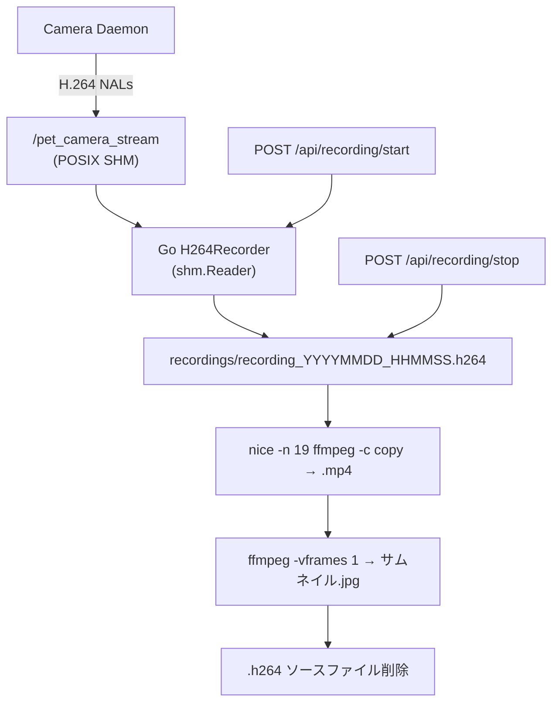

# 録画機能リファレンス

## 概要

サーバー側でH.264 NALパケットを共有メモリから直接ファイルに保存し、録画停止後にffmpegでMP4変換+サムネイル生成する方式。録画中の追加CPU負荷はゼロ（I/O書き込みのみ）。

## アーキテクチャ



### データソース

| SHM名 | 用途 |
|--------|------|
| `/pet_camera_stream` | H.264ストリーム（録画用、`H264ShmName`） |
| `/pet_camera_mjpeg_frame` | NV12フレーム（MJPEG配信用、`FrameShmName`） |
| `/pet_camera_detections` | YOLO検出結果（サムネイル時刻決定用） |

## 実装ファイル

| ファイル | 役割 |
|----------|------|
| `src/streaming_server/internal/webmonitor/h264_recorder.go` | 録画コア（SHM読み取り、ファイル書き込み、MP4変換、サムネイル生成） |
| `src/streaming_server/internal/webmonitor/server.go` | HTTP APIハンドラ（録画制御・一覧・ダウンロード・削除） |
| `src/streaming_server/internal/webmonitor/config.go` | 設定（`RecordingOutputPath`, `H264ShmName`等） |
| `src/streaming_server/internal/recorder/recorder.go` | WebRTCサーバー用チャネルベースレコーダー（別パス） |
| `src/monitor/h264_recorder.py` | Python版レコーダー（レガシー、未使用） |
| `src/web/src/hooks/useRecording.ts` | フロントエンド録画制御フック |
| `src/web/src/components/VideoControls.tsx` | 録画ボタンUI |
| `src/web/src/components/RecordingsModal.tsx` | 録画一覧モーダルUI |

## 定数

| 定数 | 値 | 説明 |
|------|-----|------|
| `HeartbeatTimeout` | 3秒 | ハートビート途絶時の自動停止閾値 |
| `MaxRecordingDuration` | 30分 | 最大録画時間（超過で自動停止） |
| ポーリング間隔 | 33ms | SHM読み取り周期（~30fps） |

## リソース見積もり

| 項目 | 値 |
|------|-----|
| H.264ビットレート | ~600kbps |
| 1分あたり | ~4.5MB |
| 1時間あたり | ~270MB |

## ファイル構造

```
recordings/
├── recording_20260204_143052.mp4    # 動画（ffmpeg変換後）
├── recording_20260204_143052.jpg    # サムネイル
└── comics/                          # アルバム（ComicCapture、別機能）
```

ファイル名フォーマット: `recording_YYYYMMDD_HHMMSS.{ext}`

変換完了後、`.h264`ソースファイルは自動削除される。

## API

### 録画制御

| エンドポイント | メソッド | 説明 |
|---------------|---------|------|
| `/api/recording/start` | POST | 録画開始 |
| `/api/recording/stop` | POST | 録画停止（→MP4変換開始） |
| `/api/recording/status` | GET | 録画状態 |
| `/api/recording/heartbeat` | POST | ハートビート送信 |

#### POST /api/recording/start レスポンス

```json
{
  "status": "recording",
  "file": "recording_20260205_123456.h264",
  "started_at": 1738732496
}
```

#### POST /api/recording/stop レスポンス

```json
{
  "status": "stopped",
  "file": "recording_20260205_123456.h264",
  "stats": { "recording": false, "converting": true, ... },
  "stopped_at": 1738732556
}
```

#### GET /api/recording/status レスポンス

```json
{
  "recording": false,
  "converting": true,
  "filename": "recording_20260205_123456.h264",
  "frame_count": 450,
  "bytes_written": 2345678,
  "duration_ms": 15000,
  "stop_reason": ""
}
```

`stop_reason`: `"heartbeat timeout"` / `"max duration reached"` / 手動停止なら空文字列

### 録画管理

| エンドポイント | メソッド | 説明 |
|---------------|---------|------|
| `/api/recordings` | GET | 一覧取得（サムネイル情報含む） |
| `/api/recordings/{name}` | GET | ダウンロード（.mp4 / .jpg） |
| `/api/recordings/{name}` | DELETE | 削除（サムネイルも同時削除） |
| `/api/recordings/{name}/thumbnail` | POST | サムネイル再生成（`{"timestamp": 5.5}`） |

#### GET /api/recordings レスポンス

```json
{
  "recordings": [
    {
      "name": "recording_20260204_143052.mp4",
      "size_bytes": 47185920,
      "created_at": "2026-02-04T14:30:52+09:00",
      "thumbnail": "recording_20260204_143052.jpg"
    }
  ]
}
```

`thumbnail`フィールドはサムネイルが存在しない場合は省略（`omitempty`）。

## サムネイル機能

### 自動生成

1. 録画中に`DetectionBroadcaster`がYOLO検出を監視
2. 最初の検出時刻を`NotifyDetection()`で記録（`firstDetectionOffset`）
3. MP4変換完了後にffmpegでサムネイル生成

### シーク位置のフォールバック

検出時刻（秒） → 3秒目 → 0秒目の順にフォールバック。各段階で生成失敗または空ファイルの場合は次を試行。

```
ffmpeg -y -ss {seekSec} -i video.mp4 -vframes 1 -vf "scale=160:-1" -q:v 2 thumbnail.jpg
```

### 既存録画の自動補完

`ListRecordings()`呼び出し時、サムネイル未生成のMP4ファイルを検出し、バックグラウンドで自動生成。

## UI

### 録画制御（VideoControls）

映像パネル下部のコントロールバーに配置。WebRTC/MJPEG切替ボタンの横に録画ボタンと録画一覧ボタン。

- 録画ボタン: トグル式（開始/停止）
- 変換中は録画ボタン無効化
- ステータステキスト: `REC MM:SS` / `Converting...` / `Auto-stopped`

### 録画一覧（RecordingsModal）

モーダルダイアログとして表示（サイドバータブではない）。

- 各録画カード: サムネイル + 日時 + サイズ + ダウンロード/削除ボタン
- 合計件数・サイズ表示
- 空状態メッセージ
- サムネイルクリックで拡大プレビューモーダル
- `.h264`ファイルは`(converting)`ラベル表示

### フロントエンド録画フロー

1. `POST /api/recording/start` で録画開始
2. 1秒間隔でハートビート送信（`POST /api/recording/heartbeat`）
3. 1秒間隔で経過時間表示更新
4. `POST /api/recording/stop` で録画停止
5. `GET /api/recording/status` をポーリングし、`converting`がfalseになるまで待機
6. 変換完了後、MP4ファイルを自動ダウンロード
7. 変換が120秒超過の場合、H.264ファイルのダウンロードを提案

## ネットワーク構成

```
:8080 - メインサーバー（HTTPS可、--tls-cert/--tls-key指定時）
         WebRTC + WebUI + 全API
--http-only フラグ - HTTP専用サーバー（任意ポート、TLS非対応端末用）
         同一ハンドラ（MJPEG + API含む全機能）
```

デフォルトはHTTP。TLS証明書指定時のみHTTPS。

## 未実装・将来検討

| 項目 | 状態 |
|------|------|
| オーバーレイ付き録画（bbox合成） | 未着手 |
| HWエンコーダー（h264_v4l2m2m等） | 未調査 |
| ストレージ自動管理・通知 | 未着手 |
| M5Stack Tab5対応（HTTP API経由） | API側完了、M5Stack側未着手 |
