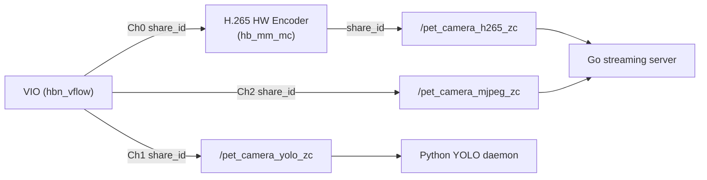
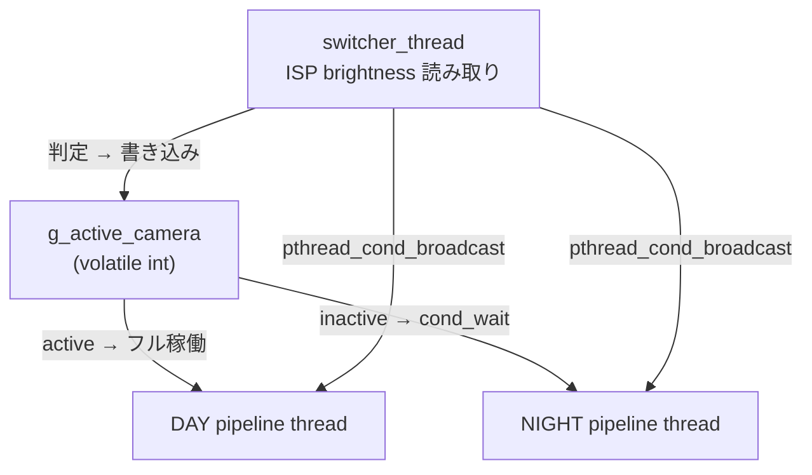
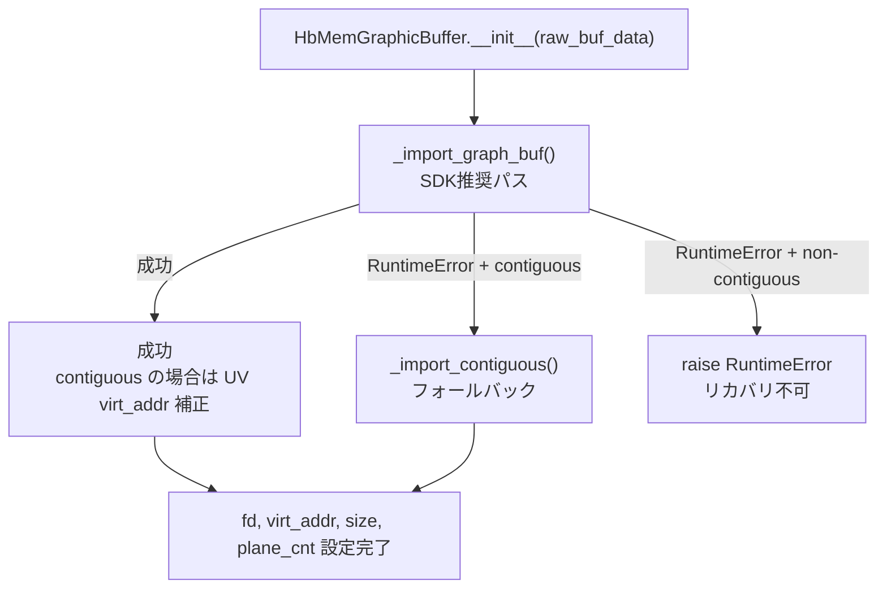
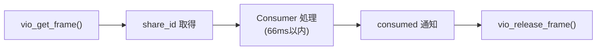
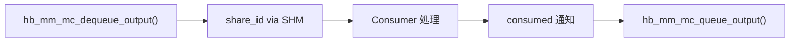

# 共有メモリ・Zero-Copy 設計リファレンス

## 概要

カメラパイプラインからコンシューマ（YOLO検出、ストリーミング等）へのフレーム転送において、memcpyを排除しVIOバッファのshare_idを直接共有するZero-Copy設計。C言語のカメラデーモン、Python製のYOLO検出デーモン、Go言語のストリーミングサーバー間で、共有メモリとセマフォを使ったIPCを実現する。

### 設計原則

1. **アクティブカメラのみがSHMに書き込み** - 非activeはcond_waitでブロック
2. **カメラ切り替えはプロセス内共有変数** - SHMもシグナルも不要
3. **brightnessはZeroCopyFrameに含める** - 別途shm_brightness不要
4. **NV12もH.265もzero-copyで取得可能**

---

## 共有メモリレイアウト

### 共有メモリ名一覧

| 名前 | 用途 |
|------|------|
| `/pet_camera_h265_zc` | H.265ストリーム ゼロコピー (encoder → Go streaming) |
| `/pet_camera_yolo_zc` | YOLO入力 ゼロコピー (統合、旧zc_0/zc_1を置換) |
| `/pet_camera_detections` | YOLO検出結果 (Python detector → Go web_monitor) |
| `/pet_camera_mjpeg_zc` | MJPEG NV12 ゼロコピー (camera → Go web_monitor) |
| `/pet_camera_roi_zc_0` | 夜間ROI領域0 (640x640, NIGHTカメラのみ) |
| `/pet_camera_roi_zc_1` | 夜間ROI領域1 (640x640, NIGHTカメラのみ) |

定義元: `src/capture/shm_constants.h`

### 現行のZero-Copyデータフロー



**期待効果**:

| 項目 | Before | After |
|------|--------|-------|
| YOLO memcpy | 10MB/s | **0** (share_id) |
| Active NV12 memcpy | 14MB/s | **0** (share_id) |
| MJPEG memcpy | 14MB/s | **0** (share_id) |
| エンコーダ入力 memcpy | 14MB/s | memcpy維持 (VPU所有バッファ) |
| H.265出力 memcpy | 1MB/s | **0** (share_id) |
| **合計** | **~53MB/s** | **~14MB/s** |

---

## データ構造

### ZeroCopyFrame (NV12用, `shared_memory.h`)

```c
#define ZEROCOPY_MAX_PLANES 2
#define HB_MEM_GRAPHIC_BUF_SIZE 160  // sizeof(hb_mem_graphic_buf_t)

typedef struct {
    uint64_t frame_number;
    struct timespec timestamp;
    int camera_id;
    int width, height;
    float brightness_avg;
    int32_t share_id[ZEROCOPY_MAX_PLANES];
    uint64_t plane_size[ZEROCOPY_MAX_PLANES];
    int32_t plane_cnt;
    uint8_t hb_mem_buf_data[HB_MEM_GRAPHIC_BUF_SIZE]; // hb_mem_graphic_buf_t 全体を埋め込み
    volatile uint32_t version;
} ZeroCopyFrame;

typedef struct {
    sem_t new_frame_sem;
    ZeroCopyFrame frame;
} ZeroCopyFrameBuffer;
```

### H265ZeroCopyFrame (H.265ビットストリーム用)

```c
#define HB_MEM_COM_BUF_SIZE 48  // sizeof(hb_mem_common_buf_t)

typedef struct {
    uint64_t frame_number;
    struct timespec timestamp;
    int camera_id;
    int width, height;
    uint32_t data_size;
    uint8_t hb_mem_buf_data[HB_MEM_COM_BUF_SIZE]; // hb_mem_common_buf_t 全体
    volatile uint32_t version;
} H265ZeroCopyFrame;

typedef struct {
    sem_t new_frame_sem;
    sem_t consumed_sem;     // Initially 0: encoder skips until Go posts first consumed
    H265ZeroCopyFrame frame;
} H265ZeroCopyBuffer;
```

### LatestDetectionResult (検出結果用)

```c
typedef struct {
    char class_name[32];
    float confidence;
    DetectionBBox bbox;
} DetectionEntry;

typedef struct {
    uint64_t frame_number;
    double timestamp;
    int num_detections;
    DetectionEntry detections[MAX_DETECTIONS];
    volatile uint32_t version;      // アトミック更新用
    sem_t detection_update_sem;     // イベント通知用セマフォ
} LatestDetectionResult;
```

**検出結果の書き込みポリシー**: 検出が1件以上ある場合のみ共有メモリに書き込み、versionを更新する。検出ゼロの場合はスキップ（CPU負荷軽減）。

---

## IPC同期: セマフォ

### ポーリング vs イベント駆動

| 項目 | ポーリング | セマフォ（イベント駆動） |
|------|-----------|----------------------|
| CPU使用率 | 8.2% | **1.1%** (86%減) |
| 平均レイテンシ | 16ms | **0.8ms** (95%改善) |
| 帯域幅（SSE） | 30 KB/s | **2.5 KB/s** (92%減) |

### 基本パターン

**Producer側（書き込み）**:
```c
// 1. セマフォ初期化（pshared=1: プロセス間共有, 初期値=0）
sem_init(&shm->detection_update_sem, 1, 0);

// 2. データ書き込み + セマフォ通知
shm->num_detections = count;
memcpy(shm->detections, detections, sizeof(DetectionEntry) * count);
__atomic_fetch_add(&shm->version, 1, __ATOMIC_SEQ_CST);
sem_post(&shm->detection_update_sem);
```

**Consumer側（読み取り）**:
```c
// 共有メモリは O_RDWR + PROT_READ|PROT_WRITE で開く（sem_waitが内部状態を更新するため）
int fd = shm_open(name, O_RDWR, 0666);
void* shm = mmap(NULL, size, PROT_READ | PROT_WRITE, MAP_SHARED, fd, 0);

// イベント駆動ループ
uint32_t last_version = 0;
while (!stopped) {
    struct timespec ts;
    clock_gettime(CLOCK_REALTIME, &ts);
    ts.tv_sec += 1;  // 1秒タイムアウト

    int ret = sem_timedwait(&shm->detection_update_sem, &ts);
    if (ret == -1) {
        if (errno == ETIMEDOUT) continue;      // タイムアウト（正常）
        if (errno == EINTR) continue;          // シグナル割り込み（正常）
        break;                                  // 実際のエラー
    }

    uint32_t current_version = __atomic_load_n(&shm->version, __ATOMIC_ACQUIRE);
    if (current_version != last_version) {
        process_data(shm);
        last_version = current_version;
    }
}
```

### カメラ切り替え設計

現在の実装ではSHMベースのカメラ制御は廃止され、プロセス内共有変数 (`volatile int g_active_camera`) + `pthread_cond_broadcast` で切り替えを行う。



| Active Camera | DAYカメラ | NIGHTカメラ |
|---------------|----------|------------|
| DAY | フル稼働 (30fps, NV12+H.265) | cond_waitでブロック (CPU 0%) |
| NIGHT | cond_waitでブロック (CPU 0%) | フル稼働 (30fps, NV12+H.265) |

---

## hb_mem API

### 構造体レイアウト

#### hb_mem_common_buf_t (48 bytes)

```c
typedef struct hb_mem_common_buf_t {
    int32_t fd;           // offset=0   ファイルディスクリプタ
    int32_t share_id;     // offset=4   プロセス間共有用ID
    int64_t flags;        // offset=8   アロケーションフラグ
    uint64_t size;        // offset=16  バッファサイズ (★必須)
    uint8_t *virt_addr;   // offset=24  仮想アドレス
    uint64_t phys_addr;   // offset=32  物理アドレス (★必須)
    uint64_t offset;      // offset=40  オフセット
} hb_mem_common_buf_t;
```

#### hb_mem_graphic_buf_t (160 bytes)

```c
typedef struct hb_mem_graphic_buf_t {
    int32_t fd[3];           // offset=0
    int32_t plane_cnt;       // offset=12  (★必須)
    int32_t format;          // offset=16  (★必須)
    int32_t width;           // offset=20  (★必須)
    int32_t height;          // offset=24  (★必須)
    int32_t stride;          // offset=28  (★推奨)
    int32_t vstride;         // offset=32  (★推奨)
    int32_t is_contig;       // offset=36
    int32_t share_id[3];     // offset=40  (★必須)
    int64_t flags;           // offset=56
    uint64_t size[3];        // offset=64  (★必須)
    uint8_t *virt_addr[3];   // offset=88
    uint64_t phys_addr[3];   // offset=112 (★必須)
    uint64_t offset[3];      // offset=136
} hb_mem_graphic_buf_t;
```

### Import API

**重要**: `share_id` だけでのインポートはSDKが対応していない。必ず `phys_addr` と `size` 等のメタデータが必要。そのため `ZeroCopyFrame` に `hb_mem_graphic_buf_t` 全体 (160 bytes) を `hb_mem_buf_data` フィールドとして埋め込んでいる。

#### 推奨パス: hb_mem_import_graph_buf

```c
int32_t hb_mem_import_graph_buf(hb_mem_graphic_buf_t *in, hb_mem_graphic_buf_t *out);
```

Producer側で`hb_mem_graphic_buf_t`全体を共有メモリに書き込み、Consumer側でそれを読み取ってimportする。SDKサンプル（`sample_share.c`）で実証済みのパターン。

#### インポートフロー（Python YOLO daemon）



### Python ctypes定義

```python
class hb_mem_common_buf_t(Structure):
    _fields_ = [
        ("fd", c_int32),        # offset 0
        ("share_id", c_int32),  # offset 4
        ("flags", c_int64),     # offset 8
        ("size", c_uint64),     # offset 16
        ("virt_addr", POINTER(c_uint8)),  # offset 24
        ("phys_addr", c_uint64),  # offset 32
        ("offset", c_uint64),   # offset 40
    ]

class hb_mem_graphic_buf_t(Structure):
    _fields_ = [
        ("fd", c_int32 * 3),         # offset 0
        ("plane_cnt", c_int32),      # offset 12
        ("format", c_int32),         # offset 16
        ("width", c_int32),          # offset 20
        ("height", c_int32),         # offset 24
        ("stride", c_int32),         # offset 28
        ("vstride", c_int32),        # offset 32
        ("is_contig", c_int32),      # offset 36
        ("share_id", c_int32 * 3),   # offset 40
        ("flags", c_int64),          # offset 56
        ("size", c_uint64 * 3),      # offset 64
        ("virt_addr", POINTER(c_uint8) * 3),  # offset 88
        ("phys_addr", c_uint64 * 3), # offset 112
        ("offset", c_uint64 * 3),    # offset 136
    ]
```

**注意**: `hb_mem_free_buf`の引数は`int32_t fd`（構造体ポインタではない）。

### エラーコード一覧

| コード | 値 (decimal) | 意味 |
|--------|--------------|------|
| HB_MEM_ERR_INVALID_PARAMS | -16777214 | 無効なパラメータ（size=0, phys_addr=0等） |
| HB_MEM_ERR_INVALID_FD | -16777213 | 無効なFD |
| HB_MEM_ERR_MODULE_NOT_FOUND | -16777208 | `hb_mem_module_open()`未呼び出し |

---

## バッファライフサイクル

### VIOバッファ



### エンコーダ出力バッファ



### カメラ切り替え

1. `switcher_thread`: `g_active_camera` を更新 (プロセス内共有変数)
2. `pthread_cond_broadcast` で全パイプラインスレッドを起床
3. 各パイプライン: 次ループで `active_camera` を確認し、非activeならcond_waitに戻る
4. Consumer: 次フレームから新しいカメラのデータを使用

---

## セマフォ実装の落とし穴と対策

### 1. メモリアクセス権限

```c
// ❌ sem_wait()でSIGSEGV
int fd = shm_open(name, O_RDONLY, 0666);
void* shm = mmap(NULL, size, PROT_READ, MAP_SHARED, fd, 0);

// ✅ sem_wait()が内部カウンタを更新するため書き込み権限必須
int fd = shm_open(name, O_RDWR, 0666);
void* shm = mmap(NULL, size, PROT_READ | PROT_WRITE, MAP_SHARED, fd, 0);
```

### 2. 構造体サイズの不一致

構造体にセマフォを追加した場合、古い共有メモリファイルが残っていると範囲外アクセスでSIGSEGV。

```c
// main()の最初で古い共有メモリを削除
shm_unlink(SHM_NAME_DETECTIONS);  // #include <sys/mman.h> 必須
LatestDetectionResult* shm = shm_detection_create();
```

### 3. sem_t型の直接使用

```c
// ❌ uint8_t配列でエミュレートは危険
uint8_t detection_update_sem[32];

// ✅ sem_t型を直接使用
sem_t detection_update_sem;
```

### 4. バージョンチェック（スプリアスウェイクアップ対策）

```c
// ✅ バージョンで重複検出
sem_wait(&shm->update_sem);
uint32_t current_version = __atomic_load_n(&shm->version, __ATOMIC_ACQUIRE);
if (current_version != last_version) {
    process_data(shm);
    last_version = current_version;
}
```

### 5. エラーハンドリング

`sem_timedwait`の戻り値:
- `ETIMEDOUT` (110): タイムアウト（正常、新データなし）
- `EINTR` (4): シグナル割り込み（正常、リトライ）
- `EINVAL` (22): セマフォ未初期化
- `EAGAIN` (11): リソース一時利用不可

---

## トラブルシューティングチェックリスト

**起動時にSIGSEGVが発生する場合**:
- `#include <sys/mman.h>` を追加したか
- `shm_unlink()` を main() の最初で呼んでいるか
- 共有メモリを `O_RDWR` + `PROT_READ | PROT_WRITE` で開いているか
- C/Go/Python の構造体定義が一致しているか
- `sem_t` 型を直接使用しているか

**sem_wait()がタイムアウトし続ける場合**:
- 書き込み側が `sem_post()` を呼んでいるか
- 共有メモリファイルのサイズは正しいか（`ls -la /dev/shm/`）

**hb_mem_importが失敗する場合**:
- エラーメッセージに`phys_addr=0x0`が表示されたら、C側のbufferフィールドを確認
- エラーコードが`-16777213`ならfd関連の問題

### デバッグコマンド

```bash
# 共有メモリ確認
ls -la /dev/shm/pet_camera_*

# プロセスのシステムコール追跡
strace -p <PID> -e trace=futex,mmap,shm_open

# SDKバージョン確認
dpkg -l | grep hobot
```

---

## 参照リソース

### SDKヘッダファイル

| ファイル | 内容 |
|----------|------|
| `/usr/include/hb_mem_mgr.h` | hb_mem API定義 |
| `/usr/include/hb_mem_err.h` | エラーコード定義 |
| `/usr/include/hbn_api.h` | VIO構造体 (`hbn_vnode_image_t`) |

### SDKサンプルコード

| ファイル | 内容 |
|----------|------|
| `/app/multimedia_samples/sample_hbmem/sample_share.c` | クロスプロセス共有の実装例 |

### プロジェクト実装ファイル

| ファイル | 内容 |
|----------|------|
| `src/capture/shared_memory.h` | ZeroCopyFrame構造体定義 |
| `src/capture/shared_memory.c` | 共有メモリ操作 (`shm_zerocopy_*`) |
| `src/capture/camera_pipeline.c` | VIOフレーム取得、share_id書き込み |
| `src/capture/hb_mem_bindings.py` | Python用hb_memバインディング |
| `src/capture/real_shared_memory.py` | Python共有メモリ読み取り |
