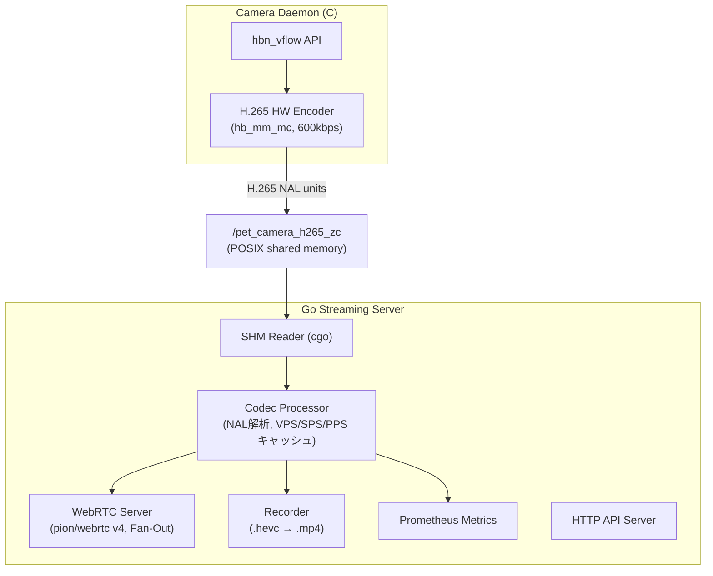
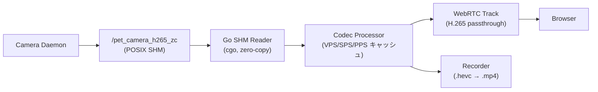
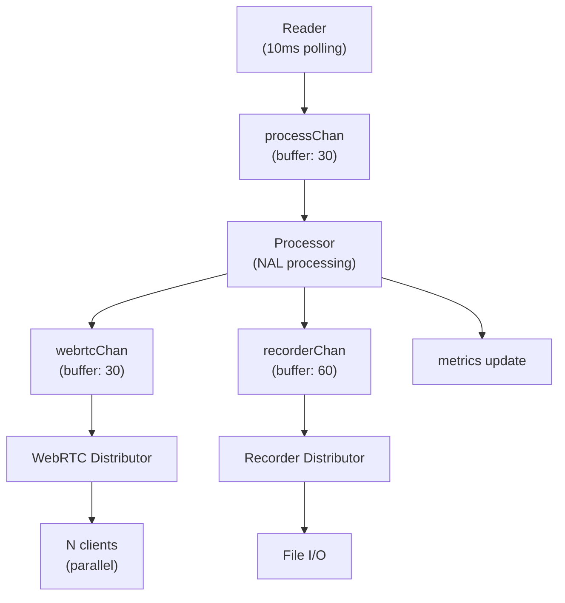
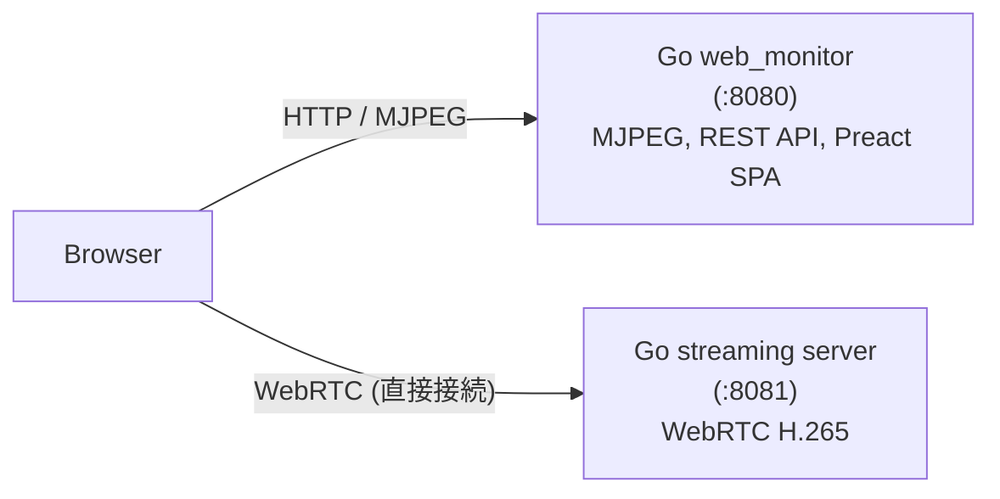

# Streaming Server 設計リファレンス

## 概要

**pion/webrtc v4**を使用したGo実装の単一バイナリストリーミングサーバー。H.265 passthroughによるゼロコピー配信、録画、Prometheusメトリクスを提供する。

### パフォーマンス目標

| メトリクス | Python版 | Go版目標 | 改善率 |
|-----------|---------|---------|-------|
| メモリ使用量 | ~110MB (2プロセス) | **<20MB (1バイナリ)** | 82%削減 |
| CPU使用率 | ~25% (デコード/再エンコード) | **<10% (passthrough)** | 60%削減 |
| デプロイサイズ | ~300MB (Python + 依存) | **<15MB (静的バイナリ)** | 95%削減 |
| 遅延 | ~200ms | **<100ms** | 50%改善 |

---

## アーキテクチャ

### システム全体図



### データフロー



### プロジェクト構造

```
src/streaming_server/
├── cmd/
│   ├── server/main.go              # WebRTC streaming server (:8081)
│   └── web_monitor/main.go         # MJPEG web monitor (:8080)
├── internal/
│   ├── shm/reader.go               # cgo共有メモリアクセス
│   ├── codec/processor.go          # H.265 NALユニット処理
│   ├── webrtc/server.go            # WebRTCサーバー (pion/webrtc v4)
│   ├── recorder/recorder.go        # H.265録画 (.hevc → .mp4)
│   ├── metrics/metrics.go          # Prometheusメトリクス
│   ├── webmonitor/                  # MJPEG配信、BBox描画、comic生成
│   ├── flaskcompat/                 # Flask互換テスト
│   └── logger/logger.go            # ロガー
├── pkg/
│   ├── types/frame.go              # 共通型定義
│   └── proto/detection.pb.go       # Protobuf検出結果
├── go.mod / go.sum
└── README.md
```

---

## 並行処理モデル

### 4+N Goroutine構成



| Goroutine | 数量 | 役割 |
|-----------|-----|------|
| Reader | 1 | 共有メモリポーリング（10ms間隔） |
| Processor | 1 | NAL解析、SPS/PPSキャッシュ、ヘッダー付与 |
| WebRTC Distributor | 1 | 全クライアントへフレームFan-Out配信 |
| Recorder Distributor | 1 | 録画有効時のみフレーム送信 |
| WebRTC Client Writer | N | クライアントごとの並列送信 |

### チャネルバッファサイズ

| チャネル | バッファサイズ | 理由 |
|---------|--------------|------|
| processChan | 30 | 1秒分 @ 30fps |
| webrtcChan | 30 | 1秒分 |
| recorderChan | 60 | 2秒分（ディスクI/O余裕） |
| clientChan | 30 | クライアント毎 |

### バックプレッシャー戦略

非ブロッキング送信 + フレームドロップ方式を採用。リアルタイム性を優先し、バッファが溢れた場合は古いフレームをドロップする。ドロップ数はメトリクスで監視可能。

```go
// ノンブロッキング送信パターン
select {
case ch <- frame:
    // 送信成功
default:
    // バッファ満杯 → フレームドロップ、メトリクス更新
}
```

### エラーハンドリング方針

| エラータイプ | 処理方法 |
|------------|---------|
| 一時的エラー（フレーム読み取り失敗等） | ログ + 続行 |
| 致命的エラー（共有メモリクローズ等） | エラーチャネル + サーバー停止 |
| Panic | defer recover + ログ + エラーチャネル |
| 連続エラー（10回連続読み取り失敗等） | 致命的エラーに昇格 |
| クライアントエラー（3回連続write失敗） | クライアント切断 |

### グレースフルシャットダウン

`context.WithCancel`による全goroutineの協調的終了。5秒のタイムアウト付き`WaitGroup.Wait()`で全goroutineの停止を保証。

---

## 主要コンポーネント

### Shared Memory Reader (`internal/shm/reader.go`)

cgoによるPOSIX共有メモリアクセス。`shared_memory.h`のFrame構造体との互換性。

```go
func NewReader(shmName string) (*Reader, error)
func (r *Reader) ReadLatest() (*types.H264Frame, error)
func (r *Reader) WaitForFrame(timeout time.Duration) (*types.H264Frame, error)
func (r *Reader) Close() error
```

- Zero-copy設計（memcpyは共有メモリ→Goヒープのみ）
- ポーリングベース（10msインターバル）

### Codec Processor (`internal/codec/processor.go`)

H.265 NALユニット解析とVPS/SPS/PPSキャッシング。

**NALユニットタイプ対応 (H.265)**:
- `NALTypeVPS (32)`: Video Parameter Set → キャッシュ
- `NALTypeSPS (33)`: Sequence Parameter Set → キャッシュ
- `NALTypePPS (34)`: Picture Parameter Set → キャッシュ
- `NALTypeIDR_W_RADL (19)`, `IDR_N_LP (20)`: IDRフレーム → VPS+SPS+PPS自動付与

録画途中開始時やクライアント途中参加時のヘッダー欠落問題を解決。

### WebRTC Server (`internal/webrtc/server.go`)

pion/webrtc v4によるH.265 passthroughストリーミング。

```go
func NewServer(stunServers []string, maxClients int) *Server
func (s *Server) HandleOffer(offerJSON []byte) ([]byte, error)
func (s *Server) SendFrame(frame *types.H264Frame)
func (s *Server) GetClientCount() int
func (s *Server) Close() error
```

- H.265コーデック登録: `webrtc.MimeTypeH265`, ClockRate=90000
- マルチクライアント対応（Fan-Outパターン）
- ICE接続状態監視による自動クライアント削除
- デフォルト最大10クライアント（`-max-clients`で変更可能）
- RTCP処理（品質フィードバック）

### Recorder (`internal/recorder/recorder.go`)

H.265録画（.hevc → .mp4変換）。

```go
func NewRecorder(basePath string) *Recorder
func (r *Recorder) Start() error
func (r *Recorder) Stop() error
func (r *Recorder) SendFrame(frame *types.H264Frame) bool
func (r *Recorder) GetStatus() RecordingStatus
```

- 録画形式: H.265 NAL → `.hevc` → `ffmpeg -f hevc -c copy` → `.mp4`
- 非ブロッキング録画（バッファ60フレーム = 2秒分）
- IDRフレーム検出時にVPS/SPS/PPSを自動付与
- ハートビート3秒タイムアウト、最大30分

### Metrics (`internal/metrics/metrics.go`)

Prometheus形式メトリクス（30+ metrics）。atomic操作によるスレッドセーフな更新。

| メトリクス名 | 説明 |
|------------|------|
| `streaming_frames_read_total` | 共有メモリ読み取りフレーム数 |
| `streaming_frames_dropped_total` | ドロップフレーム数 |
| `streaming_webrtc_frames_sent_total` | WebRTC送信フレーム数 |
| `streaming_active_clients` | アクティブWebRTCクライアント数 |
| `streaming_recording_active` | 録画状態（0/1） |
| `streaming_frame_latency_ms` | フレームレイテンシ（ms） |
| `streaming_webrtc_buffer_usage_percent` | WebRTCバッファ使用率（%） |

---

## WebRTC設計

### pion/webrtc v4 による H.265 passthrough

- H.265 NAL units を直接RTPパケットとして送信（デコード不要）
- `TrackLocalStaticSample.WriteSample()` で H.265 データを直接渡せる
- goroutineによる自然な並行処理
- iPhone Safari、Chrome で H.265 WebRTC 再生確認済み

### ブラウザクライアント実装

```javascript
class WebRTCVideoClient {
    constructor(videoElement, signalingUrl = null) {
        this.signalingUrl = signalingUrl || window.location.origin;
    }

    async start() {
        this.pc = new RTCPeerConnection({
            iceServers: [{ urls: 'stun:stun.l.google.com:19302' }]
        });
        this.pc.ontrack = (event) => {
            this.videoElement.srcObject = event.streams[0];
        };
        const offer = await this.pc.createOffer({ offerToReceiveVideo: true });
        await this.pc.setLocalDescription(offer);

        const response = await fetch(`${this.signalingUrl}/api/webrtc/offer`, {
            method: 'POST',
            headers: { 'Content-Type': 'application/json' },
            body: JSON.stringify({ sdp: offer.sdp, type: offer.type })
        });
        const answer = await response.json();
        await this.pc.setRemoteDescription(new RTCSessionDescription(answer));
    }
}
```

---

## Go web_monitor + streaming server 統合アーキテクチャ

### 2サーバー構成



| 機能 | フロー |
|------|--------|
| UI表示 | Browser → web_monitor (Preact SPA) |
| WebRTC映像 | Browser → streaming server（直接接続、低遅延） |
| MJPEG映像 + BBox | Browser ← web_monitor (Go描画) |
| 録画制御 | Browser → web_monitor → streaming server |
| 状態取得 | Browser → web_monitor |

---

## HTTP API エンドポイント

### Go Server (Port 8081)

| エンドポイント | メソッド | 説明 |
|--------------|---------|------|
| `/offer` | POST | WebRTC SDP offer/answer交換 |
| `/start` | POST | 録画開始 |
| `/stop` | POST | 録画停止 |
| `/status` | GET | 録画状態取得 |
| `/health` | GET | ヘルスチェック |

CORS設定: `Access-Control-Allow-Origin: *`

### レスポンス例

**録画状態 (`GET /status`)**:
```json
{
  "recording": true,
  "filename": "recording_20251226_223031.h264",
  "frame_count": 1500,
  "bytes_written": 2457600,
  "duration_ms": 50000
}
```

**ヘルスチェック (`GET /health`)**:
```json
{
  "status": "ok",
  "webrtc_clients": 2,
  "recording": true,
  "has_headers": true
}
```

---

## ビルドと起動

### ビルド

```bash
cd src/streaming_server
go build -o ../../build/streaming-server ./cmd/server
```

### 実行

```bash
./build/streaming-server \
  -shm /pet_camera_h265_zc \
  -http :8081 \
  -metrics :9090 \
  -pprof :6060 \
  -record-path ./recordings \
  -max-clients 10
```

### 一括起動スクリプト

```bash
./scripts/run_camera_switcher_yolo_streaming.sh
```

起動コンポーネント:
1. camera_daemon - カメラ切替＋H.265エンコード (C)
2. yolo_detector_daemon - YOLO物体検出 (Python)
3. web_monitor - Go MJPEG + REST API（ポート8080）
4. streaming-server - Go WebRTC＋録画サーバー（ポート8081）

### スクリプトオプション

| オプション | 説明 | デフォルト |
|----------|------|----------|
| `--skip-build` | ビルドをスキップ | なし |
| `--no-streaming` | Go streaming server無効化 | 有効 |
| `--streaming-port P` | Streaming serverポート | 8081 |
| `--metrics-port P` | Prometheusポート | 9090 |
| `--pprof-port P` | pprofポート | 6060 |
| `--max-clients N` | 最大WebRTCクライアント数 | 10 |

### 環境変数

| 変数名 | 説明 | デフォルト |
|-------|------|----------|
| `STREAMING_PORT` | Streaming serverポート | `8081` |
| `STREAMING_MAX_CLIENTS` | 最大WebRTCクライアント数 | `10` |
| `STREAMING_SHM` | 共有メモリ名 | `/pet_camera_h265_zc` |
| `RECORDING_PATH` | 録画保存先 | `./recordings` |

---

## 監視・プロファイリング

### Prometheusメトリクス

```bash
curl http://localhost:9090/metrics
watch -n 1 'curl -s http://localhost:9090/metrics | grep streaming_active_clients'
```

### pprof

```bash
# CPU プロファイル（30秒）
go tool pprof http://localhost:6060/debug/pprof/profile?seconds=30

# メモリプロファイル
go tool pprof http://localhost:6060/debug/pprof/heap

# Goroutineプロファイル
go tool pprof http://localhost:6060/debug/pprof/goroutine
```

---

## 録画ファイル

- **形式**: H.265 Annex B（`.hevc`）→ `.mp4` 自動変換
- **変換コマンド**: `ffmpeg -f hevc -i recording.hevc -c:v copy output.mp4`
- **再生**: `ffplay recordings/recording_YYYYMMDD_HHMMSS.mp4`

---

## 依存関係

```
module github.com/dj-oyu/rdk-x5_smart-pet-camera/streaming-server

require (
    github.com/pion/webrtc/v4 v4.2.9
    github.com/prometheus/client_golang v1.23.2
    golang.org/x/image v0.37.0
    google.golang.org/protobuf v1.36.8
)
```

**必須ツール**: `go` (1.25以降), `gcc` (cgo用), `make`
