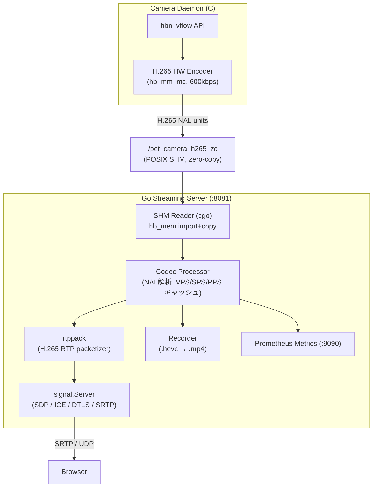
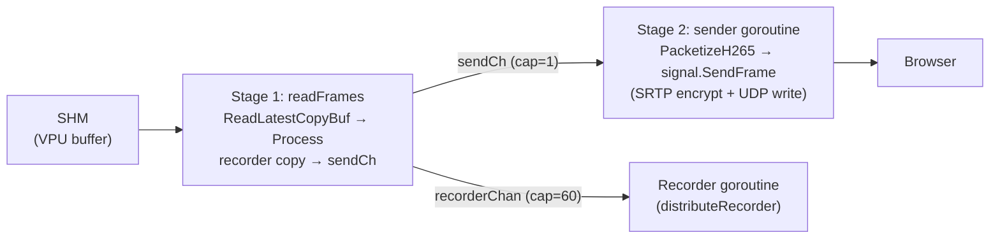
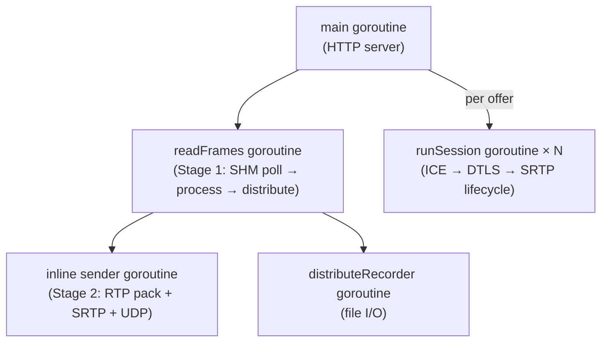

# Streaming Server 設計リファレンス

## 概要

**pion/webrtc を排除した**自前 WebRTC スタックによる Go 実装。pion/dtls のみ残置。
H.265 passthrough（デコードなし）、録画、Prometheus メトリクスを 1 バイナリで提供。

### パフォーマンス目標

| メトリクス | Python版 | Go版目標 | 改善率 |
|-----------|---------|---------|-------|
| メモリ使用量 | ~110MB (2プロセス) | **<20MB (1バイナリ)** | 82%削減 |
| CPU使用率 | ~25% (デコード/再エンコード) | **<10% (passthrough)** | 60%削減 |
| デプロイサイズ | ~300MB (Python + 依存) | **<15MB (静的バイナリ)** | 95%削減 |
| 遅延 | ~200ms | **<100ms** | 50%改善 |

---

## アーキテクチャ

### システム全体図


```mermaid
graph TD
    subgraph cam["Camera Daemon (C)"]
        vio["hbn_vflow API"]
        enc["H.265 HW Encoder<br/>(hb_mm_mc, 600kbps)"]
        vio --> enc
    end

    shm["/pet_camera_h265_zc<br/>(POSIX SHM, zero-copy)"]
    enc -->|"H.265 NAL units"| shm

    subgraph go["Go Streaming Server (:8081)"]
        reader["SHM Reader (cgo)<br/>hb_mem import+copy"]
        proc["Codec Processor<br/>(NAL解析, VPS/SPS/PPS キャッシュ)"]
        rtp["rtppack<br/>(H.265 RTP packetizer)"]
        signal["signal.Server<br/>(SDP / ICE / DTLS / SRTP)"]
        rec["Recorder<br/>(.hevc → .mp4)"]
        met["Prometheus Metrics (:9090)"]

        reader --> proc
        proc --> rtp --> signal
        proc --> rec
        proc --> met
    end

    shm --> reader
    signal -->|"SRTP / UDP"| browser["Browser"]
```

### データフロー (2ステージパイプライン)


```mermaid
graph LR
    shm["SHM<br/>(VPU buffer)"]
    stage1["Stage 1: readFrames<br/>ReadLatestCopyBuf → Process<br/>recorder copy → sendCh"]
    stage2["Stage 2: sender goroutine<br/>PacketizeH265 → signal.SendFrame<br/>(SRTP encrypt + UDP write)"]
    rec["Recorder goroutine<br/>(distributeRecorder)"]
    browser["Browser"]

    shm --> stage1
    stage1 -->|"sendCh (cap=1)"| stage2 --> browser
    stage1 -->|"recorderChan (cap=60)"| rec
```

`ReadLatestCopyBuf` は VPU バッファを Go-owned コピーに変換するため、Stage 1 が即次フレームを取得する間も Stage 2 が同フレームを保持できる。

### プロジェクト構造

```
src/streaming_server/
├── cmd/
│   ├── server/main.go              # WebRTC streaming server (:8081)
│   └── web_monitor/main.go         # MJPEG web monitor (:8080)
├── internal/
│   ├── shm/reader.go               # cgo: hb_mem import+copy, VPU バッファ管理
│   ├── codec/processor.go          # H.265 NAL解析, VPS/SPS/PPS キャッシュ
│   ├── signal/                     # 自前 WebRTC シグナリング
│   │   ├── session.go              # Session / Server / HandleOffer / SendFrame
│   │   ├── ice.go                  # ICELite + STUN Binding Request/Response
│   │   ├── stun_client.go          # outbound STUN (ICE-full mode)
│   │   ├── dtls.go                 # pion/dtls ラッパー + SRTP key export
│   │   ├── sdp.go                  # SDP パース / Answer 生成
│   │   ├── candidate.go            # ICE candidate パース
│   │   ├── sessionconn.go          # IPv6 source-pin (IPV6_PKTINFO)
│   │   └── localaddrs.go           # 非ループバック IP 列挙
│   ├── srtp/                       # 自前 SRTP (AES-128-CTR + HMAC-SHA1-80)
│   │   ├── context.go              # SRTP コンテキスト (ROC tracking)
│   │   ├── cipher.go               # AES-CTR encrypt + HMAC-SHA1 auth tag
│   │   ├── keyderiv.go             # RFC 3711 AES-CM key derivation
│   │   └── afalg.go                # AF_ALG 実装 (検証済み、現在は未使用)
│   ├── rtppack/h265.go             # H.265 RTP packetizer (single-NALU / FU-A)
│   ├── recorder/recorder.go        # H.265録画 (.hevc → .mp4)
│   ├── metrics/metrics.go          # Prometheus メトリクス
│   ├── webmonitor/                 # MJPEG配信, BBox描画, comic生成
│   └── logger/logger.go            # 構造化ロガー
├── pkg/
│   ├── types/frame.go              # VideoFrame 型
│   └── proto/detection.pb.go       # Protobuf 検出結果
├── go.mod / go.sum
└── README.md
```

---

## 並行処理モデル

### 2+1 Goroutine 構成


```mermaid
graph TD
    main["main goroutine<br/>(HTTP server)"]
    readFrames["readFrames goroutine<br/>(Stage 1: SHM poll → process → distribute)"]
    sender["inline sender goroutine<br/>(Stage 2: RTP pack + SRTP + UDP)"]
    distributeRecorder["distributeRecorder goroutine<br/>(file I/O)"]
    runSession["runSession goroutine × N<br/>(ICE → DTLS → SRTP lifecycle)"]

    main --> readFrames
    readFrames --> sender
    readFrames --> distributeRecorder
    main -->|"per offer"| runSession
```

| Goroutine | 数量 | 役割 |
|-----------|-----|------|
| readFrames | 1 | SHM ポーリング、NAL 処理、channel 分配 |
| sender (inline) | 1 | RTP packetize + signal.SendFrame |
| distributeRecorder | 1 | recorder.SendFrame (ファイル I/O) |
| runSession | N | ICE→DTLS→SRTP ライフサイクル（セッション毎） |

### チャネルバッファサイズ

| チャネル | バッファサイズ | 備考 |
|---------|--------------|------|
| sendCh (Stage 1→2) | 1 | 送信側ビジー時は drop（recorder 側に既保存） |
| recorderChan | 60 | 2秒分 @ 30fps |

### バックプレッシャー戦略

sendCh は capacity=1 のため Stage 2 がビジーの場合 WebRTC フレームをドロップし、
Stage 1 は即次フレームへ進む。録画パスは独立した memcopy 済みバッファを持つため
WebRTC ドロップの影響を受けない。

### グレースフルシャットダウン

`context.WithCancel` による全 goroutine の協調終了。`Shutdown()` の流れ:

1. `s.cancel()` → ctx 通知
2. `s.wg.Wait()` で readFrames / distributeRecorder 終了待ち
3. `s.recorder.Stop()` → 録画ファイル close
4. `s.signal.Close()` / `s.shmReader.Close()`
5. `s.httpServer.Shutdown(5s timeout)`

---

## 自前 WebRTC スタック詳細

### 採択理由

pion/webrtc v4 は H.265 サポートが不完全かつ SSRC/PT ネゴシエーションの挙動が
不透明だったため全排除。pion/dtls のみ残置し、それ以外は自前実装。

| レイヤ | 実装 | 場所 |
|--------|-----|------|
| SDP パース/生成 | 自前 | `signal/sdp.go` |
| ICE-lite (passive) | 自前 STUN handler | `signal/ice.go` |
| ICE-full (active) | 自前 outbound STUN | `signal/stun_client.go` |
| DTLS | pion/dtls v3 | `signal/dtls.go` |
| SRTP | 自前 AES-128-CTR + HMAC-SHA1-80 | `srtp/` |
| RTP packetizer | 自前 H.265 (single / FU-A) | `rtppack/h265.go` |

### SRTP 実装

`srtp/cipher.go` の `Cipher` が SRTP の暗号化・認証タグ生成を担う。

- **暗号化**: AES-128-CTR (`crypto/aes` + 自前 CTR ループ)
- **認証タグ**: HMAC-SHA1-80 (先頭 10 バイト)
- **authPool**: `sync.Pool` で HMAC インスタンスを再利用し、per-packet alloc を削減
- **AF_ALG 実装** (`srtp/afalg.go`): OP-TEE 経由の HW 暗号化を実装・検証済みだが、
  TE コンテキストスイッチのオーバーヘッドがソフトウェア実装より遅いため**未採用**。
  詳細: `docs/optee-afalg-findings.md`

### ICE 動作モード

| モード | 説明 | 有効化 |
|--------|-----|--------|
| ICE-lite (default) | passive のみ、browser からの STUN 待ち | デフォルト |
| ICE-full | server も outbound STUN を送り MAP-E NAT を開ける | `PET_CAMERA_ENABLE_ICE_FULL=1` |
| IPv6 candidates | SLAAC mngtmpaddr を SDP に advertise | `PET_CAMERA_ENABLE_IPV6_CANDIDATES=1` |

### モバイル接続経路 (5G/LTE)

MAP-E ISP 環境下では v4 inbound が使えない。2 経路を並行運用。

| 経路 | 仕組み |
|------|--------|
| **IPv6 直通** | au KDDI v6 GUA を host candidate として advertise。`IPV6_PKTINFO` で送信元を mngtmpaddr に固定（RFC 4941 temp addr に上書きされると DTLS が reject される）|
| **ICE-full + prflx** | server 側から peer candidate に STUN binding request を投げて MAP-E NAT を内側から開ける。peer-reflexive 経路で v4 確立 |

詳細: `docs/webrtc-ice-full-restoration.md`

#### 運用上の注意

- HTTPS signaling は Tailscale 経由が必須（pet-camera は public v4 なし）
- WebRTC media は Tailscale を通らず v6 直通 / 5G srflx 経路
- mngtmpaddr は `/proc/net/if_inet6` のフラグで判定（deprecated / temporary を除外）

### ブラウザクライアント実装

`src/web/src/hooks/useWebRTC.ts` 参照。シグナリングは HTTP one-shot。

**ICE gathering 完了待ちが必須**:

```javascript
const offer = await pc.createOffer();
await pc.setLocalDescription(offer);
if (pc.iceGatheringState !== 'complete') {
  await new Promise(resolve => {
    const handler = () => {
      if (pc.iceGatheringState === 'complete') {
        pc.removeEventListener('icegatheringstatechange', handler);
        resolve();
      }
    };
    pc.addEventListener('icegatheringstatechange', handler);
  });
}
// gathering 完了後に POST
const r = await fetch('/offer', {
  method: 'POST',
  body: JSON.stringify({ sdp: pc.localDescription.sdp, type: 'offer' }),
});
await pc.setRemoteDescription(await r.json());
```

gathering 完了前に POST すると Safari over 5G で candidate 0 個の offer が飛び ICE が確立しない。

---

## Shared Memory Reader

cgo による POSIX SHM アクセス。`src/capture/shm_constants.h` が single source of truth。

```go
// Zero-copy (VPU buffer mapping, free on next call)
func (r *Reader) ReadLatest() (*types.VideoFrame, error)

// Copy-on-read (hb_mem import + memcpy + free, async safe)
func (r *Reader) ReadLatestCopyBuf(dst []byte) (*types.VideoFrame, error)

// Frame interval measurement (version change polling)
func (r *Reader) MeasureFrameInterval(samples int) time.Duration
```

- `ReadLatest`: VPU buffer を zero-copy でマップ。次の呼び出しで自動 free → 同期消費のみ
- `ReadLatestCopyBuf`: import + memcpy + free を 1 呼び出しで完結。非同期消費（recorder等）に安全
- `shmBufPool` (`sync.Pool[*[]byte]`): 512KB バッファを再利用し per-frame alloc を削減

---

## Codec Processor

H.265 NAL unit 解析と VPS/SPS/PPS キャッシング (`internal/codec/processor.go`)。

| NAL タイプ | 値 | 処理 |
|-----------|---|------|
| VPS | 32 | キャッシュ |
| SPS | 33 | キャッシュ |
| PPS | 34 | キャッシュ |
| IDR_W_RADL | 19 | IDR フレームとして VPS+SPS+PPS を自動付与 |
| IDR_N_LP | 20 | 同上 |

クライアントの mid-stream join や録画途中開始時のヘッダー欠落を防ぐ。

---

## Recorder

H.265 録画 (`internal/recorder/recorder.go`)。

```go
func (r *Recorder) Start() error
func (r *Recorder) Stop() error
func (r *Recorder) SendFrame(frame *types.VideoFrame) bool
func (r *Recorder) UpdateHeaders(vps, sps, pps []byte)
func (r *Recorder) GetStatus() RecordingStatus
```

- 形式: H.265 NAL Annex B → `.hevc` → `ffmpeg -f hevc -c copy` → `.mp4`
- `recorderChan` (cap=60) 経由で非同期受信
- IDR フレーム先頭に VPS/SPS/PPS を自動付与

---

## HTTP API

### Go streaming server (Port 8081)

| エンドポイント | メソッド | 説明 |
|--------------|---------|------|
| `/offer` | POST | WebRTC SDP offer → answer |
| `/start` | POST | 録画開始 |
| `/stop` | POST | 録画停止 |
| `/status` | GET | 録画状態 |
| `/health` | GET | ヘルスチェック |
| `/api/clients/count` | GET | 接続 WebRTC クライアント数 |

CORS: `Access-Control-Allow-Origin: *`

### レスポンス例

**`GET /health`**:
```json
{
  "status": "ok",
  "webrtc_clients": 2,
  "recording": true,
  "has_headers": true
}
```

**`GET /status`**:
```json
{
  "recording": true,
  "filename": "recording_20260101_120000.hevc",
  "frame_count": 1500,
  "bytes_written": 2457600,
  "duration_ms": 50000
}
```

---

## 環境変数

| 変数名 | 説明 | デフォルト |
|-------|------|----------|
| `PET_CAMERA_ENABLE_ICE_FULL` | ICE-full (outbound STUN) を有効化 | `0` (ICE-lite) |
| `PET_CAMERA_ENABLE_IPV6_CANDIDATES` | IPv6 host candidate を advertise | `0` |

CLI フラグ: `-shm`, `-http`, `-metrics`, `-pprof`, `-record-path`, `-max-clients`, `-log-level`, `-log-color`

---

## 既知の問題 / TODO

未対応の指摘は現時点でなし。

### 解決済み (#215 / cdd49cd)

以下はコードレビューで挙がり、いずれも修正済み。参考として記録する。

| 場所 | 問題 | 対応 |
|------|------|------|
| `signal/ice.go` | HandleSTUN が USERNAME / MESSAGE-INTEGRITY を未検証 (ICE ハイジャック) | `validateRequestAuth()` を追加し、検証失敗時は無応答 |
| `signal/dtls.go` | SDP offer の fingerprint が DTLS peer 証明書と未照合 | `VerifyPeerCertificate` で SHA-256 を照合 + `RequireAnyClientCert` |
| `cmd/server/main.go` | shutdown 時に `recorderChan` を drain せず録画末尾が欠損 | `sendCh` → `sendWg.Wait()` → `close(recorderChan)` の順に drain |
| `signal/session.go` | MaxClients チェックが TOCTOU 競合 | check と insert を同一クリティカルセクションに統合 |
| `signal/session.go` / `cmd/server/main.go` | SSRC が全セッション共通 `0x12345678` | セッションごとに `generateSSRC()` で採番し SDP に載せ、`SendFrame` が送信直前にパケットヘッダを `sess.ssrc` へ書き換える (session.go:449)。共有 packetizer が使う `main.go:243` の値は上書き前のプレースホルダ |
| `cmd/server/main.go` | RTP タイムスタンプが 30fps ハードコード | 壁時計 90kHz 基準 (`time.Since(streamStart)`) に変更 |
| `signal/sdp.go` | `H265/90000` regex が大文字のみ | `(?i)` フラグを追加 |
| `signal/sdp.go` | `a=rtcp` 行と `a=rtcp-mux` が矛盾 | `a=rtcp:9 IN IP4 0.0.0.0` に修正 |
| `signal/session.go` | keepalive タイムアウト 30s が狭い | 45s に緩和 |
| `cmd/server/main.go` | `io.ReadAll(r.Body)` にサイズ制限なし | `MaxBytesReader` 64KiB + `ReadTimeout` 10s |

---

## ビルドと起動

```bash
cd src/streaming_server
go build ./cmd/server && go build ./cmd/web_monitor
go test ./...
```

```bash
# 起動例
./server \
  -shm /pet_camera_h265_zc \
  -http :8081 \
  -metrics :9090 \
  -pprof :6060 \
  -max-clients 10 \
  -log-level info
```

systemd サービス: `scripts/USAGE.md` 参照。

---

## 監視

```bash
# Prometheus メトリクス
curl http://localhost:9090/metrics | grep streaming_

# pprof CPU (30秒)
go tool pprof http://localhost:6060/debug/pprof/profile?seconds=30

# pprof メモリ
go tool pprof http://localhost:6060/debug/pprof/heap
```

主要メトリクス:

| メトリクス名 | 説明 |
|------------|------|
| `streaming_frames_read_total` | SHM 読み取りフレーム数 |
| `streaming_webrtc_frames_sent_total` | WebRTC 送信フレーム数 |
| `streaming_recorder_frames_dropped_total` | recorder チャネル満杯によるドロップ数 |
| `streaming_active_clients` | SRTP 確立済みクライアント数 |
| `streaming_recording_active` | 録画状態 (0/1) |
| `streaming_frame_latency_ms` | SHM キャプチャ → 処理完了レイテンシ |

---

## 依存関係

```
github.com/pion/dtls/v3         DTLS 1.2 ハンドシェイク (pion/webrtc は除外)
golang.org/x/net/ipv6           IPV6_PKTINFO (source IP pin)
github.com/prometheus/...       メトリクス
golang.org/x/image              MJPEG 描画 (web_monitor)
google.golang.org/protobuf      検出結果 protobuf
```

**必須ビルドツール**: `go 1.21+`, `gcc` (cgo), `libhbmem` (RDK X5 専用, `/usr/hobot/lib`)
