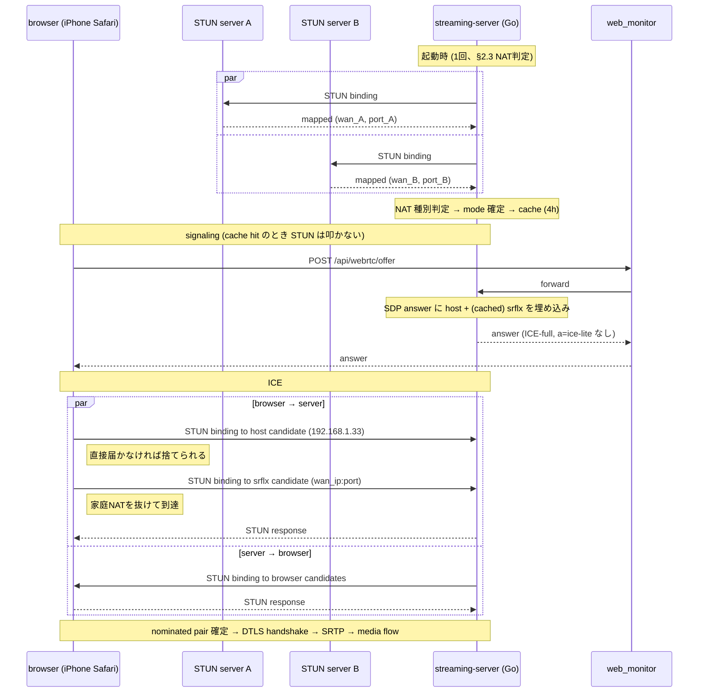

# WebRTC ICE-full + srflx 復元 設計ドキュメント

## ステータス
ドラフト / **検証フェーズ** (実装前)

ブランチ: `feat/webrtc-ice-full-restoration`
関連: PR #209 (multi-IP host candidate 化)

> **進行ポリシー**: 仮説先行で実装に入らず、本ドキュメントの「§ 11 検証フェーズ」に挙げた項目を計測 → 結果を「§ 12 計測結果」に追記 → §2の設計を確定/修正 → 実装着手、の順で進める。

## 1. 背景

### 1.1 結論先出し

- **pion/webrtc 時代 (`e8d1d79` 以前) はモバイル回線からの WebRTC 視聴ができていた**
- `e8d1d79` で pion を排除して自前実装に置き換えた際、**ICE 周りの機能を意図せず大きく削った** ことが原因で動かなくなった
- 失われた機能を自前実装で復元すれば pion 時代の動作に戻る
- **Cloudflare TURN サーバの導入は不要** (一旦は必要と検討したが、再調査で不要と判明)

### 1.2 現状

直近の PR #209 で host candidate を全 NIC ぶん発行するよう改善した。

| アクセス経路 | 動作 |
|---|---|
| 自宅LAN内 (同一 192.168.1.0/24) Safari/Chrome | ✅ 視聴可能 |
| 自宅LAN内 Tailscale | ✅ 視聴可能 (PR #209 後) |
| **モバイル回線 iPhone Safari over Tailscale** | ❌ ICE が一切起動しない |

### 1.3 失敗時の症状

- HTTPS による signaling は正常 → SDP answer 返却
- ブラウザ側 `setRemoteDescription` は成功 (例外なし)
- **STUN binding request が UDP socket に1パケットも届かない** (45秒 tcpdump で 0 packets)
- `connectionState` は最終的に `'failed'` に遷移し、UI は MJPEG にフォールバック

### 1.4 pion 時代との差分

`e8d1d79^` の pion 実装では以下が **自動的に行われていた**:

```go
// 旧 internal/webrtc/server.go (pion 版)
iceServers = []webrtc.ICEServer{{
    URLs: []string{"stun:stun.l.google.com:19302"},
}}
config: webrtc.Configuration{ICEServers: iceServers}
```

これだけで pion 内部が以下を全部やってくれていた:

1. **srflx 候補の取得**: Google STUN に問い合わせて家の WAN IP:port を学習し、SDP に `a=candidate ... typ srflx` として追加
2. **ICE-full モード**: browser の各 candidate に対して STUN binding request を発信、双方向のホールパンチを実施
3. **USE-CANDIDATE 処理 / 候補ペア優先度計算**: ICE 標準に沿ったペア選定

`e8d1d79` の自前実装ではこれらが **全部スキップされた**:

| 項目 | pion時代 | 現在 (`e8d1d79` 以降) |
|---|---|---|
| ICE モード | ICE-full | **ICE-lite** (`a=ice-lite`) |
| host candidate | あり | あり |
| srflx candidate | あり (STUN自動取得) | **なし** |
| 自前 STUN binding 発信 | あり | **なし** (受信側のみ) |
| candidate pair check | pion ライブラリが管理 | **なし** |

→ 家庭NAT 越え (= 外部からのアクセス) に必要な「公開到達可能な候補と双方向ホールパンチ」が消えた状態。これがモバイル回線で動かなくなった真因。

### 1.5 ICE-lite 化で得られたメリット

ICE-lite 化は意図せずではなく **明確なメリット** ももたらしている。失わせたくない:

| メリット | 仕組み |
|---|---|
| **WebRTC ↔ MJPEG 切替が高速化** | 起動時/接続時の srflx gather が無く、SDP answer を即返せる |
| **CPU 使用率低下** | ※ ICE-lite は寄与せず、別要因 (RTP payloader 共有 #202、interceptor削減 #205、SRTP最適化 #208) |

定常 CPU 削減は ICE-lite とは独立した最適化なので、ICE-full 復元時も維持される。**唯一の懸念は切替レイテンシ**だが、後述の方針で解消する。

## 2. 解決方針

### 2.1 ICE-full + srflx を自前実装で復元 (Cloudflare TURN サーバは使わない)

| コンポーネント | 変更 |
|---|---|
| streaming-server `internal/signal/stun_client.go` (新規) | パブリック STUN binding request 送信、XOR-MAPPED-ADDRESS パース |
| streaming-server (起動時1回) | srflx を gather してキャッシュ。STUN keepalive で定期更新 |
| streaming-server `internal/signal/sdp.go` | SDP answer に srflx candidate を追加、`a=ice-lite` を削除 |
| streaming-server `internal/signal/ice.go` | ICE-full: browser candidate に向けた binding request、候補ペアチェック、USE-CANDIDATE 処理 |
| browser側 | **変更なし** (現状の `iceServers: [{urls: 'stun:stun.l.google.com:19302'}]` のまま) |

### 2.2 srflx 取得は lazy + 4h cache (定期ポーリングはしない)

ICE-full 化の主なコストは **srflx gather 1往復(~50-200ms)**。これを per-session に毎回払うのは切替レイテンシを劣化させるので、以下の lazy キャッシュ方式で吸収する。

- 起動時に **NAT 種別を判定** (§ 2.3 のフローを 1 回実行)
- 結果として `(wan_ip, nat_type, port_preserved)` を **4h cache**
- per-session: cache hit なら srflx candidate = `(cached_wan_ip, session_socket_port)` をそのまま SDP に埋める。STUN は叩かない
- cache 期限切れ (4h) でアクセスがあった場合: その session は host のみで先行発行 (待たない)、background で再判定 → cache 更新
- ICE 失敗フィードバックがあれば cache を invalidate して次回 force re-gather (WAN IP 変化への追従)

> **NAT mapping の寿命とは別問題**: セッション中は ICE/RTP の通信で mapping が自然延命する。セッション終了後は mapping が期限切れしても、次セッションで socket を bind し直して STUN を投げれば新しい mapping が即作られる。**定期 keepalive は不要**。

ICE-full の connectivity check (server→browser candidate への STUN binding) は per-session 発生するが、典型的に <100ms で完了し、ユーザ体感としては気付かない。

### 2.3 NAT 種別自動検出 (起動時に1回)

ユーザが手で「自宅ルータが symmetric NAT でないことを確認」する代わりに、**サーバ起動時に自動検出**する。検出ロジック:

```
単一 UDP socket bind on internal_port_X
  ├→ STUN to server A (e.g. stun.l.google.com:19302) → mapped (wan_A, port_A)
  └→ STUN to server B (e.g. stun.cloudflare.com:3478) → mapped (wan_B, port_B)

  Case 1: wan_A==wan_B && port_A==port_B && port_A==internal_port_X
          ⇒ EIM (cone NAT) + port preservation
          ⇒ fast mode: WAN IP を 4h cache、per-session STUN 不要
  Case 2: wan_A==wan_B && port_A==port_B && port_A != internal_port_X
          ⇒ EIM だが port preservation なし
          ⇒ medium mode: per-session で STUN を1回叩いて mapped_port を取得 (cache は WAN IP のみ)
  Case 3: wan_A != wan_B || port_A != port_B
          ⇒ Endpoint-Dependent Mapping (Symmetric NAT)
          ⇒ srflx を出さず host のみで動作 (= 現在の挙動と同等、リモートは諦め)
  Case 4: STUN タイムアウト/エラー
          ⇒ srflx を出さず host のみで動作 (= 現在の挙動)
```

> RFC 5780 (NAT Behavior Discovery) は単一サーバで `CHANGE-REQUEST` を使ってやれるが、Google STUN は対応していないので **異なる宛先 STUN サーバ 2 つ** を用いた classic 方式で判定する。

### 2.4 Cloudflare TURN サーバが不要な理由

検討段階では Cloudflare TURN を使う案を出したが、**pion 時代に動いていた = STUN だけで足りていた = TURN 不要** という事実が立証された。

- サーバ側はパブリック STUN で srflx を取得し、browser 側も既存の Google STUN で同様に srflx を取得する
- 両者が srflx 候補を SDP に並べ、家庭ルータが full-cone or address-restricted-cone であればホールパンチが成立する
- これが pion 内部でやっていた挙動そのもの

例外: サーバが **symmetric NAT** 配下にある場合 (二重NAT、企業FW等) はホールパンチが破れる。ただし一般家庭ではほぼ発生せず、pion 時代に動いていた事実から本ユーザ環境ではそのケースに該当しないと判断できる。発生時は別 PR で TURN client 追加を検討する (本設計の対象外)。

→ **Cloudflare アカウント、API token、credential 発行エンドポイントなど、外部サービスに関する作業は一切不要。**

### 2.5 接続シーケンス



## 3. スコープ

### in scope
- **検証フェーズ**: NAT/IPv6/UPnP 等の事前計測 (§ 11)
- パブリック STUN client 実装 (`stun:stun.l.google.com:19302` 等)
- 起動時 NAT 種別自動検出 + lazy 4h cache (定期 keepalive は **しない**)
- SDP answer に srflx candidate を追加、`a=ice-lite` を削除
- ICE-full 化 (binding request 発信、候補ペア状態管理、USE-CANDIDATE 処理)
- 切替レイテンシ維持 (cache hit 時は STUN を叩かない)
- 既存 LAN 動作の保持 (Symmetric NAT 検出時は host のみで現状互換)
- 自動・手動テスト

### out of scope
- **Cloudflare TURN を使った中継** (本設計では不要と結論済み)
- TURN client 実装全般 (symmetric NAT 環境用、別 PR で必要に応じて)
- WebRTC ↔ HLS フォールバック設計
- 帯域制御 / コスト監視ダッシュボード

## 4. 役割分担

### user (人間) のタスク
- [ ] § 11 検証フェーズの実機計測 (iPhone を LTE に切ってテスト等、Claude 単独不可なもの)
- [ ] LAN 動作のリグレッション確認 (Safari/Chrome 両方)
- [ ] モバイル回線 (LTE) 実機テスト (Safari iPhone)
- [ ] 切替速度の体感確認 (現状と比べて遅くなっていないか)

NAT 種別の事前確認は不要 (起動時自動検出)。外部サービス契約・API token 管理も不要 (Cloudflare TURN を使わないため)。

### Claude (作業) のタスク

#### 検証フェーズ (§ 11、実装前)
- [ ] `scripts/diag/` 配下に検証用ツール群を整備 (詳細は § 11)
- [ ] 計測結果を § 12 に集約、設計確定/修正の根拠とする

#### 実装フェーズ (検証結果で設計確定後)
- [ ] `internal/signal/stun_client.go` 新規: STUN binding request 送信/応答パース、XOR-MAPPED-ADDRESS 抽出
- [ ] `internal/signal/nat_probe.go` 新規: 起動時 NAT 種別自動検出 (§ 2.3 のロジック)
- [ ] `cmd/server/main.go`: 起動時 NAT probe 実行、結果を `signal.Server` に渡す
- [ ] `internal/signal/session.go`: srflx (cached) をフィールドに保持、`AnswerParams.CandidateIPs` に host + srflx を結合
- [ ] `internal/signal/ice.go` 拡張: ICE-full、binding request 発信、候補ペア状態機械、USE-CANDIDATE
- [ ] `internal/signal/sdp.go`: `a=ice-lite` を削除、srflx candidate (`typ srflx raddr ... rport ...`) 出力
- [ ] テスト: `stun_client_test.go`, `nat_probe_test.go`, `ice_test.go` 新規/拡張
- [ ] `docs/streaming-server.md` 更新 (リモート視聴節を追加)

## 5. 設定 (環境変数)

```ini
# /etc/systemd/system/pet-camera-streaming.service
PET_CAMERA_PUBLIC_STUN_PRIMARY=stun:stun.l.google.com:19302    # NAT probe 用 (空なら ICE-lite + host のみ = 既存挙動)
PET_CAMERA_PUBLIC_STUN_SECONDARY=stun:stun.cloudflare.com:3478 # EIM 検出用 (異なる宛先サーバ、空なら NAT probe を諦め host のみ)
PET_CAMERA_NAT_PROBE_CACHE_HOURS=4                              # cache TTL
```

`PET_CAMERA_PUBLIC_STUN_PRIMARY=` (空) で従来の ICE-lite + host のみに戻せる。問題発生時の即時フォールバック手段。

## 6. リスクと検討事項

| リスク | 影響度 | 対応 |
|---|---|---|
| ICE-full 化で既存 LAN 動作にリグレッション | 高 | 段階デプロイ、`PET_CAMERA_PUBLIC_STUN_PRIMARY=` 空でフォールバック可能に |
| NAT probe 失敗 / Symmetric NAT 検出 | 中 | srflx を出さず host のみで動作 (= 現在の挙動と同等)。warn ログのみ |
| WAN IP が動的 IP で変わる | 中 | ICE 失敗フィードバックで cache invalidate → 次回 force re-probe |
| Cone NAT だが port preservation なし | 中 | NAT probe で検出、medium mode (per-session STUN) にフォールバック |
| 公開IP UDP 露出のセキュリティ | 中 | DTLS-SRTP 暗号化 + ICE ufrag/pwd 認証 + ランダムポート。実害ほぼ無し |
| 仮説検証なしで実装するリスク | 高 | § 11 検証フェーズで先に計測、失敗仮説を早期に潰す |

## 7. 段階リリース計画

1. **Phase 1**: STUN client 実装 + 起動時 srflx gather + SDP に srflx 候補追加 (ICE-lite のまま)
   - LAN 動作維持確認
   - srflx が SDP に正しく載るか確認
2. **Phase 2**: ICE-full 化 (`a=ice-lite` 削除、binding request 発信、ペアチェック)
   - LAN 動作維持確認、切替レイテンシ確認
3. **Phase 3**: STUN keepalive ループ
   - 長時間稼働で WAN IP 変化追従を確認
4. **Phase 4**: モバイル回線実機テスト、ドキュメント更新、本番リリース

各 Phase ごとに小PRに分けてマージ予定。

## 8. テスト計画

### unit
- `stun_client_test.go`: binding request build、binding response parse、XOR-MAPPED-ADDRESS 抽出 (IPv4/IPv6)
- `sdp_test.go` 追加: srflx candidate を含む answer 生成、`a=ice-lite` 不在
- `ice_test.go`: 候補ペア状態機械、priority 計算、USE-CANDIDATE 処理

### integration
- ループバックで pion 製クライアントとの interop テスト (controlling 側を pion で)
- 既存 `session_race_test.go` を ICE-full 経路でも通す

### manual
- 自宅 LAN: Safari/Chrome 両方で再生、切替レイテンシが体感で悪化していないこと
- 外出先 LTE: iPhone Safari で再生 (これがゴール)
- `chrome://webrtc-internals` でデスクトップから候補ペアの状態を確認
- 長時間稼働: 24h 経過後もモバイルから繋がること (keepalive 検証)

## 9. 参考資料

- RFC 8445: ICE
- RFC 5389/8489: STUN
- pion/webrtc の ICE-full + STUN gather 実装 (`e8d1d79^` の `internal/webrtc/server.go` で参照していた API)
- WebKit ICE filtering 挙動: 個別観察ログ (このリポジトリでは PR #209 設計時に判明)

## 10. 次アクション

- ユーザ: 設計レビュー → 承認
- Claude: § 11 検証フェーズの診断スクリプト整備 → 実機計測 → § 12 に結果集約 → § 2 設計確定 → 実装着手

## 11. 検証フェーズ

設計の前提仮説を実機で潰してから実装に入る。検証スクリプト群は `scripts/diag/` に置く。優先度順:

### 11.A NAT 挙動 / WAN IP (必須)

**目的**: § 2.3 の NAT 種別自動検出が成立するか、4h cache 戦略の前提が満たされるかを確認。

| 項目 | 手段 | 受入基準 |
|---|---|---|
| WAN IP 値 | 自前 STUN client → Google STUN | 公開IPv4が返ること |
| ポート保存 | STUN 応答の mapped port を内部 port と比較 | `mapped == internal` (or 規則的に外れ) |
| EIM 判定 | 異なる 2 STUN サーバに同 socket から投げて mapped 比較 | 同一なら EIM、不一致なら symmetric |
| NAT mapping timeout 実測 | STUN で穴を開け、N秒後に外部から UDP を投げて到達するか確認 | 30 秒・1分・5分・30分 で測定 → どこまで生きるか分かる |

**スクリプト**: `scripts/diag/nat_probe.go` (Go の小スクリプト、stunclient 的な機能)

### 11.B iPhone Safari over LTE の E2E 仮説検証 (必須)

**目的**: 「WAN IP candidate なら iPhone Safari は STUN を投げる」仮説を実装前に確かめる。失敗するなら設計の根本見直し。

**手順**:
1. 検証用ブランチで一時パッチ: NAT probe で取った WAN IP:port を srflx として SDP answer に焼き込む (ICE-lite のままで OK)
2. 実機にデプロイ
3. iPhone を Tailscale OFF + LTE に切ってアクセス (WebRTC が動くか観察)
4. デバイス側で `tcpdump -i any 'udp portrange 20000-20020'` を回し、iPhone から STUN が届いているかを確認
5. 結果を3パターンで記録:
   - 通った → 設計確定、実装フェーズへ
   - STUN 届かない → Safari は WAN IP も filter している可能性、別仮説 (e.g. ポート開放、Tailscale ICE-full、IPv6) を試す
   - STUN 届くが ICE 通らない → DTLS or codec 問題、別軸の調査

**スクリプト**: `scripts/diag/inject_srflx_patch.sh` + 実機 tcpdump 観測

### 11.C Cone NAT の細分判定 (必須)

**目的**: full-cone / address-restricted-cone / port-restricted-cone を識別。ICE-full 必須かどうかが変わる。

**手段**: RFC 5780 風の filter test (パブリック側からの送信元 IP/port を変えた binding を発生させる)。pion/stun の `nat-discovery` を参考実装にする。

### 11.D IPv6 経路の可能性 (調査価値高)

**目的**: グローバル IPv6 が両端で使えれば NAT 問題が消えて設計が大幅簡略化。

| 項目 | 手段 | メモ |
|---|---|---|
| 実機の IPv6 | `ip -6 addr show` | グローバル prefix (2400:: 等) があるか |
| 実機の IPv6 到達確認 | `curl -6 https://ifconfig.io` | 出力されるなら IPv6 で公開到達 |
| iPhone LTE の IPv6 | Safari で `https://test-ipv6.com` | 24/24 ならフル IPv6 |
| AAAA レコード | `dig AAAA rdk-x5.tail848eb5.ts.net` | Tailscale は IPv6 配布する |

**当たれば**: SDP に `c=IN IP6 <addr>` + `a=candidate ... <ipv6_addr> ... typ host` で srflx 不要。本設計の大半が不要になる。

### 11.E UPnP-IGD / NAT-PMP / PCP 対応確認 (補助)

**目的**: ルータが対応していれば「明示的にポート開ける」 → STUN 不要、最も確実。

**手段**:
```bash
sudo apt install miniupnpc        # for UPnP
upnpc -s                          # UPnP デバイス検出
upnpc -r 20000 UDP                # 試しに穴開け
natpmpc -a 0 0 udp 3600           # NAT-PMP
```

**当たれば**: 起動時にルータに穴を要求 → 確定的なポート → srflx より確実 (ただしルータ設定で UPnP が無効化されているケース多い)。

### 11.F Tailscale 経由の ICE-full 再試行 (B/D が両方失敗時)

**目的**: 「Safari は CGNAT 候補に STUN を投げない」仮説を、サーバ側からも binding を打つ ICE-full で再検証。サーバが先に Tailscale 候補に投げれば、Safari 側も応答ハンドシェイクで動く可能性が残っている。

**手段**: 検証用パッチで Tailscale 候補に向けて先行 STUN binding を発信、iPhone Safari 側の挙動を観測。

### 11.G DTLS / SRTP over the 実経路 (実装ディテール)

LTE 経由の RTT・jitter・loss を計測。NACK interceptor 再導入の判断材料。

| 項目 | 手段 |
|---|---|
| RTT | `iperf3 -u -c <peer> -t 30` |
| Loss | iperf3 出力 |
| MTU | `ping -M do -s 1472 <peer>` 等で Path MTU |
| DTLS 安定性 | 実 WebRTC セッションを長時間 (1h) 流して切断率観測 |

### 11.H 検証実行順序

1. **D (IPv6)** を最初に — 当たれば全部スキップできる
2. **B (E2E with hardcoded WAN srflx)** を次に — 理論検証、これで通れば残りはコード化
3. **A + C (NAT 詳細)** を並行 — fast/medium/slow path の判定に必要
4. **E (UPnP)** は補助
5. **F (Tailscale ICE-full)** は B と D が両方失敗したら

## 12. 計測結果

(検証フェーズ実行後に追記)

### 12.A NAT 挙動 / WAN IP

- WAN IP: TBD
- ポート保存: TBD
- EIM: TBD
- NAT mapping timeout: TBD

### 12.B iPhone Safari over LTE E2E

- 結果: TBD

### 12.C Cone NAT サブタイプ

- 結果: TBD

### 12.D IPv6

- 実機 IPv6: TBD
- iPhone LTE IPv6: TBD
- 採用判断: TBD

### 12.E UPnP / NAT-PMP / PCP

- ルータ対応: TBD
- 採用判断: TBD

### 12.F Tailscale 経由 ICE-full

- 結果: TBD

### 12.G 実経路の品質

- RTT: TBD / Loss: TBD / MTU: TBD

### 結論 (検証完了後に書く)

- 採用する経路: TBD
- 設計確定版の主要パラメータ: TBD
- 不要になった項目: TBD
