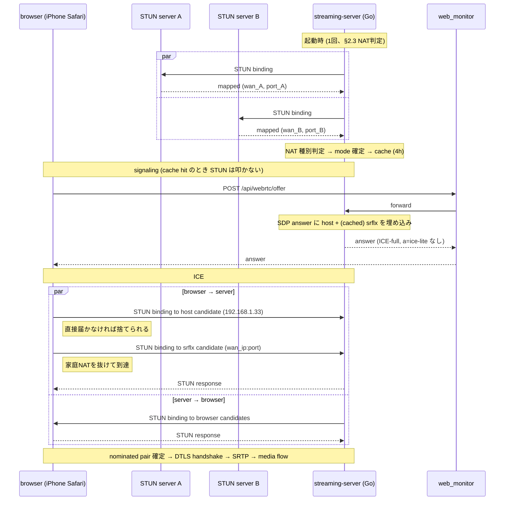

# WebRTC ICE-full + srflx 復元 設計ドキュメント

## ステータス
ドラフト / **検証フェーズ** (実装前)

ブランチ: `feat/webrtc-ice-full-restoration`
関連: PR #209 (multi-IP host candidate 化)

> **進行ポリシー**: 仮説先行で実装に入らず、本ドキュメントの「§ 11 検証フェーズ」に挙げた項目を計測 → 結果を「§ 12 計測結果」に追記 → §2の設計を確定/修正 → 実装着手、の順で進める。

## 1. 背景

### 1.1 結論先出し

- **pion/webrtc 時代 (`e8d1d79` 以前) はモバイル回線からの WebRTC 視聴ができていた**
- `e8d1d79` で pion を排除して自前実装に置き換えた際、**ICE 周りの機能を意図せず大きく削った** ことが原因で動かなくなった
- 失われた機能を自前実装で復元すれば pion 時代の動作に戻る
- **Cloudflare TURN サーバの導入は不要** (一旦は必要と検討したが、再調査で不要と判明)

### 1.2 現状

直近の PR #209 で host candidate を全 NIC ぶん発行するよう改善した。

| アクセス経路 | 動作 |
|---|---|
| 自宅LAN内 (同一 192.168.1.0/24) Safari/Chrome | ✅ 視聴可能 |
| 自宅LAN内 Tailscale | ✅ 視聴可能 (PR #209 後) |
| **モバイル回線 iPhone Safari over Tailscale** | ❌ ICE が一切起動しない |

### 1.3 失敗時の症状

- HTTPS による signaling は正常 → SDP answer 返却
- ブラウザ側 `setRemoteDescription` は成功 (例外なし)
- **STUN binding request が UDP socket に1パケットも届かない** (45秒 tcpdump で 0 packets)
- `connectionState` は最終的に `'failed'` に遷移し、UI は MJPEG にフォールバック

### 1.4 pion 時代との差分

`e8d1d79^` の pion 実装では以下が **自動的に行われていた**:

```go
// 旧 internal/webrtc/server.go (pion 版)
iceServers = []webrtc.ICEServer{{
    URLs: []string{"stun:stun.l.google.com:19302"},
}}
config: webrtc.Configuration{ICEServers: iceServers}
```

これだけで pion 内部が以下を全部やってくれていた:

1. **srflx 候補の取得**: Google STUN に問い合わせて家の WAN IP:port を学習し、SDP に `a=candidate ... typ srflx` として追加
2. **ICE-full モード**: browser の各 candidate に対して STUN binding request を発信、双方向のホールパンチを実施
3. **USE-CANDIDATE 処理 / 候補ペア優先度計算**: ICE 標準に沿ったペア選定

`e8d1d79` の自前実装ではこれらが **全部スキップされた**:

| 項目 | pion時代 | 現在 (`e8d1d79` 以降) |
|---|---|---|
| ICE モード | ICE-full | **ICE-lite** (`a=ice-lite`) |
| host candidate | あり | あり |
| srflx candidate | あり (STUN自動取得) | **なし** |
| 自前 STUN binding 発信 | あり | **なし** (受信側のみ) |
| candidate pair check | pion ライブラリが管理 | **なし** |

→ 家庭NAT 越え (= 外部からのアクセス) に必要な「公開到達可能な候補と双方向ホールパンチ」が消えた状態。これがモバイル回線で動かなくなった真因。

### 1.5 ICE-lite 化で得られたメリット

ICE-lite 化は意図せずではなく **明確なメリット** ももたらしている。失わせたくない:

| メリット | 仕組み |
|---|---|
| **WebRTC ↔ MJPEG 切替が高速化** | 起動時/接続時の srflx gather が無く、SDP answer を即返せる |
| **CPU 使用率低下** | ※ ICE-lite は寄与せず、別要因 (RTP payloader 共有 #202、interceptor削減 #205、SRTP最適化 #208) |

定常 CPU 削減は ICE-lite とは独立した最適化なので、ICE-full 復元時も維持される。**唯一の懸念は切替レイテンシ**だが、後述の方針で解消する。

### 1.6 自宅ネットワークの前提 (MAP-E 環境)

ユーザの ISP は **MAP-E** 方式 (v6plus / transix / OCN バーチャルコネクト 等) を採用している前提で設計する。MAP-E は以下の制約を持つ:

| 性質 | MAP-E での挙動 | 設計への影響 |
|---|---|---|
| WAN IPv4 | 他ユーザと共有 (CGN 相当) | srflx を取得しても、それは「自分専用」ではなく「共有 IP の割当 port 範囲内」 |
| 使用可能 port | **割当 port 範囲のみ** (典型 240 port × N 個、不連続) | サーバの local bind port が WAN port に **そのまま現れない**。`mapped_port == local_port` 保証なし |
| port preservation | **不可** (CE がアルゴリズムで port 選択) | per-session に STUN を叩いて mapped_port を取得しない限り、SDP に書けない |
| EIM (Endpoint-Independent Mapping) | 一般に成立 (CE はステートレス的に動作) | srflx + ICE-lite で peer 側 EIM ならホールパンチ可能 |
| UPnP-IGD / NAT-PMP / PCP | **基本不可** (CE はユーザ制御の port forwarding を提供しない) | §11.E は **対象外** に格下げ |
| IPv6 | **直通可能** (MAP-E は v4 over v6 トンネル — v6 は素のグローバル) | **v6 経路が NAT 越え不要で最も素直**。設計の主軸候補 |

→ **IPv4 経路を取るなら srflx 必須** (host だけでは不可、port preservation 前提も不可)、**IPv6 経路を取れば NAT そのものを回避できる**。

### 1.7 実機の IPv6 到達性 (確認済み)

`ip -6 addr show` で global prefix `240d:f:dd4:d800::/64` が確認できた。`curl -6 https://ifconfig.io` が **パブリック IPv6 アドレスを返す** → サーバ側は **IPv6 で外部から直接到達可能**な状態にある。

→ **§11.D の検証はサーバ側についてはほぼ完了**。残る未確認項目は iPhone 側 (LTE 経由で v6 IPv6 アドレスが付くか + そこからサーバの v6 にUDPが到達するか) のみ。

## 2. 解決方針

### 2.0 ICE-full の発動シナリオ整理

ICE-full が**実際に必要になるのは「iPhone を 5G/LTE 回線でアクセスしたとき」だけ**。それ以外は ICE-lite + host で完結する。

| シナリオ | 必要な機能 | ICE-full 必要 |
|---|---|---|
| 自宅 LAN (同一 192.168.1.0/24) | host candidate | 不要 |
| Tailscale (CGNAT 100.64/10) | host candidate (Tailscale IF) | 不要 |
| **iPhone 5G/LTE** | srflx (家庭側 WAN) + connectivity check 双方向 | **必要 (またはサーバ側からも binding を投げて補完)** |
| 外部 LAN (出先 Wi-Fi 等) | 上と同じ (srflx + 双方向 check) | iPhone と同じ扱い |

→ **設計の優先度**:
1. **IPv6 直通** (§11.D) で 5G/LTE をカバーできるか先に確認 — 当たれば ICE-full は不要
2. ダメなら **ICE-lite + srflx (片方向)** で改善を試す — peer 側が EIM なら通る可能性
3. それでも届かないとき **ICE-full** (双方向 binding) を導入

ICE-full は「最終フォールバック」かつ「**iPhone 5G/LTE 用のピンポイント補完**」と位置付ける。LAN/Tailscale のパスは ICE-full にしても挙動が変わらない (host が最高 priority で選ばれる) ので、有効化してもリグレッション要因にはなりにくい。

### 2.1 ICE-full + srflx を自前実装で復元 (Cloudflare TURN サーバは使わない)

| コンポーネント | 変更 | 必要 Phase |
|---|---|---|
| streaming-server `internal/signal/stun_client.go` (新規) | パブリック STUN binding request 送信、XOR-MAPPED-ADDRESS パース | Phase 2 (srflx) |
| streaming-server (起動時1回) | srflx を gather してキャッシュ (lazy, 4h)。**定期 keepalive はしない** | Phase 2 |
| streaming-server `internal/signal/sdp.go` | SDP answer に srflx candidate を追加。`a=ice-lite` は **ICE-full 化のときだけ削除** | Phase 2 (srflx 追加) / Phase 3 (ice-lite 削除) |
| streaming-server `internal/signal/ice.go` | ICE-full: browser candidate に向けた binding request、候補ペアチェック、USE-CANDIDATE 処理 | **Phase 3 (条件付き)** — iPhone 5G/LTE で srflx だけでは足りないと判明したときだけ |
| streaming-server `internal/signal/session.go` | `getLocalIPs()` を IPv6 対応に拡張、ListenUDP を dual-stack `[::]` 化 | **Phase 1 (IPv6)** |
| streaming-server `internal/signal/sdp.go` | IPv6 host candidate (`a=candidate ... 2400::... typ host`)、`c=IN IP6 ...` 切替 | Phase 1 |
| browser側 | **変更なし** (現状の `iceServers: [{urls: 'stun:stun.l.google.com:19302'}]` のまま) | — |

### 2.2 srflx 取得は lazy + 4h cache (定期ポーリングはしない)

ICE-full 化の主なコストは **srflx gather 1往復(~50-200ms)**。これを per-session に毎回払うのは切替レイテンシを劣化させるので、以下の lazy キャッシュ方式で吸収する。

- 起動時に **NAT 種別を判定** (§ 2.3 のフローを 1 回実行)
- 結果として `(wan_ip, nat_type, port_preserved)` を **4h cache**
- per-session: cache hit なら srflx candidate = `(cached_wan_ip, session_socket_port)` をそのまま SDP に埋める。STUN は叩かない
- cache 期限切れ (4h) でアクセスがあった場合: その session は host のみで先行発行 (待たない)、background で再判定 → cache 更新
- ICE 失敗フィードバックがあれば cache を invalidate して次回 force re-gather (WAN IP 変化への追従)

> **NAT mapping の寿命とは別問題**: セッション中は ICE/RTP の通信で mapping が自然延命する。セッション終了後は mapping が期限切れしても、次セッションで socket を bind し直して STUN を投げれば新しい mapping が即作られる。**定期 keepalive は不要**。

ICE-full の connectivity check (server→browser candidate への STUN binding) は per-session 発生するが、典型的に <100ms で完了し、ユーザ体感としては気付かない。

### 2.3 NAT 種別自動検出 (起動時に1回)

ユーザが手で「自宅ルータが symmetric NAT でないことを確認」する代わりに、**サーバ起動時に自動検出**する。検出ロジック:

```
単一 UDP socket bind on internal_port_X
  ├→ STUN to server A (e.g. stun.l.google.com:19302) → mapped (wan_A, port_A)
  └→ STUN to server B (e.g. stun.cloudflare.com:3478) → mapped (wan_B, port_B)

  Case 1: wan_A==wan_B && port_A==port_B && port_A==internal_port_X
          ⇒ EIM (cone NAT) + port preservation
          ⇒ fast mode: WAN IP を 4h cache、per-session STUN 不要
  Case 2: wan_A==wan_B && port_A==port_B && port_A != internal_port_X
          ⇒ EIM だが port preservation なし
          ⇒ medium mode: per-session で STUN を1回叩いて mapped_port を取得 (cache は WAN IP のみ)
  Case 3: wan_A != wan_B || port_A != port_B
          ⇒ Endpoint-Dependent Mapping (Symmetric NAT)
          ⇒ srflx を出さず host のみで動作 (= 現在の挙動と同等、リモートは諦め)
  Case 4: STUN タイムアウト/エラー
          ⇒ srflx を出さず host のみで動作 (= 現在の挙動)
```

> RFC 5780 (NAT Behavior Discovery) は単一サーバで `CHANGE-REQUEST` を使ってやれるが、Google STUN は対応していないので **異なる宛先 STUN サーバ 2 つ** を用いた classic 方式で判定する。

### 2.4 Cloudflare TURN サーバが不要な理由

検討段階では Cloudflare TURN を使う案を出したが、**pion 時代に動いていた = STUN だけで足りていた = TURN 不要** という事実が立証された。

- サーバ側はパブリック STUN で srflx を取得し、browser 側も既存の Google STUN で同様に srflx を取得する
- 両者が srflx 候補を SDP に並べ、家庭ルータが full-cone or address-restricted-cone であればホールパンチが成立する
- これが pion 内部でやっていた挙動そのもの

例外: サーバが **symmetric NAT** 配下にある場合 (二重NAT、企業FW等) はホールパンチが破れる。ただし一般家庭ではほぼ発生せず、pion 時代に動いていた事実から本ユーザ環境ではそのケースに該当しないと判断できる。発生時は別 PR で TURN client 追加を検討する (本設計の対象外)。

→ **Cloudflare アカウント、API token、credential 発行エンドポイントなど、外部サービスに関する作業は一切不要。**

### 2.5 接続シーケンス



## 3. スコープ

### in scope
- **検証フェーズ**: NAT/IPv6/UPnP 等の事前計測 (§ 11)
- パブリック STUN client 実装 (`stun:stun.l.google.com:19302` 等)
- 起動時 NAT 種別自動検出 + lazy 4h cache (定期 keepalive は **しない**)
- SDP answer に srflx candidate を追加、`a=ice-lite` を削除
- ICE-full 化 (binding request 発信、候補ペア状態管理、USE-CANDIDATE 処理)
- 切替レイテンシ維持 (cache hit 時は STUN を叩かない)
- 既存 LAN 動作の保持 (Symmetric NAT 検出時は host のみで現状互換)
- 自動・手動テスト

### out of scope
- **Cloudflare TURN を使った中継** (本設計では不要と結論済み)
- TURN client 実装全般 (symmetric NAT 環境用、別 PR で必要に応じて)
- WebRTC ↔ HLS フォールバック設計
- 帯域制御 / コスト監視ダッシュボード

## 4. 役割分担

### user (人間) のタスク
- [ ] § 11 検証フェーズの実機計測 (iPhone を LTE に切ってテスト等、Claude 単独不可なもの)
- [ ] LAN 動作のリグレッション確認 (Safari/Chrome 両方)
- [ ] モバイル回線 (LTE) 実機テスト (Safari iPhone)
- [ ] 切替速度の体感確認 (現状と比べて遅くなっていないか)

NAT 種別の事前確認は不要 (起動時自動検出)。外部サービス契約・API token 管理も不要 (Cloudflare TURN を使わないため)。

### Claude (作業) のタスク

#### 検証フェーズ (§ 11、実装前)
- [ ] `scripts/diag/` 配下に検証用ツール群を整備 (詳細は § 11)
- [ ] 計測結果を § 12 に集約、設計確定/修正の根拠とする

#### 実装フェーズ (検証結果で設計確定後)
- [ ] `internal/signal/stun_client.go` 新規: STUN binding request 送信/応答パース、XOR-MAPPED-ADDRESS 抽出
- [ ] `internal/signal/nat_probe.go` 新規: 起動時 NAT 種別自動検出 (§ 2.3 のロジック)
- [ ] `cmd/server/main.go`: 起動時 NAT probe 実行、結果を `signal.Server` に渡す
- [ ] `internal/signal/session.go`: srflx (cached) をフィールドに保持、`AnswerParams.CandidateIPs` に host + srflx を結合
- [ ] `internal/signal/ice.go` 拡張: ICE-full、binding request 発信、候補ペア状態機械、USE-CANDIDATE
- [ ] `internal/signal/sdp.go`: `a=ice-lite` を削除、srflx candidate (`typ srflx raddr ... rport ...`) 出力
- [ ] テスト: `stun_client_test.go`, `nat_probe_test.go`, `ice_test.go` 新規/拡張
- [ ] `docs/streaming-server.md` 更新 (リモート視聴節を追加)

## 5. 設定 (環境変数)

```ini
# /etc/systemd/system/pet-camera-streaming.service

# Phase A/B (本設計の主要 2 パス)
PET_CAMERA_ENABLE_IPV6_CANDIDATES=true   # SDP に v6 host candidate を載せるか (Phase B)
PET_CAMERA_ENABLE_ICE_FULL=true          # outgoing STUN binding と prflx discovery を有効にするか (Phase A)。false で従来の ICE-lite 互換

# Phase D (srflx、条件付き、Phase A で 5G が届かなかったら導入)
PET_CAMERA_PUBLIC_STUN_PRIMARY=stun:stun.l.google.com:19302    # 起動時 srflx gather + NAT probe primary (空なら srflx 機能を無効)
PET_CAMERA_PUBLIC_STUN_SECONDARY=stun:stun.cloudflare.com:3478 # NAT probe で EIM 検証に使う 2 つ目の STUN
PET_CAMERA_NAT_PROBE_CACHE_HOURS=4                              # srflx の lazy cache TTL
```

切替の指針:
- 単独検証時は片方を false にして対応 path のみ動作させる (§ 7.0 のマトリクス参照)
- 問題発生時は両方 false にすれば従来の ICE-lite + host 挙動に戻せる (即時ロールバック)

## 6. リスクと検討事項

| リスク | 影響度 | 対応 |
|---|---|---|
| ICE-full 化で既存 LAN 動作にリグレッション | 高 | 段階デプロイ、`PET_CAMERA_PUBLIC_STUN_PRIMARY=` 空でフォールバック可能に |
| NAT probe 失敗 / Symmetric NAT 検出 | 中 | srflx を出さず host のみで動作 (= 現在の挙動と同等)。warn ログのみ |
| WAN IP が動的 IP で変わる | 中 | ICE 失敗フィードバックで cache invalidate → 次回 force re-probe |
| Cone NAT だが port preservation なし | 中 | NAT probe で検出、medium mode (per-session STUN) にフォールバック |
| 公開IP UDP 露出のセキュリティ | 中 | DTLS-SRTP 暗号化 + ICE ufrag/pwd 認証 + ランダムポート。実害ほぼ無し |
| 仮説検証なしで実装するリスク | 高 | § 11 検証フェーズで先に計測、失敗仮説を早期に潰す |

## 7. 段階リリース計画

**目的**: 「最小 ICE-full」 と 「IPv6 直通」 の**両方**を実装し、それぞれが 5G/LTE で独立して動作することを実機で実証する。両パスとも動けば本番では ICE が priority で自動選択 (通常は v6 host が最優先) し、片方が落ちても他方でフォールバックできる二重化が成立する。

**実装順序**: **A → D → B → C**
1. まず v4 経路を最小実装 (A) で立て、5G 動作の素朴な仮説検証
2. A だけで届かなかったら srflx (D) を足して v4 経路を堅牢化
3. v4 経路が落ち着いたら v6 直通 (B) を最適化として追加
4. 最後に両 path を統合テスト (C)

この順は「先に難しい (v4 NAT 越え) を片付けてから簡単な最適化 (v6) を足す」設計思想。Phase A 実装中に発見される事項 (MAP-E の細かい挙動、Safari の candidate filter 等) が D の実装に活きる流れにもなる。

### 7.0 検証用 env var (両 Phase で導入)

各 Phase の検証時にもう一方を OFF にして単独動作を確認できるよう、起動時 env var で切り替えできるようにする:

```
PET_CAMERA_ENABLE_IPV6_CANDIDATES=true|false   # default true
PET_CAMERA_ENABLE_ICE_FULL=true|false          # default true (false で従来の ICE-lite 挙動)
```

| 検証シナリオ | `IPV6_CANDIDATES` | `ICE_FULL` | 期待動作 |
|---|---|---|---|
| **Phase A 単独検証** (ICE-full の独立動作) | `false` | `true` | v4 host のみ + outgoing STUN + prflx discovery で 5G から繋がる |
| **Phase B 単独検証** (v6 直通の独立動作) | `true` | `false` | v6 host のみ (= ICE-lite) で 5G から繋がる |
| 本番設定 | `true` | `true` | 両 candidate 公開、ICE が priority で v6 host を選ぶのが通常、v6 不通時は ICE-full + prflx でフォールバック |
| 完全 disable | `false` | `false` | 現在の挙動 (LAN/Tailscale のみ動作、5G 不通) |

### 7.1 Phase A — 最小 ICE-full (~250 LoC)

**狙い**: outgoing STUN binding と prflx discovery で MAP-E NAT を内側からホール開けし、5G iPhone と通信成立を実証する。peer は常に 1 つなので state machine はフルセット不要、最小実装で十分。

- `internal/signal/ice.go` 拡張:
  - offer の `a=candidate` 各エントリに対して **outgoing STUN binding request** を送信
  - retransmit: RFC 5389 (Ti=500ms 開始、指数バックオフ、RTO×7 で諦め)
  - 最初に成功応答が返ったペアを nominated とする (USE-CANDIDATE は controlled 側で受動的に処理)
  - フル state machine (Frozen/Waiting/In-Progress/Succeeded/Failed) は **省略**
- `internal/signal/sdp.go`: `AnswerParams.ICELite bool` を追加、`ENABLE_ICE_FULL=true` のとき `a=ice-lite` を省く
- `internal/signal/session.go`: ICE-full モードでは offer 内の candidate を抽出して ICE 状態に渡す
- env var の読み込み (`cmd/server/main.go`)
- テスト: outgoing binding build、retransmit、prflx 認識、nominated 選定
- **検証**: `IPV6_CANDIDATES=false, ICE_FULL=true` でデプロイ → 5G iPhone 実機テスト

### 7.2 Phase D — srflx via STUN (条件付き、~820 LoC)

**狙い**: Phase A の最小 ICE-full でも 5G に届かなかったら、SDP に明示的に srflx candidate を載せて iPhone 側に「サーバの WAN address はここ」と直接教える。MAP-E + EIM 前提が崩れているケース (CE が Address-Restricted-Cone 動作する等) を救う。

**実装に入る条件**: Phase A 検証で 5G から prflx discovery が成立しないと判明したとき。Phase A が刺さるならスキップ。

- `internal/signal/stun_client.go` (新規, ~150 LoC):
  - パブリック STUN への binding request、XOR-MAPPED-ADDRESS パース
  - RFC 5389 retransmit (Phase A の outgoing binding ロジックを共用できる可能性あり)
- `internal/signal/nat_probe.go` (新規, ~200 LoC):
  - 起動時に 2 STUN サーバ並列クエリ → EIM/port preservation 判定
  - 4h lazy cache、結果は `(wan_ip4, wan_ip6, mapping_mode)`
  - ICE 失敗フィードバックで cache invalidate
- `internal/signal/sdp.go`: `AnswerParams.SrflxCandidates []SrflxCand` を追加、`a=candidate ... typ srflx raddr ... rport ...` 出力
- `internal/signal/session.go`: cached srflx を `AnswerParams` に積む
- `cmd/server/main.go`: 起動時 NAT probe 実行
- テスト: `stun_client_test.go`, `nat_probe_test.go`, `sdp_test.go` 追記
- **検証**: `IPV6_CANDIDATES=false, ICE_FULL=true` (srflx は ICE_FULL 経由で SDP に積まれる) でデプロイ → 5G iPhone 実機テスト

### 7.3 Phase B — IPv6 直通 (~135 LoC)

**狙い**: v6 host candidate を SDP に載せ、MAP-E トンネル外の素 IPv6 で iPhone と直結。NAT 越え自体が不要になり、ICE 収束も最速。

- `internal/signal/session.go`:
  - `getLocalIPs()` を `getLocalCandidateAddrs()` に拡張: v4 + v6 (global scope, mngtmpaddr 優先 / `tempaddr` は除外)
  - `ListenUDP` の bind を `IP: nil` で dual-stack 化
- `internal/signal/sdp.go`:
  - v6 候補がある場合 `c=IN IP6 ...` を併用、`a=candidate ... <v6_addr> ...` をフォーマット
  - priority は v6 host > v4 host > srflx の順 (RFC 8421 互換)
- env var `PET_CAMERA_ENABLE_IPV6_CANDIDATES=false` で v6 候補出力を抑止 (Phase A 単独検証用)
- テスト: v6 候補を含む answer 生成、`c=IN IP6` 切替、dual-stack listen
- **検証**: `IPV6_CANDIDATES=true, ICE_FULL=false` でデプロイ → 5G iPhone 実機テスト

### 7.4 Phase C — 統合テスト

- `IPV6_CANDIDATES=true, ICE_FULL=true` でデプロイ
- `chrome://webrtc-internals` 相当 (Safari は不可なので Mac/PC からの Chrome で確認) で 5G 経由時の selected pair を観察:
  - v6 host が selected pair になっているのが期待 (priority 最上位)
  - v6 不通環境を擬似的に作って (例: AAAA レコードを SDP から削る) ICE-full + prflx に切替わるか確認
- LAN/Tailscale のリグレッション確認
- 切替レイテンシ計測 (現状比で悪化していないこと)

### 7.5 Phase E — 仕上げ

- ドキュメント更新 (`docs/streaming-server.md` にリモート視聴節追加)
- systemd unit (`scripts/pet-camera-streaming.service`) の env var 設定
- 24h 長時間稼働確認
- 本番リリース

## 8. テスト計画

### unit
- `stun_client_test.go`: binding request build、binding response parse、XOR-MAPPED-ADDRESS 抽出 (IPv4/IPv6)
- `sdp_test.go` 追加: srflx candidate を含む answer 生成、`a=ice-lite` 不在
- `ice_test.go`: 候補ペア状態機械、priority 計算、USE-CANDIDATE 処理

### integration
- ループバックで pion 製クライアントとの interop テスト (controlling 側を pion で)
- 既存 `session_race_test.go` を ICE-full 経路でも通す

### manual
- 自宅 LAN: Safari/Chrome 両方で再生、切替レイテンシが体感で悪化していないこと
- 外出先 LTE: iPhone Safari で再生 (これがゴール)
- `chrome://webrtc-internals` でデスクトップから候補ペアの状態を確認
- 長時間稼働: 24h 経過後もモバイルから繋がること (keepalive 検証)

## 9. 参考資料

- RFC 8445: ICE
- RFC 5389/8489: STUN
- pion/webrtc の ICE-full + STUN gather 実装 (`e8d1d79^` の `internal/webrtc/server.go` で参照していた API)
- WebKit ICE filtering 挙動: 個別観察ログ (このリポジトリでは PR #209 設計時に判明)

## 10. 次アクション

- ユーザ: 設計レビュー → 承認
- Claude: § 11 検証フェーズの診断スクリプト整備 → 実機計測 → § 12 に結果集約 → § 2 設計確定 → 実装着手

## 11. 検証フェーズ

設計の前提仮説を実機で潰してから実装に入る。検証スクリプト群は `scripts/diag/` に置く。優先度順:

### 11.A NAT 挙動 / WAN IP (必須)

**目的**: § 2.3 の NAT 種別自動検出が成立するか、4h cache 戦略の前提が満たされるかを確認。

| 項目 | 手段 | 受入基準 |
|---|---|---|
| WAN IP 値 | 自前 STUN client → Google STUN | 公開IPv4が返ること |
| ポート保存 | STUN 応答の mapped port を内部 port と比較 | `mapped == internal` (or 規則的に外れ) |
| EIM 判定 | 異なる 2 STUN サーバに同 socket から投げて mapped 比較 | 同一なら EIM、不一致なら symmetric |
| NAT mapping timeout 実測 | STUN で穴を開け、N秒後に外部から UDP を投げて到達するか確認 | 30 秒・1分・5分・30分 で測定 → どこまで生きるか分かる |

**スクリプト**: `scripts/diag/nat_probe.go` (Go の小スクリプト、stunclient 的な機能)

### 11.B iPhone Safari over LTE の E2E 仮説検証 (必須)

**目的**: 「WAN IP candidate なら iPhone Safari は STUN を投げる」仮説を実装前に確かめる。失敗するなら設計の根本見直し。

**手順**:
1. 検証用ブランチで一時パッチ: NAT probe で取った WAN IP:port を srflx として SDP answer に焼き込む (ICE-lite のままで OK)
2. 実機にデプロイ
3. iPhone を Tailscale OFF + LTE に切ってアクセス (WebRTC が動くか観察)
4. デバイス側で `tcpdump -i any 'udp portrange 20000-20020'` を回し、iPhone から STUN が届いているかを確認
5. 結果を3パターンで記録:
   - 通った → 設計確定、実装フェーズへ
   - STUN 届かない → Safari は WAN IP も filter している可能性、別仮説 (e.g. ポート開放、Tailscale ICE-full、IPv6) を試す
   - STUN 届くが ICE 通らない → DTLS or codec 問題、別軸の調査

**スクリプト**: `scripts/diag/inject_srflx_patch.sh` + 実機 tcpdump 観測

### 11.C Cone NAT の細分判定 (必須)

**目的**: full-cone / address-restricted-cone / port-restricted-cone を識別。ICE-full 必須かどうかが変わる。

**手段**: RFC 5780 風の filter test (パブリック側からの送信元 IP/port を変えた binding を発生させる)。pion/stun の `nat-discovery` を参考実装にする。

### 11.D IPv6 経路の可能性 (**最有力 — サーバ側は既に確認済み**)

**目的**: グローバル IPv6 が両端で使えれば NAT 問題が消えて設計が大幅簡略化。MAP-E 環境では特に有効 (MAP-E のトンネル外側 = 素の v6 がそのまま使える)。

| 項目 | 手段 | 結果 |
|---|---|---|
| 実機の IPv6 | `ip -6 addr show` | ✅ `240d:f:dd4:d800::/64` あり (KDDI au IPv6) |
| 実機の IPv6 到達確認 | `curl -6 https://ifconfig.io` | ✅ パブリック IPv6 を返す |
| 実機 IPv6 の安定性 | `temporary dynamic` の rotation 周期 | ⚠️ 要確認 — RFC 4941 temporary address は数時間で回るので、SLAAC EUI-64 か mngtmpaddr の安定アドレスを別途用意する必要あり |
| iPhone 5G/LTE の IPv6 | Safari で `https://test-ipv6.com` (Wi-Fi OFF, モバイルデータのみ) | **TBD — 残タスクはこれ1つ** |
| AAAA レコード | `dig AAAA rdk-x5.tail848eb5.ts.net` | Tailscale は IPv6 配布する |
| iPhone から実機 v6 への UDP 到達 | iPhone から実機の v6 アドレス宛に `nc -u` 的なテスト (signaling 経由でアドレス取得) | TBD |

**サーバ側で確認済み**:
- ISP は MAP-E (v4 over v6 トンネル) のため v6 はトンネル外でグローバル直通
- ipconfig.io が応答 = ステートフル firewall が egress を許可、外部からの応答パケットも戻る
- 外部からの **新規 inbound UDP** が通るかは未確認 (CE/ルータが ingress を許可しているか)

**残検証ステップ**:
1. iPhone モバイルデータ単独で `https://test-ipv6.com` を開く → IPv6 スコア確認
2. iPhone の Safari から実機の v6 アドレス + 既存 HTTPS 8080 に直接アクセス (signaling が通れば inbound が許可されている)
3. SDP に v6 candidate を仕込んで WebRTC を試す

**当たれば**: Phase 2/3 (STUN client, NAT probe, ICE-full) は全部不要。**修正は §13 の Phase 1 のみ ~50 LoC で完了**。

### 11.E UPnP-IGD / NAT-PMP / PCP 対応確認 (低優先 — MAP-E 環境では基本不可)

**前提**: 自宅は MAP-E (§1.6) 環境のため、CE 側でユーザ制御の port forwarding は提供されない可能性が高い。**期待値は低い**。一応動作確認だけしておく。

**手段** (一発確認のみ、ダメなら諦め):
```bash
sudo apt install miniupnpc
upnpc -s                          # UPnP デバイス検出 — おそらく nothing found
natpmpc -a 0 0 udp 3600           # NAT-PMP — おそらく timeout
```

応答があれば嬉しい誤算、無ければ予想通りなので即スキップ。

### 11.F Tailscale 経由の ICE-full 再試行 (B/D が両方失敗時)

**目的**: 「Safari は CGNAT 候補に STUN を投げない」仮説を、サーバ側からも binding を打つ ICE-full で再検証。サーバが先に Tailscale 候補に投げれば、Safari 側も応答ハンドシェイクで動く可能性が残っている。

**手段**: 検証用パッチで Tailscale 候補に向けて先行 STUN binding を発信、iPhone Safari 側の挙動を観測。

### 11.G DTLS / SRTP over the 実経路 (実装ディテール)

LTE 経由の RTT・jitter・loss を計測。NACK interceptor 再導入の判断材料。

| 項目 | 手段 |
|---|---|
| RTT | `iperf3 -u -c <peer> -t 30` |
| Loss | iperf3 出力 |
| MTU | `ping -M do -s 1472 <peer>` 等で Path MTU |
| DTLS 安定性 | 実 WebRTC セッションを長時間 (1h) 流して切断率観測 |

### 11.H 検証実行順序

1. **D (IPv6 / iPhone LTE 側)** を最初に — 当たれば全部スキップ。サーバ側はもう確認済み (§1.7)
2. **B (E2E with hardcoded WAN srflx)** を次に — Phase 2 (srflx) の理論検証
3. **A + C (NAT 詳細)** を Phase 2 の実装計画用に
4. **E (UPnP)** は MAP-E 環境では期待値低い、1コマンドで終わるので念のため
5. **F (Tailscale ICE-full)** は B と D が両方失敗したら最終手段として

## 12. 計測結果

(検証フェーズ実行後に追記)

### 12.A NAT 挙動 / WAN IP

- WAN IP: TBD
- ポート保存: TBD
- EIM: TBD
- NAT mapping timeout: TBD

### 12.B iPhone Safari over LTE E2E

- 結果: TBD

### 12.C Cone NAT サブタイプ

- 結果: TBD

### 12.D IPv6

- 実機 IPv6: TBD
- iPhone LTE IPv6: TBD
- 採用判断: TBD

### 12.E UPnP / NAT-PMP / PCP

- ルータ対応: TBD
- 採用判断: TBD

### 12.F Tailscale 経由 ICE-full

- 結果: TBD

### 12.G 実経路の品質

- RTT: TBD / Loss: TBD / MTU: TBD

### 結論 (検証完了後に書く)

- 採用する経路: TBD
- 設計確定版の主要パラメータ: TBD
- 不要になった項目: TBD

## 13. 修正範囲と規模見積もり

依存ライブラリは **増やさない** (stdlib `net` + `crypto/hmac` + `crypto/sha256` + 既存 `pion/dtls` のみ)。

### 13.1 Phase 1 — IPv6 経路 (最有力)

| ファイル | 変更内容 | 規模 (新規/差分 LoC) |
|---|---|---|
| `internal/signal/session.go` | `getLocalIPs()` を `getLocalCandidateAddrs()` に拡張: IPv4 (既存) + IPv6 global (新規)、temporary/link-local を除外 | +30 / -10 |
| `internal/signal/session.go` | `ListenUDP` の bind address を `IP: nil` 化 (kernel 既定で dual-stack) | +0 / -1 |
| `internal/signal/sdp.go` | `c=IN IP6 ...` を v6 候補がある場合に併記、`a=candidate` で v6 アドレスをフォーマット | +20 / -5 |
| `internal/signal/sdp_test.go` | v6 候補のテスト追加 | +60 |
| `internal/signal/session_race_test.go` | 必要なら dual-stack 観点で 1 ケース追加 | +20 |
| **合計** | | **~135 LoC** |

### 13.2 Phase 2 — srflx via STUN (IPv6 がダメだったら)

| ファイル | 変更内容 | 規模 |
|---|---|---|
| `internal/signal/stun_client.go` (新規) | binding request build / response parse、XOR-MAPPED-ADDRESS、RFC 5389 retransmit (Ti = 500ms, RTO×7) | ~150 LoC |
| `internal/signal/nat_probe.go` (新規) | 2 STUN サーバ並列クエリ、EIM/port preservation 判定、4h lazy cache、結果は `(wan_ip4, wan_ip6, mapping_mode)` | ~200 LoC |
| `internal/signal/session.go` | `Server` に `natCache *NATCache` を追加、`HandleOffer` で srflx を `AnswerParams` に積む | +40 |
| `internal/signal/sdp.go` | `AnswerParams.SrflxCandidates []SrflxCand` を追加、`a=candidate ... typ srflx raddr ... rport ...` 出力 | +50 |
| `cmd/server/main.go` | 起動時 NAT probe 実行、結果を `signal.NewServer` に渡す。env var の読み込み (`PET_CAMERA_PUBLIC_STUN_PRIMARY/SECONDARY`) | +30 |
| テスト (`stun_client_test.go`, `nat_probe_test.go`, `sdp_test.go` 追記) | unit + テーブル駆動 | ~350 LoC |
| **合計** | | **~820 LoC** |

### 13.3 Phase 3 — ICE-full (srflx でも届かない最終フォールバック)

| ファイル | 変更内容 | 規模 |
|---|---|---|
| `internal/signal/ice.go` | outgoing binding request build、`a=ice-controlled` / controlling 判定、候補ペアの state machine (Frozen/Waiting/InProgress/Succeeded/Failed)、USE-CANDIDATE 処理、nominated pair 選定 | ~300 LoC |
| `internal/signal/ice.go` | ICE 失敗時の cache invalidate コールバック | +20 |
| `internal/signal/sdp.go` | `a=ice-lite` 出力を条件付きに変更 (`AnswerParams.ICELite bool`) | +10 |
| `internal/signal/session.go` | ICE-full モード時の peer candidate 受信パスを `runSession` に追加 | +60 |
| テスト (`ice_test.go` 新規) | binding request build、retransmit、ペア状態遷移、USE-CANDIDATE | ~300 LoC |
| **合計** | | **~690 LoC** |

### 13.4 累積規模 (Phase A + B 両方実装、Phase D は条件付き)

ICE-full と IPv6 直通の **両方が 5G モバイルで動作することを実証する** 方針に従い、Phase A と B は両方必ず実装する。Phase D (srflx) は A/B どちらも 5G で届かなかった場合のみ追加。

| ケース | 実装 LoC | テスト LoC | 合計 LoC | 工数感 |
|---|---|---|---|---|
| Phase A 単独 (最小 ICE-full のみ) | ~150 | ~100 | ~250 | 1日 |
| Phase B 単独 (IPv6 直通のみ) | ~55 | ~80 | ~135 | 半日 |
| **Phase A + B 両方 (本設計の主目標)** | **~205** | **~180** | **~385** | **1.5-2日** |
| Phase A + B + D (srflx 追加、最終形) | ~675 | ~610 | ~1285 | 4-5日 |
| 旧計画 (full ICE-full state machine 含む全部) | ~895 | ~730 | ~1625 | 4-5日 |

最小 ICE-full (Phase A) と IPv6 (Phase B) の合計 ~385 LoC が **2日仕事の範囲** に収まる見込み。両方動けば 5G が二重化されて堅牢。

## 14. 現状の network 関連実装サマリ (基準点)

調査時点 (本 PR 着手時点) の network 周りコードの構造を、変更時のリグレッション基準として固定しておく。

### 14.1 UDP socket / listen
- `internal/signal/session.go:53-55` — port range は **20000-30000**、`nextPort` で sequential 割当 (ロックあり)
- `internal/signal/session.go:86-91` — `&net.UDPAddr{IP: net.IPv4zero, Port: port}` で **IPv4 のみ bind** (これが IPv6 阻害要因)

### 14.2 host candidate 収集
- `internal/signal/session.go:350-366` `getLocalIPs()` — `net.InterfaceAddrs()` 全走査、`IsLoopback()` を除外、`To4()` で **IPv4 のみ抽出**。IPv6 候補は **完全に捨てている**

### 14.3 STUN / ICE
- `internal/signal/ice.go` — **受信側 (binding response 生成) のみ**実装。MESSAGE-INTEGRITY は HMAC-SHA1、FINGERPRINT は CRC32 で実装済み (RFC 5389 準拠)
- outgoing binding request、retransmit、候補ペア state machine は **未実装**
- ICELite struct は ufrag/pwd 4つを保持するだけのシンプル構造

### 14.4 SDP 出力
- `internal/signal/sdp.go:143` — `a=ice-lite` 固定出力
- `internal/signal/sdp.go:176-178` — host candidate のみ、`typ host` 固定、srflx/relay 非対応
- `internal/signal/sdp.go:127-130` — `c=IN IP4` 固定 (IPv6 の `c=IN IP6` は未対応)
- `internal/signal/sdp.go:175-178` — 各 IP に対し priority を `basePriority - i` で振る (foundation も `i+1` で別)

### 14.5 DTLS
- `internal/signal/dtls.go` — pion/dtls v3 を使用、self-signed cert (`pion/dtls/v3/pkg/crypto/selfsign`)、SRTP profile `AES128_CM_HMAC_SHA1_80`
- net.PacketConn 抽象に乗っているので、UDP 経路 (v4/v6) には透過

### 14.6 関連 LoC 統計
```
internal/signal/dtls.go        147
internal/signal/ice.go         181
internal/signal/sdp.go         200
internal/signal/sdp_test.go    138
internal/signal/session.go     427
internal/signal/session_race_test.go  168
合計                          1261
```

### 14.7 env var / 設定
- 既存の streaming-server で `PET_CAMERA_*` プレフィックスは 1 箇所だけ (`PET_CAMERA_DETECT_PORT` in `cmd/web_monitor/main.go:45`)
- 本設計で追加する `PET_CAMERA_PUBLIC_STUN_PRIMARY/SECONDARY` も同様に `os.Getenv` で読む方針 (`cmd/server/main.go` に追加)
- 起動 systemd unit `pet-camera-streaming.service` に `Environment=PET_CAMERA_PUBLIC_STUN_PRIMARY=stun:stun.l.google.com:19302` を追加する必要あり (`scripts/` 配下)
