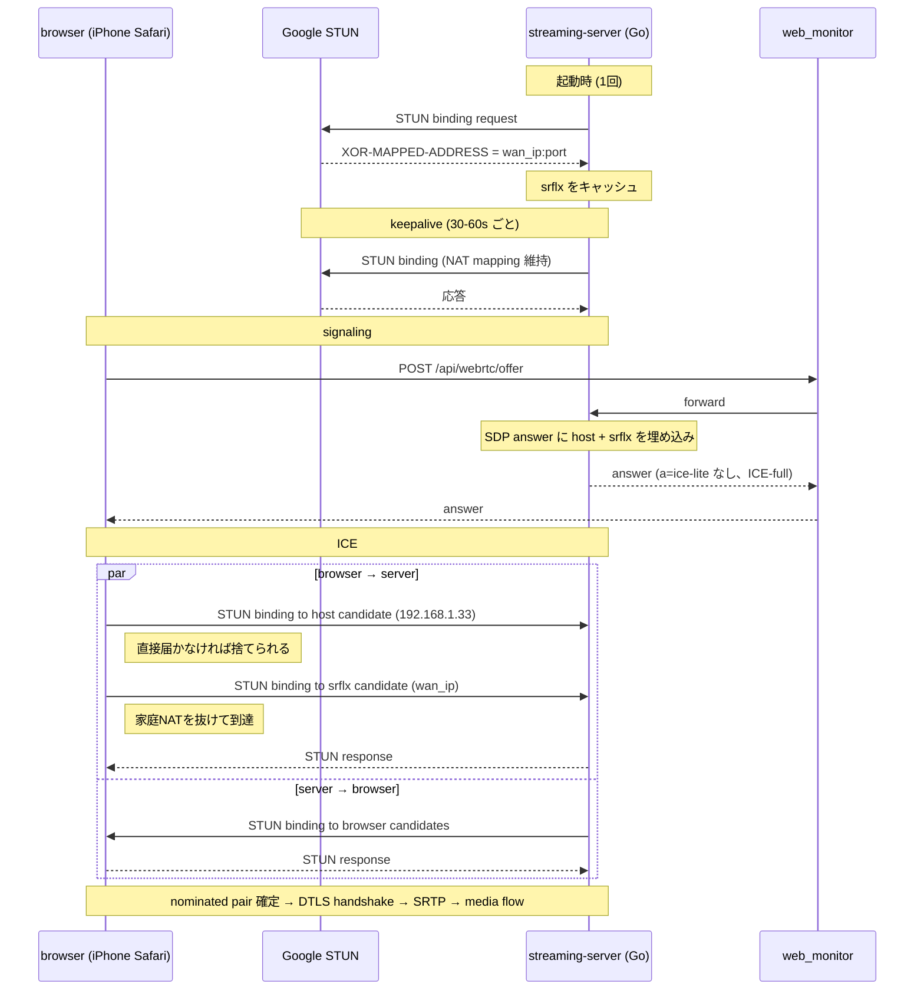

# WebRTC ICE-full + srflx 復元 設計ドキュメント

## ステータス
ドラフト / 設計レビュー前

ブランチ: `feat/webrtc-ice-full-restoration`
関連: PR #209 (multi-IP host candidate 化)

## 1. 背景

### 1.1 結論先出し

- **pion/webrtc 時代 (`e8d1d79` 以前) はモバイル回線からの WebRTC 視聴ができていた**
- `e8d1d79` で pion を排除して自前実装に置き換えた際、**ICE 周りの機能を意図せず大きく削った** ことが原因で動かなくなった
- 失われた機能を自前実装で復元すれば pion 時代の動作に戻る
- **Cloudflare TURN サーバの導入は不要** (一旦は必要と検討したが、再調査で不要と判明)

### 1.2 現状

直近の PR #209 で host candidate を全 NIC ぶん発行するよう改善した。

| アクセス経路 | 動作 |
|---|---|
| 自宅LAN内 (同一 192.168.1.0/24) Safari/Chrome | ✅ 視聴可能 |
| 自宅LAN内 Tailscale | ✅ 視聴可能 (PR #209 後) |
| **モバイル回線 iPhone Safari over Tailscale** | ❌ ICE が一切起動しない |

### 1.3 失敗時の症状

- HTTPS による signaling は正常 → SDP answer 返却
- ブラウザ側 `setRemoteDescription` は成功 (例外なし)
- **STUN binding request が UDP socket に1パケットも届かない** (45秒 tcpdump で 0 packets)
- `connectionState` は最終的に `'failed'` に遷移し、UI は MJPEG にフォールバック

### 1.4 pion 時代との差分

`e8d1d79^` の pion 実装では以下が **自動的に行われていた**:

```go
// 旧 internal/webrtc/server.go (pion 版)
iceServers = []webrtc.ICEServer{{
    URLs: []string{"stun:stun.l.google.com:19302"},
}}
config: webrtc.Configuration{ICEServers: iceServers}
```

これだけで pion 内部が以下を全部やってくれていた:

1. **srflx 候補の取得**: Google STUN に問い合わせて家の WAN IP:port を学習し、SDP に `a=candidate ... typ srflx` として追加
2. **ICE-full モード**: browser の各 candidate に対して STUN binding request を発信、双方向のホールパンチを実施
3. **USE-CANDIDATE 処理 / 候補ペア優先度計算**: ICE 標準に沿ったペア選定

`e8d1d79` の自前実装ではこれらが **全部スキップされた**:

| 項目 | pion時代 | 現在 (`e8d1d79` 以降) |
|---|---|---|
| ICE モード | ICE-full | **ICE-lite** (`a=ice-lite`) |
| host candidate | あり | あり |
| srflx candidate | あり (STUN自動取得) | **なし** |
| 自前 STUN binding 発信 | あり | **なし** (受信側のみ) |
| candidate pair check | pion ライブラリが管理 | **なし** |

→ 家庭NAT 越え (= 外部からのアクセス) に必要な「公開到達可能な候補と双方向ホールパンチ」が消えた状態。これがモバイル回線で動かなくなった真因。

### 1.5 ICE-lite 化で得られたメリット

ICE-lite 化は意図せずではなく **明確なメリット** ももたらしている。失わせたくない:

| メリット | 仕組み |
|---|---|
| **WebRTC ↔ MJPEG 切替が高速化** | 起動時/接続時の srflx gather が無く、SDP answer を即返せる |
| **CPU 使用率低下** | ※ ICE-lite は寄与せず、別要因 (RTP payloader 共有 #202、interceptor削減 #205、SRTP最適化 #208) |

定常 CPU 削減は ICE-lite とは独立した最適化なので、ICE-full 復元時も維持される。**唯一の懸念は切替レイテンシ**だが、後述の方針で解消する。

## 2. 解決方針

### 2.1 ICE-full + srflx を自前実装で復元 (Cloudflare TURN サーバは使わない)

| コンポーネント | 変更 |
|---|---|
| streaming-server `internal/signal/stun_client.go` (新規) | パブリック STUN binding request 送信、XOR-MAPPED-ADDRESS パース |
| streaming-server (起動時1回) | srflx を gather してキャッシュ。STUN keepalive で定期更新 |
| streaming-server `internal/signal/sdp.go` | SDP answer に srflx candidate を追加、`a=ice-lite` を削除 |
| streaming-server `internal/signal/ice.go` | ICE-full: browser candidate に向けた binding request、候補ペアチェック、USE-CANDIDATE 処理 |
| browser側 | **変更なし** (現状の `iceServers: [{urls: 'stun:stun.l.google.com:19302'}]` のまま) |

### 2.2 切替レイテンシを維持する設計

ICE-full 化の主なコストは **srflx gather 1往復(~50-200ms)** だが、以下で吸収する:

- **srflx は起動時1回だけ gather してキャッシュ**: 家の WAN IP:port は session 毎に変わらない
- 別 goroutine で **STUN keepalive を定期送信** (typ. 30〜60s ごと) → NAT mapping 維持 + WAN IP 変化検知
- per-session の SDP answer はキャッシュ済み srflx をそのまま埋め込むだけ → answer 生成レイテンシは **現状と同等**

ICE-full の connectivity check (server→browser candidate への STUN binding) は per-session 発生するが、典型的に <100ms で完了し、ユーザ体感としては気付かない。

### 2.3 Cloudflare TURN サーバが不要な理由

検討段階では Cloudflare TURN を使う案を出したが、**pion 時代に動いていた = STUN だけで足りていた = TURN 不要** という事実が立証された。

- サーバ側はパブリック STUN で srflx を取得し、browser 側も既存の Google STUN で同様に srflx を取得する
- 両者が srflx 候補を SDP に並べ、家庭ルータが full-cone or address-restricted-cone であればホールパンチが成立する
- これが pion 内部でやっていた挙動そのもの

例外: サーバが **symmetric NAT** 配下にある場合 (二重NAT、企業FW等) はホールパンチが破れる。ただし一般家庭ではほぼ発生せず、pion 時代に動いていた事実から本ユーザ環境ではそのケースに該当しないと判断できる。発生時は別 PR で TURN client 追加を検討する (本設計の対象外)。

→ **Cloudflare アカウント、API token、credential 発行エンドポイントなど、外部サービスに関する作業は一切不要。**

### 2.4 接続シーケンス



## 3. スコープ

### in scope
- パブリック STUN client 実装 (`stun:stun.l.google.com:19302` 等)
- 起動時 srflx gather + キャッシュ + 定期 keepalive
- SDP answer に srflx candidate を追加、`a=ice-lite` を削除
- ICE-full 化 (binding request 発信、候補ペア状態管理、USE-CANDIDATE 処理)
- 切替レイテンシ維持 (起動時 gather 戦略の徹底)
- 既存 LAN 動作の保持
- 自動・手動テスト

### out of scope
- **Cloudflare TURN を使った中継** (本設計では不要と結論済み)
- TURN client 実装全般 (symmetric NAT 環境用、別 PR で必要に応じて)
- WebRTC ↔ HLS フォールバック設計
- 帯域制御 / コスト監視ダッシュボード

## 4. 役割分担

### user (人間) のタスク
- [ ] 自宅ルータが symmetric NAT でないことを確認 (pion 時代に動いていたので OK の見込み)
- [ ] LAN 動作のリグレッション確認 (Safari/Chrome 両方)
- [ ] モバイル回線 (LTE) 実機テスト (Safari iPhone)
- [ ] 切替速度の体感確認 (現状と比べて遅くなっていないか)

外部サービス契約・API token 管理などのタスクは **不要** (Cloudflare TURN を使わないため)。

### Claude (作業) のタスク
- [ ] `internal/signal/stun_client.go` 新規: STUN binding request 送信/応答パース、XOR-MAPPED-ADDRESS 抽出
- [ ] `cmd/server/main.go`: 起動時 srflx gather、結果を `signal.Server` に渡す
- [ ] `internal/signal/session.go`: srflx をフィールドに保持、`AnswerParams.CandidateIPs` に host + srflx を結合
- [ ] STUN keepalive ループ (goroutine、定期送信、WAN IP 変化検知でキャッシュ更新)
- [ ] `internal/signal/ice.go` 拡張: ICE-full、binding request 発信、候補ペア状態機械、USE-CANDIDATE
- [ ] `internal/signal/sdp.go`: `a=ice-lite` を削除、srflx candidate (`typ srflx raddr ... rport ...`) 出力
- [ ] テスト: `stun_client_test.go`, `ice_test.go` 新規/拡張
- [ ] 診断スクリプト: `scripts/diag/check-srflx.sh` (起動時 srflx を表示)
- [ ] `docs/streaming-server.md` 更新 (リモート視聴節を追加)

## 5. 設定 (環境変数)

```ini
# /etc/systemd/system/pet-camera-streaming.service
PET_CAMERA_PUBLIC_STUN=stun:stun.l.google.com:19302   # srflx gather 用 (空なら ICE-lite + host のみ = 既存挙動)
PET_CAMERA_STUN_KEEPALIVE_SEC=45                       # keepalive 周期
```

`PET_CAMERA_PUBLIC_STUN=` (空) で従来の ICE-lite + host のみに戻せる。問題発生時の即時フォールバック手段。

## 6. リスクと検討事項

| リスク | 影響度 | 対応 |
|---|---|---|
| ICE-full 化で既存 LAN 動作にリグレッション | 高 | 段階デプロイ、`PET_CAMERA_PUBLIC_STUN=` 空でフォールバック可能に |
| srflx gather 失敗時の挙動 | 中 | 起動時失敗 → ICE-lite + host のみで起動継続、warn ログ |
| WAN IP が変わる ISP (動的IP) | 中 | keepalive で検知、キャッシュ更新、次セッションから新 srflx |
| 自宅 ISP が CGNAT (PPPoE二重NAT) | 低 | pion 時代に動いていたので発生していない見込み。発生時は TURN client 検討 (別 PR) |
| STUN keepalive の余分なトラフィック | 低 | 数十秒に1回 70 byte 程度。無視できる |

## 7. 段階リリース計画

1. **Phase 1**: STUN client 実装 + 起動時 srflx gather + SDP に srflx 候補追加 (ICE-lite のまま)
   - LAN 動作維持確認
   - srflx が SDP に正しく載るか確認
2. **Phase 2**: ICE-full 化 (`a=ice-lite` 削除、binding request 発信、ペアチェック)
   - LAN 動作維持確認、切替レイテンシ確認
3. **Phase 3**: STUN keepalive ループ
   - 長時間稼働で WAN IP 変化追従を確認
4. **Phase 4**: モバイル回線実機テスト、ドキュメント更新、本番リリース

各 Phase ごとに小PRに分けてマージ予定。

## 8. テスト計画

### unit
- `stun_client_test.go`: binding request build、binding response parse、XOR-MAPPED-ADDRESS 抽出 (IPv4/IPv6)
- `sdp_test.go` 追加: srflx candidate を含む answer 生成、`a=ice-lite` 不在
- `ice_test.go`: 候補ペア状態機械、priority 計算、USE-CANDIDATE 処理

### integration
- ループバックで pion 製クライアントとの interop テスト (controlling 側を pion で)
- 既存 `session_race_test.go` を ICE-full 経路でも通す

### manual
- 自宅 LAN: Safari/Chrome 両方で再生、切替レイテンシが体感で悪化していないこと
- 外出先 LTE: iPhone Safari で再生 (これがゴール)
- `chrome://webrtc-internals` でデスクトップから候補ペアの状態を確認
- 長時間稼働: 24h 経過後もモバイルから繋がること (keepalive 検証)

## 9. 参考資料

- RFC 8445: ICE
- RFC 5389/8489: STUN
- pion/webrtc の ICE-full + STUN gather 実装 (`e8d1d79^` の `internal/webrtc/server.go` で参照していた API)
- WebKit ICE filtering 挙動: 個別観察ログ (このリポジトリでは PR #209 設計時に判明)

## 10. 次アクション

- ユーザ: 設計レビュー → 承認
- Claude: Phase 1 (STUN client + srflx gather) から実装開始
