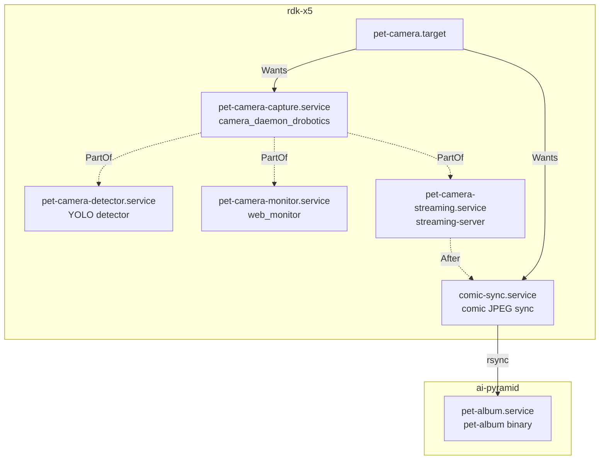

# scripts/ — Usage Guide

## Production Scripts

### build.sh — モジュール別ビルド (開発用)

rdk-x5 上でモジュール単位のビルドと systemd restart を行う。

```bash
./scripts/build.sh                    # rdk-x5 全モジュール (capture, web, streaming, monitor)
./scripts/build.sh capture            # camera daemon のみ (依存サービスも連動再起動)
./scripts/build.sh streaming          # streaming server のみ
./scripts/build.sh monitor            # web monitor + web assets
./scripts/build.sh web                # web assets のみ (restart なし)
./scripts/build.sh detector           # ビルド不要、systemd restart のみ
./scripts/build.sh album              # GitHub artifact download (ai-pyramid用)
./scripts/build.sh --no-restart ...   # ビルドのみ、restart しない
```

### install-services.sh — systemd サービスインストール

```bash
sudo ./scripts/install-services.sh rdk-x5       # rdk-x5 用サービス一式
sudo ./scripts/install-services.sh ai-pyramid    # ai-pyramid 用サービス
```

インストール後の操作:

```bash
# rdk-x5
sudo systemctl start pet-camera.target       # 全体起動
sudo systemctl stop pet-camera.target        # 全体停止
systemctl status pet-camera-*.service        # 状態確認
journalctl -u pet-camera-capture -f          # ログ (journald)

# ai-pyramid
sudo systemctl start pet-album.service
journalctl -u pet-album -f
```

### resolve-model.sh — YOLO モデルパス解決

detector サービスが内部で使用。直接呼ぶ場合:

```bash
./scripts/resolve-model.sh v26n    # → /path/to/yolo26n_det_bpu_bayese_640x640_nv12.bin
./scripts/resolve-model.sh v11n    # → /path/to/yolo11n_detect_bayese_640x640_nv12.bin
```

検索順: `models/` → `/tmp/yolo_models/`。v26n が見つからなければ v11n にフォールバック。

### sync-comics.sh — コミック画像同期

rdk-x5 → ai-pyramid へコミック JPEG を rsync する。systemd (`comic-sync.service`) で常駐。

```bash
./scripts/sync-comics.sh    # 手動実行 (通常は systemd 経由)
```

### test-device.sh — テストスイート

```bash
./scripts/test-device.sh --all       # 全テスト
./scripts/test-device.sh --go        # Go (gofmt, vet, test)
./scripts/test-device.sh --rust      # Rust (fmt, clippy, test)
./scripts/test-device.sh --python    # Python (pyright, integration)
./scripts/test-device.sh --docs      # Mermaid diagram validation
```

### run_camera_switcher_yolo_streaming.sh — レガシーランチャー

systemd 未導入環境でのデバッグ用。ビルド・起動・ログ保存を一括で行う。

```bash
./scripts/run_camera_switcher_yolo_streaming.sh
./scripts/run_camera_switcher_yolo_streaming.sh --skip-build --no-detector
```

## Development Tools

### profile_shm.py — SHM プロファイラ

共有メモリの使用状況を JSON メトリクスで出力。

```bash
uv run scripts/profile_shm.py
```

## systemd アーキテクチャ



- capture 停止時は detector/monitor/streaming も連動停止 (`PartOf=`)
- SHM 未準備時は `Restart=on-failure` で自動リトライ (3秒間隔)
- ログは全て journald (`journalctl -u <service> -f`)

### sudoers NOPASSWD 設定 (任意)

開発中の `sudo systemctl restart` 等をパスワード不要にする:

```bash
sed 's/__USER__/youruser/' deploy/rdk-x5/sudoers-pet-camera.example > /tmp/sudoers-pet-camera
sudo visudo -cf /tmp/sudoers-pet-camera
sudo cp /tmp/sudoers-pet-camera /etc/sudoers.d/pet-camera
sudo chmod 440 /etc/sudoers.d/pet-camera
```

### サービスファイル編集時の注意

- `ExecStart` 内で `EnvironmentFile` (`.env`) の変数を参照する場合は `$$` でエスケープすること。systemd は `${VAR}` を `Environment=` の値で先に展開するため、`.env` にしかない変数は空になる。
  ```ini
  # NG: systemd が展開 → .env の値が使われない
  ExecStart=/bin/sh -c '[ -n "${MY_VAR}" ] && ...'
  # OK: sh が展開 → .env の値が使われる
  ExecStart=/bin/sh -c '[ -n "$${MY_VAR}" ] && ...'
  ```
- `Environment=` で定義した変数は `$` のままでよい (systemd が展開する)
