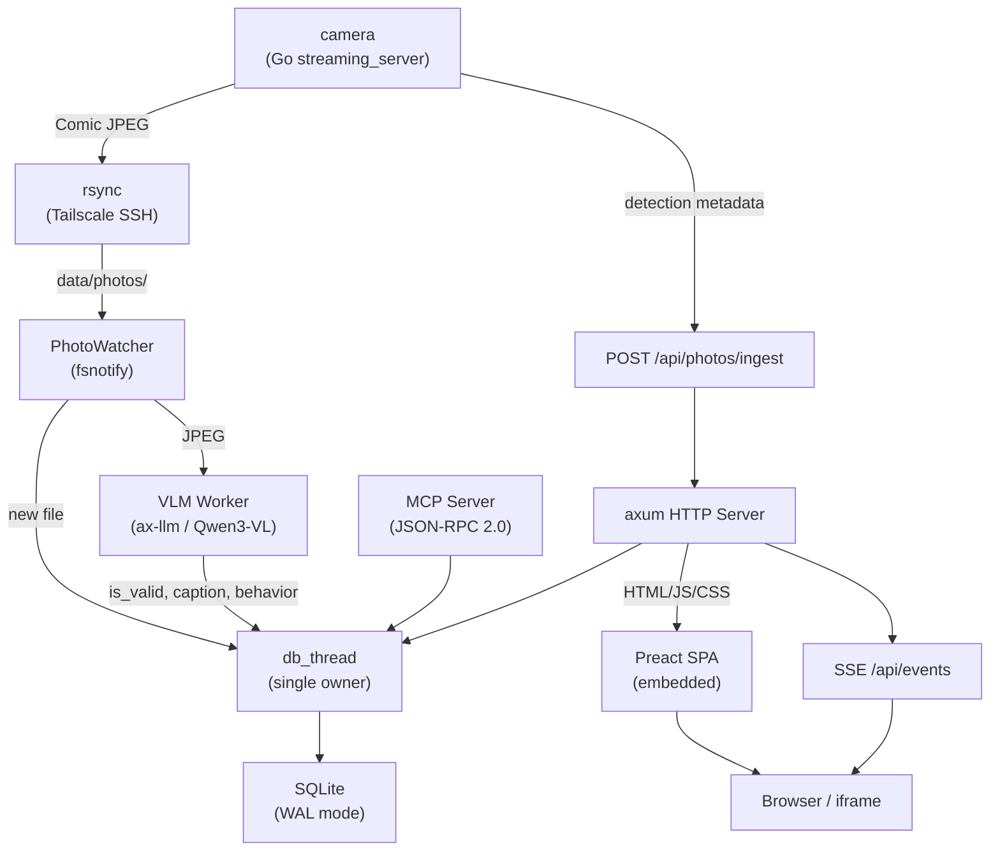
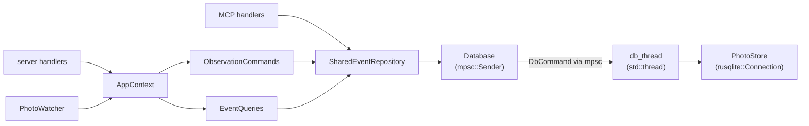

# ai-pyramid Architecture Reference

## System Overview



## DB Access Architecture

全DBアクセスは単一の `db_thread` を経由する。`Arc<Mutex<>>` は使用しない。



- `PhotoStore` (= `rusqlite::Connection`) は `db_thread` スレッドが唯一の所有者
- リクエストは `mpsc::channel` 経由で逐次処理、ロック不要
- `rusqlite::Connection` は `Send` だが `!Sync` → 単一スレッド所有が最適

---

## API Endpoints

### Album UI

| Method | Path | Purpose |
|--------|------|---------|
| GET | `/app` | Preact SPA (index.html) |
| GET | `/app/{*path}` | SPA assets (JS, CSS) |

### Photos API

| Method | Path | Purpose |
|--------|------|---------|
| GET | `/api/photos` | イベント一覧 (`?is_valid=true&pet_id=chatora&limit=50&offset=0`) |
| GET | `/api/photos/{filename}` | JPEG画像配信 (immutable cache) |
| PATCH | `/api/photos/{filename}` | photo の is_valid / pet_id 更新 |
| POST | `/api/photos/ingest` | rdk-x5 からの comic metadata + detections 受信 |

### Detections API

| Method | Path | Purpose |
|--------|------|---------|
| GET | `/api/detections/{photo_id}` | photo に紐づく全 detection 取得 |
| PATCH | `/api/detections/{id}` | detection の pet_id_override 更新 (→ photo pet_id 多数決更新) |

### Metadata / SSE

| Method | Path | Purpose |
|--------|------|---------|
| GET | `/api/stats` | total / confirmed / rejected / pending カウント |
| GET | `/api/pet-names` | `PET_NAME_*` 環境変数からの表示名マッピング |
| GET | `/api/events` | SSE ストリーム (photo 変更時に PhotoEvent を push) |
| GET | `/health` | ヘルスチェック |

### MCP (Model Context Protocol)

| Method | Path | Purpose |
|--------|------|---------|
| POST | `/mcp` | JSON-RPC 2.0 (initialize, tools/list, tools/call) |
| GET | `/mcp/photos/{id}` | photo JPEG ダウンロード (MCP tool 用) |

**MCP Tool**: `get_recent_photos` — 最新の valid photos をテキスト形式で返却

---

## Database Schema

### photos テーブル

| Column | Type | Description |
|--------|------|-------------|
| id | INTEGER PK | Auto-increment |
| filename | TEXT UNIQUE | `comic_YYYYMMDD_HHMMSS_{pet_id}.jpg` |
| captured_at | TEXT | ISO 8601 |
| caption | TEXT | VLM 生成キャプション |
| is_valid | INTEGER | NULL=pending, 0=invalid, 1=valid |
| pet_id | TEXT | "mike" / "chatora" / "other" |
| behavior | TEXT | "eating" / "sleeping" / "playing" / "resting" / "moving" / "grooming" / "other" |
| vlm_attempts | INTEGER | VLM 推論試行回数 |
| vlm_last_error | TEXT | 最後のエラーメッセージ |
| created_at | TEXT | サーバー登録時刻 |

### detections テーブル

| Column | Type | Description |
|--------|------|-------------|
| id | INTEGER PK | Auto-increment |
| photo_id | INTEGER FK | → photos(id) |
| panel_index | INTEGER | comic パネル番号 (0-3) |
| bbox_x/y/w/h | INTEGER | comic 画像座標 (848×496) |
| yolo_class | TEXT | "cat" / "dog" / "person" / "cup" / "food_bowl" |
| pet_class | TEXT | UV scatter 自動判定 |
| pet_id_override | TEXT | ユーザー手動修正 |
| confidence | REAL | YOLO confidence |
| detected_at | TEXT | 検出時刻 |

### マイグレーション

- `CREATE TABLE IF NOT EXISTS` — テーブルなければ作成
- `ALTER TABLE ADD COLUMN` — 既存DBへのカラム追加 (エラー無視)
- バイナリ更新のみでマイグレーション完了、手動操作不要

---

## Application Layer

### Commands (ObservationCommands)

| Method | Purpose |
|--------|---------|
| `ingest_source_photo` | photo 登録 + PetEvent 発行 |
| `apply_observation` | VLM 結果適用 (is_valid, caption, behavior) |
| `override_event_validity` | is_valid 手動変更 |
| `record_observation_failure` | VLM 失敗記録 |
| `ingest_with_detections` | photo + detections 一括登録 |
| `update_detection_override` | detection の pet_id_override 更新 |
| `update_pet_id` | photo の pet_id 更新 |

### Queries (EventQueries)

| Method | Purpose |
|--------|---------|
| `get_event_by_source` / `get_event_by_id` | 単一イベント取得 |
| `list_events` | フィルタ付き一覧 (status, pet_id, pagination) |
| `list_pending_sources` | VLM 未処理の filename 一覧 |
| `activity_stats` | カウント統計 |
| `get_observation_attempts` | VLM 試行回数 |
| `get_detections` | photo に紐づく detections |

### Events

photo 変更時に `PetEvent` を broadcast → SSE bridge が `PhotoEvent` に変換して push。

---

## Frontend (Preact SPA)

`ui/dist/` は Bun でビルドし、Rust バイナリに `include_dir!` で埋め込み。

### コンポーネント構成

```
App
├── EventGrid          # photo カードグリッド (featured + history)
├── EventDetail        # モーダル: 画像 + SVG bbox overlay + pet_id 修正
├── FilterBar          # status フィルタ + pet フィルタ (API から動的取得)
└── StatsStrip         # 統計カード (total / confirmed / pending / rejected)
```

### API Client (api.ts)

| Function | Endpoint |
|----------|----------|
| `fetchEvents(query)` | GET /api/photos |
| `fetchStats()` | GET /api/stats |
| `fetchDetections(photoId)` | GET /api/detections/{id} |
| `updateDetectionOverride(id, petId)` | PATCH /api/detections/{id} |
| `fetchPetNames()` | GET /api/pet-names |

SSE: `EventSource("/api/events")` でリアルタイム更新。

---

## External Integrations

### VLM (vlm/mod.rs)

- OpenAI 互換 Chat API (`/v1/chat/completions`)
- base64 エンコードした JPEG を image_url で送信
- レスポンス: `{is_valid, caption, behavior}` (JSON)
- リトライ: 1回 (NoneType エラー対策)
- デフォルト: `http://localhost:8000`, model `qwen3-vl-2B-Int4-ax650`, max_tokens 128

### PhotoWatcher (ingest/watcher.rs)

1. 起動時: photos_dir をスキャン、未登録 JPEG を ingest
2. fsnotify: Create/Modify イベントを監視
3. ファイル安定性チェック: 500ms × 3回 (書き込み完了待ち)
4. VLM キュー: mpsc channel → 1 worker (NPU 排他)
5. 定期リスキャン: 300秒ごとに pending を再キュー (max 5 attempts)

### Filename Parser (ingest/filename.rs)

フォーマット: `comic_YYYYMMDD_HHMMSS[_{pet_id}].jpg`
- pet_id: "mike" / "chatora" / "other" (ホワイトリスト検証)

---

## Configuration

### CLI Args (clap)

| Arg | Default | Description |
|-----|---------|-------------|
| `--addr` | `:8082` | Listen address |
| `--tls-cert` | auto-detect | TLS 証明書パス |
| `--tls-key` | auto-detect | TLS 秘密鍵パス |
| `--photos-dir` | `data/photos` | 画像保存ディレクトリ |
| `--db-path` | `data/pet-album.db` | SQLite DB パス |
| `--vlm-url` | `http://localhost:8000` | VLM API URL |
| `--vlm-model` | `qwen3-vl-2B-Int4-ax650` | VLM モデル名 |
| `--vlm-max-tokens` | `128` | VLM 出力トークン上限 |

### Environment Variables

| Variable | Description |
|----------|-------------|
| `PUBLIC_URL` | 外部公開 URL (MCP の photo URL 生成に使用) |
| `PET_NAME_MIKE` | mike の表示名 (例: "ミケ") |
| `PET_NAME_CHATORA` | chatora の表示名 (例: "チャトラ") |

### TLS Auto-Detection

以下のパスを順に検索:
1. `/data/tailscale/certs/<album-host>.{crt,key}`
2. `../../<album-host>.{crt,key}`

---

## Test Coverage

52 テスト (2026-03-23 時点):

| Module | Tests | Scope |
|--------|-------|-------|
| db | 13 | CRUD, filters, pagination, VLM retry, majority vote |
| application | 3 | event publishing, validity override |
| ingest/filename | 8 | filename parsing, validation |
| server | 11 | REST API, ingest, detections, pet-names, SSE, embedded UI |
| mcp | 9 | JSON-RPC, tools, photo download, URL resolution |
| vlm | 6 | JSON parsing, mock server |

### Build & Test

```bash
cd src/ai-pyramid/ui && bun install && bun run build  # UI ビルド (必須)
cd src/ai-pyramid
cargo clippy          # lint
cargo test            # 52 tests
cargo build --release # opt-level=z, LTO, strip
```
