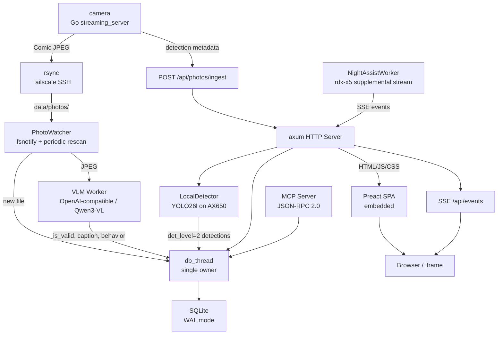
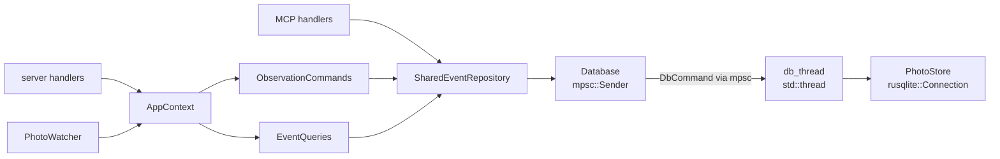

# ai-pyramid Architecture Reference

## System Overview


```mermaid
graph TD
    RDK["camera<br/>Go streaming_server"]
    RSYNC["rsync<br/>Tailscale SSH"]
    INGEST_API["POST /api/photos/ingest"]
    WATCHER["PhotoWatcher<br/>fsnotify + periodic rescan"]
    VLM["VLM Worker<br/>OpenAI-compatible / Qwen3-VL"]
    LOCALDET["LocalDetector<br/>YOLO26l on AX650"]
    NIGHT["NightAssistWorker<br/>rdk-x5 supplemental stream"]
    DB_THREAD["db_thread<br/>single owner"]
    SQLITE["SQLite<br/>WAL mode"]
    SERVER["axum HTTP Server"]
    MCP["MCP Server<br/>JSON-RPC 2.0"]
    UI["Preact SPA<br/>embedded"]
    SSE["SSE /api/events"]
    BROWSER["Browser / iframe"]

    RDK -->|Comic JPEG| RSYNC
    RSYNC -->|data/photos/| WATCHER
    RDK -->|detection metadata| INGEST_API
    INGEST_API --> SERVER
    WATCHER -->|new file| DB_THREAD
    WATCHER -->|JPEG| VLM
    VLM -->|is_valid, caption, behavior| DB_THREAD
    SERVER --> LOCALDET
    LOCALDET -->|det_level=2 detections| DB_THREAD
    NIGHT -->|SSE events| SERVER
    DB_THREAD --> SQLITE
    SERVER --> DB_THREAD
    MCP --> DB_THREAD
    SERVER -->|HTML/JS/CSS| UI
    SERVER --> SSE
    UI --> BROWSER
    SSE --> BROWSER
```

## DB Access Architecture

全DBアクセスは単一の `db_thread` を経由する。`Arc<Mutex<>>` は使用しない。


```mermaid
graph LR
    S["server handlers"]
    M["MCP handlers"]
    W["PhotoWatcher"]
    CTX["AppContext"]
    CMD["ObservationCommands"]
    Q["EventQueries"]
    REPO["SharedEventRepository"]
    DB["Database<br/>mpsc::Sender"]
    THR["db_thread<br/>std::thread"]
    STORE["PhotoStore<br/>rusqlite::Connection"]

    S --> CTX
    M --> REPO
    W --> CTX
    CTX --> CMD
    CTX --> Q
    CMD --> REPO
    Q --> REPO
    REPO --> DB
    DB -->|DbCommand via mpsc| THR
    THR --> STORE
```

- `PhotoStore` (= `rusqlite::Connection`) は `db_thread` スレッドが唯一の所有者
- リクエストは `mpsc::channel` 経由で逐次処理、ロック不要
- `rusqlite::Connection` は `Send` だが `!Sync` → 単一スレッド所有が最適

### DB command dispatch

`application/db_thread.rs` は `Database`、公開 `DbCommand`、単一thread loopを保持する。
store呼び出しはdomain別に分割され、album系22 commandを
`application/db_thread/album.rs`、training/background系15 commandを
`application/db_thread/training.rs` が処理する。`DbCommand::into_domain` と両dispatcherは
全variantを明示列挙するため、variant追加時の振り分け漏れはコンパイル時に検出される。

## Runtime composition

- `main.rs`: dotenv読込、tracing初期化、CLI parse、bootstrap呼び出しのみ
- `bootstrap/mod.rs`: DB・VLM・detector・watcher・training・router・TLS serverの構築と起動
- `server/mod.rs`: `AppState` とroute composition
- `server/album.rs`: photo/event/detection metadata REST
- `server/detection.rs`: backfillとdetect-now workflow
- `server/events.rs`: album/night-assist SSE
- `server/summary.rs`: daily summary
- `server/assets.rs` / `test_pages.rs`: embedded SPAと診断ページ

---

## API Endpoints

### Album UI

| Method | Path | Purpose |
|--------|------|---------|
| GET | `/app` | Preact SPA (index.html) |
| GET | `/app/{*path}` | SPA assets (JS, CSS) |

### Photos API

| Method | Path | Purpose |
|--------|------|---------|
| GET | `/api/photos` | イベント一覧 (`?is_valid=true&pet_id=chatora&limit=50&offset=0`) |
| GET | `/api/photos/{filename}` | JPEG画像配信 (immutable cache) |
| GET | `/api/photos/{filename}/panel/{panel}` | comic 1コマ切り出し (0-3, 640x640 letterbox) |
| PATCH | `/api/photos/{filename}` | photo の is_valid / pet_id / behavior 更新 |
| POST | `/api/photos/ingest` | rdk-x5 からの comic metadata + detections 受信 |
| GET | `/api/event/{id}` | DB primary key ベースの単一 event 取得 |

### Detections API

| Method | Path | Purpose |
|--------|------|---------|
| GET | `/api/detections/{photo_id}` | photo に紐づく全 detection 取得 |
| PATCH | `/api/detections/{id}` | detection の pet_id_override 更新 (→ photo pet_id 多数決更新) |
| POST | `/api/backfill` | 未検出写真の一括 detection 実行 (排他制御あり, 409 if running) |
| GET | `/api/backfill/status` | backfill 実行状態 `{ "running": bool }` |
| POST | `/api/detect-now/{filename}` | 単一 comic の即時 detection 実行 |

### Metadata / SSE

| Method | Path | Purpose |
|--------|------|---------|
| GET | `/api/stats` | total / confirmed / rejected / pending カウント |
| GET | `/api/behaviors` | DB に存在する behavior 一覧 |
| GET | `/api/edit-history` | ユーザー修正履歴 (`?since=` 対応) |
| POST | `/api/daily-summary` | 指定日のサマリ生成 |
| GET | `/api/pet-names` | `PET_NAME_*` 環境変数からの表示名マッピング |
| GET | `/api/events` | SSE ストリーム (photo 変更時に PhotoEvent を push) |
| GET | `/api/night-assist/detections/stream` | night assist の検出SSE |
| GET | `/health` | ヘルスチェック |

### MCP (Model Context Protocol)

| Method | Path | Purpose |
|--------|------|---------|
| POST | `/mcp` | JSON-RPC 2.0 (initialize, tools/list, tools/call) |
| GET | `/mcp/photos/{id}` | photo JPEG ダウンロード (MCP tool 用) |

**MCP Tool**: `get_recent_photos` — 最新の valid photos をテキスト形式で返却

---

## Database Schema

### photos テーブル

| Column | Type | Description |
|--------|------|-------------|
| id | INTEGER PK | Auto-increment |
| filename | TEXT UNIQUE | `comic_YYYYMMDD_HHMMSS_{pet_id}.jpg` |
| captured_at | TEXT | ISO 8601 |
| caption | TEXT | VLM 生成キャプション |
| is_valid | INTEGER | NULL=pending, 0=invalid, 1=valid |
| pet_id | TEXT | "mike" / "chatora" / "other" |
| behavior | TEXT | "eating" / "sleeping" / "playing" / "resting" / "moving" / "grooming" / "other" |
| vlm_attempts | INTEGER | VLM 推論試行回数 |
| vlm_last_error | TEXT | 最後のエラーメッセージ |
| created_at | TEXT | サーバー登録時刻 |
| detected_at | TEXT | detection 実行時刻 (NULL=未実行, 非NULL=実行済み) |
| caption_level | INTEGER | 0=basic VLM, 1=detection-enhanced |

### detections テーブル

| Column | Type | Description |
|--------|------|-------------|
| id | INTEGER PK | Auto-increment |
| photo_id | INTEGER FK | → photos(id) |
| panel_index | INTEGER | comic パネル番号 (0-3) |
| bbox_x/y/w/h | INTEGER | comic 画像座標 (848×496) |
| yolo_class | TEXT | "cat" / "dog" / "person" / "cup" / "food_bowl" |
| pet_class | TEXT | UV scatter 自動判定 |
| pet_id_override | TEXT | ユーザー手動修正 |
| confidence | REAL | YOLO confidence |
| detected_at | TEXT | 検出時刻 |
| color_metrics | TEXT | pet-camera 由来の opaque JSON |
| det_level | INTEGER | 1=RDK X5 realtime, 2=AI Pyramid high-precision |
| model | TEXT | 検出モデル識別子 |

### edit_history テーブル

| Column | Type | Description |
|--------|------|-------------|
| id | INTEGER PK | Auto-increment |
| photo_id | INTEGER FK | → photos(id) |
| changes | TEXT | JSON diff |
| created_at | TEXT | 更新時刻 |

### マイグレーション

- `CREATE TABLE IF NOT EXISTS` — テーブルなければ作成
- `ALTER TABLE ADD COLUMN` — 既存DBへのカラム追加 (エラー無視)
- バイナリ更新のみでマイグレーション完了、手動操作不要

---

## Application Layer

### Commands (ObservationCommands)

| Method | Purpose |
|--------|---------|
| `ingest_source_photo` | photo 登録 + PetEvent 発行 |
| `apply_observation` | VLM 結果適用 (is_valid, caption, behavior) |
| `override_event_validity` | is_valid 手動変更 |
| `record_observation_failure` | VLM 失敗記録 |
| `ingest_with_detections` | photo + detections 一括登録 |
| `update_detection_override` | detection の pet_id_override 更新 |
| `update_pet_id` | photo の pet_id 更新 |
| `update_behavior` | photo の behavior 更新 |
| `mark_detected` | photo の detected_at をセット (検出ゼロでも) |

### Queries (EventQueries)

| Method | Purpose |
|--------|---------|
| `get_event_by_source` / `get_event_by_id` | 単一イベント取得 |
| `list_events` | フィルタ付き一覧 (status, pet_id, pagination) |
| `list_pending_sources` | VLM 未処理の filename 一覧 |
| `activity_stats` | カウント統計 |
| `get_observation_attempts` | VLM 試行回数 |
| `get_detections` | photo に紐づく detections |
| `list_undetected_photos` | detected_at IS NULL の写真一覧 |
| `distinct_behaviors` | 既知 behavior 値の列挙 |
| `get_edit_history` | 編集履歴取得 |

### Events

photo 変更時に `PetEvent` を broadcast → SSE bridge が `PhotoEvent` に変換して push。

---

## Frontend (Preact SPA)

`ui/dist/` は Bun でビルドし、Rust バイナリに `include_dir!` で埋め込み。

### コンポーネント構成

```
App
├── EventGrid          # photo カードグリッド (featured + history)
├── EventDetail        # モーダル: 画像 + glass bbox overlay (HTML/CSS) + pet_id 修正
├── FilterBar          # status / pet / behavior / detection class フィルタ
├── StatsStrip         # 統計カード (total / confirmed / pending / rejected)
└── BackfillButton     # detection backfill 実行ボタン (standalone sidebar)
```

`EventDetail`はcompositionとAPI mutation orchestrationを担当し、表示責務を
`components/event-detail/`へ分離する。

| File | Responsibility |
|------|----------------|
| `metadata-editor.tsx` | photo metadata編集 |
| `detection-list.tsx` | detection一覧とoverride操作 |
| `comic-view.tsx` | comic全体表示とbbox overlay |
| `panel-carousel.tsx` | panel carouselとnavigation UI |
| `use-panel-view.ts` | panel crop描画、active panel、zoom/pan/navigation state |
| `presentation.ts` | 座標・表示用pure helper |

### Training UI and frame formats

training UIは`components/training/`に置き、`annotate-page.tsx`をpage composition、
`annotate-canvas.tsx`をbbox描画・pointer interactionの境界とする。残る責務は次へ分離する。

| File | Responsibility |
|------|----------------|
| `training-frame-card.tsx` | frame card表示と選択 |
| `training-dialogs.tsx` | purge/background等の確認dialog |
| `annotation-model.ts` | annotation stateとpure update helper |
| `annotation-toolbar.tsx` | class、approve/reject等の操作 |
| `annotation-sidebar.tsx` | frame navigationとannotation一覧 |

frame一覧、annotation CRUD、approve/reject、background model、dataset exportは
`lib/training-api.ts`の型付きclientを通す。

rdk-x5の給餌frameは次の両形式を同じlogical frameとして扱う。

- `feeding_<frame>_<width>x<height>.nv12`: 従来のraw NV12
- `feeding_<frame>_<width>x<height>.webp`: 現行のlossless luma WebP

sidecarはどちらも拡張子を除いた同じstemの`.json`である。preview cacheは元形式に
かかわらず`data/training/<stem>.jpg`となる。WebPはheaderから画像をdecodeし、NV12だけ
filenameのgeometryをffmpegへ渡す。dataset export時のlabelも`<stem>.txt`とし、
`.webp.txt`や`.nv12.txt`にはしない。

### API Client (api.ts)

| Function | Endpoint |
|----------|----------|
| `fetchEvents(query)` | GET /api/photos |
| `fetchStats()` | GET /api/stats |
| `fetchDetections(photoId)` | GET /api/detections/{id} |
| `updateDetectionOverride(id, petId)` | PATCH /api/detections/{id} |
| `updatePhoto(filename, patch)` | PATCH /api/photos/{filename} |
| `startBackfill()` | POST /api/backfill |
| `fetchBackfillStatus()` | GET /api/backfill/status |
| `fetchBehaviors()` | GET /api/behaviors |
| `fetchPetNames()` | GET /api/pet-names |

SSE: `EventSource("/api/events")` でリアルタイム更新。

---

## External Integrations

### VLM (`vlm/`)

- OpenAI 互換 Chat API (`/v1/chat/completions`)
- base64 エンコードした JPEG を image_url で送信
- レスポンス: `{is_valid, caption, behavior}` (JSON)
- リトライ: 1回 (NoneType エラー対策)
- デフォルト: `http://localhost:8000`, model `AXERA-TECH/Qwen3-VL-2B-Instruct-GPTQ-Int4-C256-P3584-CTX4095`, max_tokens 128
- `mod.rs`: configと公開facade
- `client.rs`: image encode、HTTP request、summary
- `parser.rs`: JSON抽出・互換parse・出力sanitization

### Local detector (`detect/local/`)

- `local.rs`: 公開facade、設定、画像file入力
- `wire.rs`: 16-byte request、12-byte response/detection protocol（NV12はreserved fieldでrow strideを通知）
- `client.rs`: Unix socket transport
- `image_conversion.rs`: RGB→NV12変換（AX650 IVPS向け16-byte aligned stride）
- `pipeline.rs`: YOLO26l raw-first実行、pet未検出時の4-panel fallback、bbox変換・merge

Local detectorはpetcameraと同じ6 COCO class（person、cat、dog、cup、bowl、chair）だけを
argmax前に評価する。YOLO11sとアスペクト比変形は使用しない。Level 2が写真全体で
cat/dogを1件も検出できなかった場合は、comic化前の高解像度frameで得たLevel 1の
cat/dog行だけを`det_level=2`、`model=level1-inherited`として保存する。bbox、confidence、
pet identity、color metricsは引き継ぐが、Level 1の非pet classは引き継がない。Level 2が
少なくとも1件のpetを検出した場合は、panel単位の欠落に限りDB queryがLevel 1 catを
fallbackとして返す。

### PhotoWatcher (ingest/watcher.rs)

1. 起動時: photos_dir をスキャン、未登録 JPEG を ingest
2. fsnotify: Create/Modify イベントを監視
3. ファイル安定性チェック: 500ms × 3回 (書き込み完了待ち)
4. VLM キュー: mpsc channel → 1 worker (NPU 排他)
5. 定期リスキャン: 300秒ごとに pending を再キュー (max 5 attempts)

[補足] `main.rs` は `PET_CAMERA_HOST` / `PET_ALBUM_HOST` がある場合に remote detect client を有効化し、ローカル `LocalDetector` が使えるときは backfill と night assist に AX650 側 YOLO26l を併用する。

### Filename Parser (ingest/filename.rs)

フォーマット: `comic_YYYYMMDD_HHMMSS[_{pet_id}].jpg`
- pet_id: "mike" / "chatora" / "other" (ホワイトリスト検証)

---

## Configuration

### CLI Args (clap)

| Arg | Default | Description |
|-----|---------|-------------|
| `--addr` | `:8082` | Listen address |
| `--tls-cert` | auto-detect | TLS 証明書パス |
| `--tls-key` | auto-detect | TLS 秘密鍵パス |
| `--photos-dir` | `data/photos` | 画像保存ディレクトリ |
| `--db-path` | `data/pet-album.db` | SQLite DB パス |
| `--vlm-url` | `http://localhost:8000` | VLM API URL |
| `--vlm-model` | `AXERA-TECH/Qwen3-VL-2B-Instruct-GPTQ-Int4-C256-P3584-CTX4095` | VLM モデル名 |
| `--vlm-max-tokens` | `128` | VLM 出力トークン上限 |
| `--no-night-assist` | `false` | rdk-x5 夜間補助検出を無効化 |

### Environment Variables

| Variable | Description |
|----------|-------------|
| `PUBLIC_URL` | 外部公開 URL (MCP の photo URL 生成に使用) |
| `PET_ALBUM_TLS_CERT` / `PET_ALBUM_TLS_KEY` | HTTPS 用証明書/秘密鍵 |
| `PET_CAMERA_HOST` / `PET_CAMERA_PORT` | rdk-x5 側 monitor への接続先 |
| `PET_CAMERA_DETECT_PORT` | detector HTTP API を直接叩く場合のポート |
| `PET_ALBUM_PORT` | 自己公開URL生成用ポート |
| `PET_NAME_MIKE` | mike の表示名 (例: "ミケ") |
| `PET_NAME_CHATORA` | chatora の表示名 (例: "チャトラ") |

### TLS Auto-Detection

`main.rs` の現行実装はファイル探索ではなく、`PET_ALBUM_TLS_CERT` と `PET_ALBUM_TLS_KEY` の両方が存在し、実ファイルも存在する場合にのみ HTTPS を有効化する。未設定時は HTTP にフォールバックする。

---

## Test Coverage

core refactorのGitHub CIではRust 107 testsが成功した。その後も回帰testを追加しているため、
現在件数は固定値ではなくCIの`cargo test`結果を正とする。

| Module | Focus |
|--------|-------|
| db | CRUD, filters, migration-safe reads, det_level優先, edit history |
| application | event publishing, validity / pet_id / behavior 更新 |
| ingest/filename | filename parsing, validation |
| server | REST API, ingest, detections, backfill, pet-names, SSE, embedded UI |
| mcp | JSON-RPC, tools, photo download, URL resolution |
| vlm | JSON parsing, mock server, retry behavior |

テスト数は継続的に増減するため、この文書では固定値よりもコマンドを正とする。

### Build & Test

```bash
cd src/ai-pyramid/ui && bun install && bun run build  # UI ビルド (必須)
cd src/ai-pyramid
cargo clippy          # lint
cargo test            # current test set
cargo build --release # opt-level=z, LTO, strip
```
