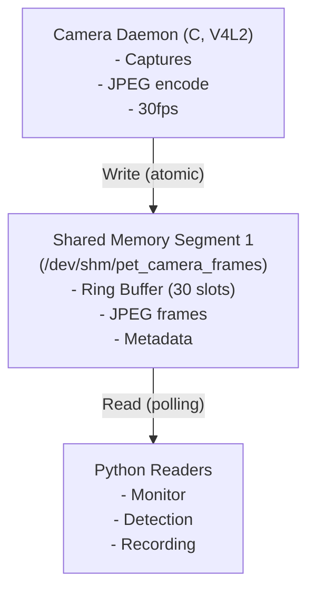

# Camera Capture Daemon - Phase 1 実装

V4L2カメラキャプチャデーモンと共有メモリインターフェースの実装

## 概要

このディレクトリには以下のコンポーネントが含まれています:

1. **共有メモリ実装** (`shared_memory.c/h`) - POSIX共有メモリによるプロセス間通信
2. **カメラデーモン** (`camera_daemon_drobotics.c`) - V4L2キャプチャとJPEGエンコーディング
3. **Pythonラッパー** (`real_shared_memory.py`) - C実装された共有メモリのPythonバインディング
4. **テストプログラム** (`test_integration.py`, `test_daemon_python.py`) - 動作確認用

## アーキテクチャ



## ビルド方法

### 必要な依存関係

```bash
# Ubuntu/Debian
sudo apt-get install -y \
    build-essential \
    libjpeg-dev \
    v4l-utils \
    libv4l-dev

# カメラデバイスの確認
v4l2-ctl --list-devices
```

### コンパイル

```bash
cd src/capture

# camera_daemon_drobotics とライブラリのビルド
make

# カメラデーモンの起動（前回プロセスと共有メモリをクリーンアップ）
make run

# バックグラウンド起動（--daemon 付き、停止は make kill-processes）
make run-daemon

# 後片付け
make clean
```

### ビルド成果物

- `../../build/camera_daemon_drobotics` - カメラキャプチャデーモン
- `../../build/libjpeg_encoder.a` - JPEG エンコーダライブラリ (CGO用)
- `../../build/libn2d_comic.a` - nano2D コミック合成ライブラリ
- `../../build/libn2d_letterbox.so` - nano2D レターボックス共有ライブラリ

## 使用方法

### 1. カメラデーモンの起動

```bash
# デフォルト設定 (640x480@30fps)
./build/camera_daemon_drobotics

# カスタム設定
./build/camera_daemon_drobotics -d /dev/video0 -w 1280 -h 720 -f 30 -c 0

# オプション:
#   -d <device>   カメラデバイス (デフォルト: /dev/video0)
#   -c <id>       カメラID (デフォルト: 0)
#   -w <width>    フレーム幅 (デフォルト: 640)
#   -h <height>   フレーム高さ (デフォルト: 480)
#   -f <fps>      フレームレート (デフォルト: 30)
#   --help        ヘルプを表示

# Makefile 経由で起動（前回プロセス/共有メモリを掃除してから実行）
make run
```

### 2. Python統合テストの実行

別のターミナルで:

```bash
# カメラデーモンが起動していることを確認してから実行
uv run src/capture/test_integration.py

# FPS統計を表示
uv run src/capture/test_integration.py --fps-stats

# フレームを保存
uv run src/capture/test_integration.py --save-frames --output-dir /tmp/frames

# 最大100フレームをキャプチャ
uv run src/capture/test_integration.py --max-frames 100
```

### 3. 既存のWebモニターとの統合

モックから実機への切り替え:

```python
# ゼロコピーSHM読み取り
from capture.real_shared_memory import ZeroCopySharedMemory
shm = ZeroCopySharedMemory()
shm.open()
```

## 共有メモリ仕様

### フレームバッファ

- **名前**: `/dev/shm/pet_camera_frames`
- **サイズ**: 約300MB (1080p想定)
- **構造**:
  - `write_index`: uint32_t (atomic)
  - `frames[30]`: Frame構造体の配列

### Frame構造体

```c
// ゼロコピー設計: SHMにはメタデータ(share_id等)のみ格納
// 実データはhb_mem_import経由でVPUメモリに直接アクセス
// 詳細は shared_memory.h を参照
```

### 検出結果バッファ

- **名前**: `/dev/shm/pet_camera_detections`
- **サイズ**: 約5KB
- **構造**:
  - 最新の検出結果のみを保持
  - `version`カウンタで更新を検知

## トラブルシューティング

### カメラが開けない

```bash
# デバイスの確認
ls -l /dev/video*

# 権限の確認
sudo usermod -a -G video $USER
# ログアウト・ログインして反映

# カメラ情報の確認
v4l2-ctl -d /dev/video0 --all
```

### 共有メモリが見つからない

```bash
# 共有メモリの確認
ls -l /dev/shm/

# 古い共有メモリの削除
rm -f /dev/shm/pet_camera_*

# カメラデーモンを再起動
```

### JPEGエンコードエラー

```bash
# libjpegのインストール確認
ldconfig -p | grep jpeg

# 再インストール
sudo apt-get install --reinstall libjpeg-dev
```

### パフォーマンス問題

```bash
# CPU使用率の確認
top -p $(pgrep camera_daemon_drobotics)

# 解像度を下げる
./build/camera_daemon_drobotics -w 320 -h 240

# フレームレートを下げる
./build/camera_daemon_drobotics -f 15
```

## ファイル一覧

```
src/capture/
├── Makefile                    # ビルド設定
├── camera_daemon_main.c        # メインエントリーポイント
├── camera_pipeline.c/h         # カメラパイプライン（VIO→ISP→VSE→エンコーダ）
├── vio_lowlevel.c/h            # D-Robotics VIO低レベルAPI
├── encoder_lowlevel.c/h        # H.265 VPUエンコーダ
├── encoder_thread.c/h          # エンコーダスレッド
├── shared_memory.c/h           # 共有メモリ（ゼロコピー）
├── shm_constants.h             # SHM定数定義
├── isp_brightness.c/h          # ISP明るさ制御・低照度補正
├── isp_lowlight_profile.h      # 低照度ISPプロファイル
├── camera_switcher.c/h         # 昼夜切り替えコントローラ
├── jpeg_encoder.c/h            # JPEGエンコーダ（CGOライブラリ）
├── n2d_comic.c/h               # nano2Dコミック合成
├── n2d_letterbox.c/h           # nano2Dレターボックス
├── rgn_overlay.c/h             # RGNオーバーレイ
├── logger.c/h                  # ログユーティリティ
├── real_shared_memory.py       # Pythonラッパー
├── hb_mem_bindings.py          # hb_memバインディング
├── test_integration.py         # 統合テスト
├── test_daemon_python.py       # Pythonデーモンテスト
└── mock_detector_daemon.py     # モック検出デーモン
```
